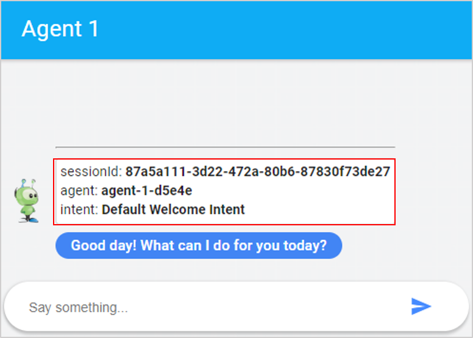
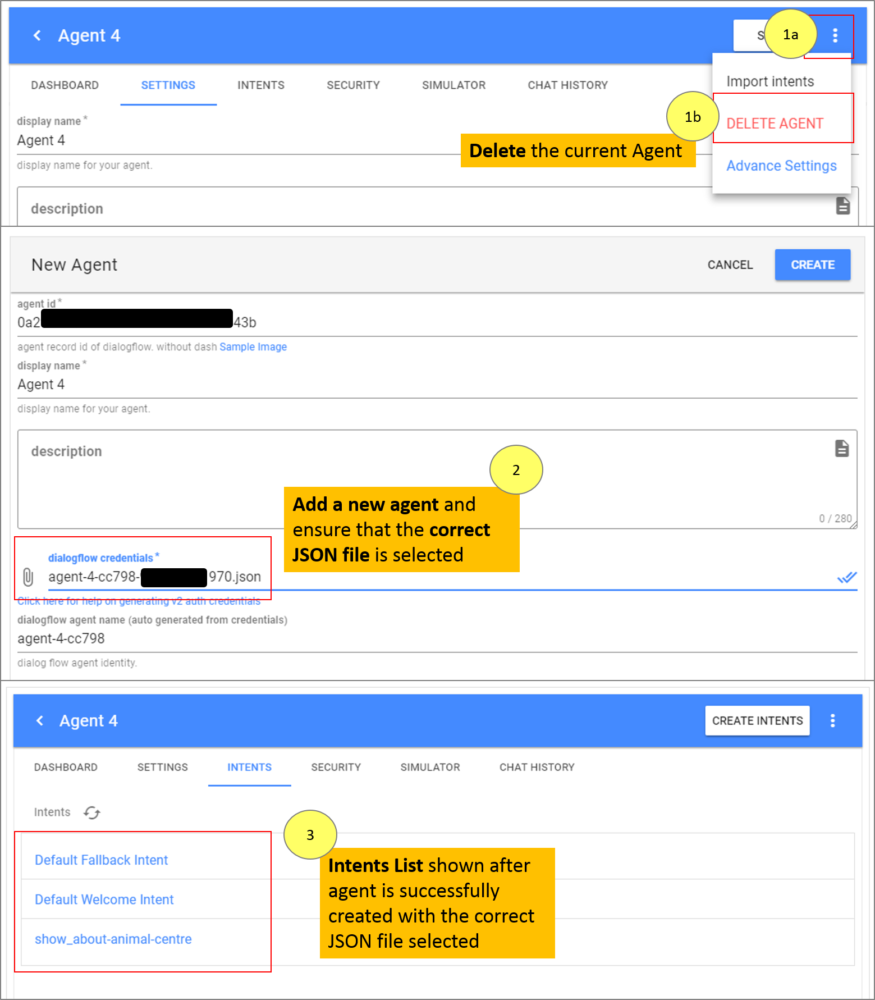
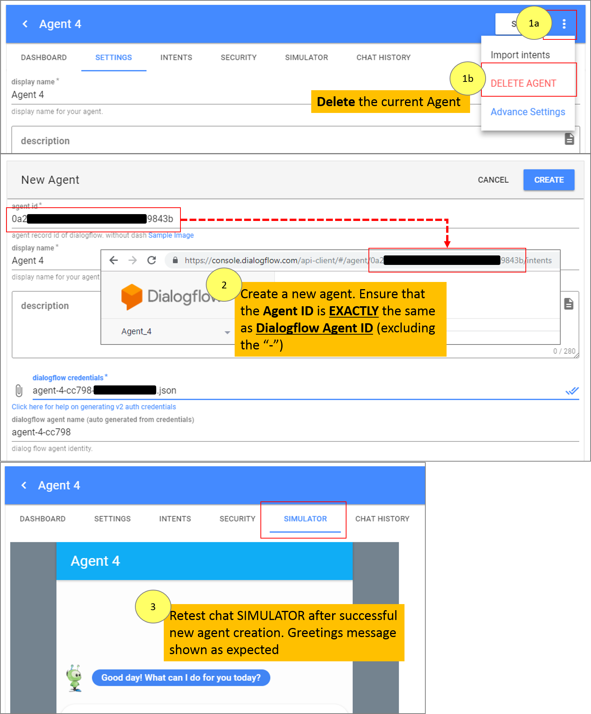
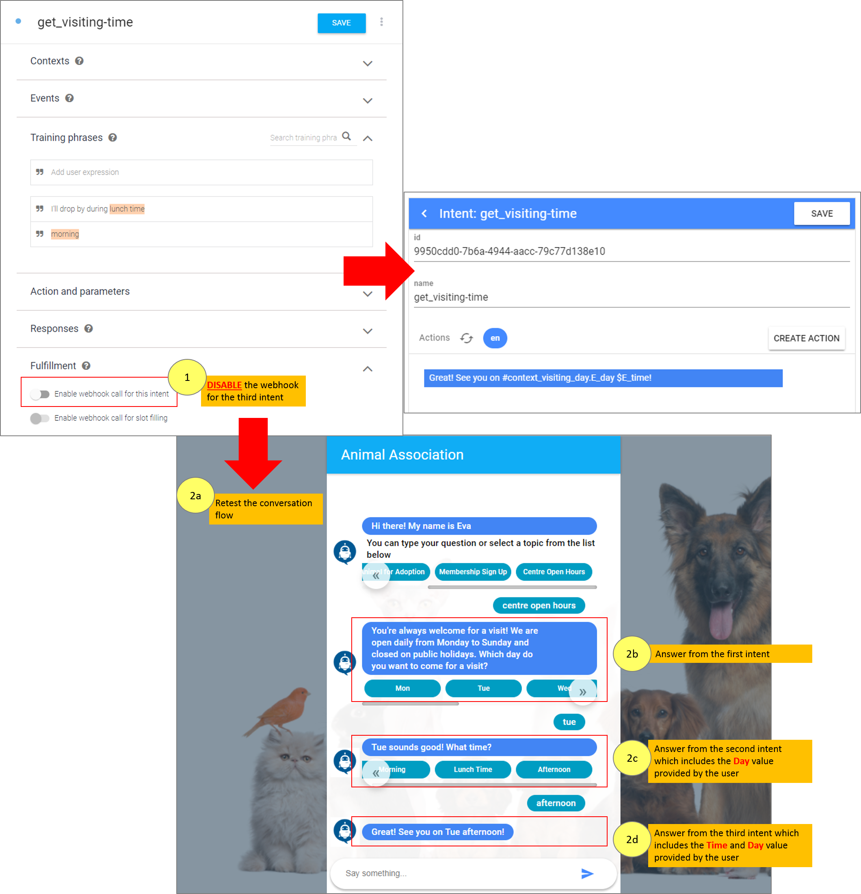

# Chat Simulator Debugging

There are times when you have configured the response in GIANT for the Intent but the configured response is not shown in the Chat Simulator. This guide provides you the steps to check on the configuration that causes the problem and the corrective measure. The below three Intents will be used as examples for the debugging steps.

## Part 1: Intent Use Cases
- Intent 1: **perform_pictures** 
    - This Intent is created to capture the parameter of _animal-species_ from the _User Says_. The captured parameter is then brought over and subsequently trigger the Event _evt-perform_pictures_ configured under Intent 2 **perform_pictures--animal**
    
	

- Intent 2: **perform_pictures--animal**
    - The parameter value of _animal-species_ brought forward from Intent 1 **perform_pictures** will trigger this Intent. As a result, either one of the animal photos (dog, cat or bird) will be shown to the user depending on the _animal-species_ parameter value provided by the user.
    - After the animal photos are shown, another Event _evt-perform_club_joining_ configured under Intent 3 **perform_club_joining** will be triggered.
    
	

- Intent 3: **perform_club_joining**
    - After Intent 2 **perform_pictures--animal** is triggered, this intent is triggered to recommend the user in joining the Animal Association as a member.
    - Two Responses are configured under this Intent: The _Rich Text Response_ (to show "be-a-member" text recommendation) and the _Webhook_ (to show the Membership Form for user to fill-in)
    
	

## Part 2: Using the Chat Simulator

1. Launch the **Chat Simulator** in a new browser tab. Enter the _User Says_ to trigger Intent 1 **perform_pictures**. 

	

2. All of the responses are shown as expected EXCEPT the _Card Response_ for **dog**, which is missing.
 
	

3. To check on the issue, add the characters **&d=1** at the end of the **Chat Simulator URL**. Press ENTER key, then refresh the page by pressing F5. 
    
    

4. The chat window will now show the response content with some additional details.
    
    

5. Enter again the _User Says_ to trigger Intent 1 **perform_pictures**. Intent 2 **perform_pictures--animal** and Intent 3 **perform_club_joining** should be triggered subsequently. The last triggered Intent is shown in the detailed summary (in this case, Intent 3 **perform_club_joining** is the last triggered Intent)

    

6. From the responses shown, you can see that the _Card Response_ to show the dog pictures configured under Intent 2 **perform_pictures--animal** is missing. From here, it is confirmed that Intent 2 _Card Response_ fails to be triggered. 

    

7. Switch off the toggle of the Event response for triggering Intent 3 **perform_club_joining** and save the changes. This is to avoid the response from being shown as the last triggered Intent, also to narrow down the problem area. 
    
    

8. Enter again the _User Says_ in the **Chat Simulator** to trigger Intent 1 **perform_pictures**. From the details shown, Intent 2 **perform_pictures--animal** is the last triggered Intent after Intent 1 is triggered. The correct parameter is captured and passed to Intent 2. Proceed to check on the configurations made for the _Card Response_ for Intent 2, whether any case-sensitive or incorrect spelling is applied.
    
    

9. Cross checking of the value in the _animal-species_ Entity (in Dialogflow) shows that the spelling DOES NOT MATCH with the corresponding value configured in the _Card Response_ (in GIANT). This is the reason causing the failure to trigger the _Card Response_ for **dog**.

    

10. Amend the spelling so that it is EXACTLY the same with the value configured for the _Entity_. Please note that the spelling is case-sensitive.

    

11. Test on the **Chat Simulator** again to check that the issue is fixed. 
    
    

12. From the results, it is confirmed that the issue is fixed after amending the configuration. You can turn on the toggle again for the Event response _evt-perform_club_joining_ under Intent 2 **perform_pictures--animal** and save the changes. 
    
    

13. Test on the **Chat Simulator** again to view the full results. If you want to hide the additional details shown for each response, delete the characters **&d=1** from the end of the **Chat Simulator URL**, press ENTER key then refresh the page by pressing F5.
    
    
    
    
## Troubleshooting Checklist

When the **Chat Simulator** fails to show the responses as expected, follow the checklist below to find out what may have caused the issue to happen:

- Is the **Intent's webhook** enabled?
- Is the **GIANT chatbot agent configured correctly** in GIANT?
- Is the **Fulfillment section configured correctly** for GIANT chatbot agent to connect to Dialogflow's agent?
- Is the **Training Phrase** added for the Intent?
- Is the **Entity/Parameter configured correctly** in the Intent? (both in Dialogflow and GIANT)
- Have you added the **answer for the Intent**?
- If the Intent is newly created, have you **refresh the Intent list** in GIANT for the new Intent to be imported?
- Did you **accidentally DELETED** any Intent, Entity, Training Phrase or Answer configured previously?
- When using **Context** and the response configured in the final Intent **did not show the parameter provided by the user** in the previous intent, have you checked that the **webhook is disabled** for the Intent?  

### Issue Caused by Intent's Webhook

- Illustration of issue

	- **Answer configured** for the Intent is **not shown** in the chat simulator.

		

- Cause(s)
	
	- **Webhook disabled** in Dialogflow for the Intent.

		

- How to solve it

	- **Enable the Intent's webhook** toggle in the Fulfillment section.
	 
		
    
    	

### Issue Caused by Incorrect GIANT Chatbot Agent Setup 

- Illustration of issue
	
	- **Intent list not shown** after chatbot is created in GIANT.

		
        
	- **Chat simulator not working** after chatbot is created in GIANT.

		      

- Cause(s)
	
	- Intent list not shown due to **incorrect JSON file attached**.

		
    
    - Chat simulator not working due to **incorrect Agent ID entered** during chatbot creation in GIANT.

		

- How to solve it
	
	- **Missing Intents List**: Delete the current agent, recreate the agent and attach the correct JSON file.
	
		
    
    - **Chat Simulator not working**: Delete the current agent, recreate the agent and enter the correct Dialogflow Agent ID.
	
		

### Issue Caused by Incorrect Dialogflow Agent Fulfillment Setup

- Illustration of issue

	-  **Missing Default web url** link in the SETTINGS and SIMULATOR screen. 

		

- Cause(s)

	- **Webhook not enabled** in **Dialogflow Agent's Fulfillment** section
	- **Missing or incorrect Dialogflow webhook URL copied from GIANT** into Dialogflow Agent's Fulfillment section
	- **Incorrect authorization or bearer** information

		

- How to solve it

	- **Enable the webhook toggle** in Dialogflow Agent's **Fulfillment** section
	- Ensure that the information entered for **Dialogflow webhook URL, Authorization and Bearer fields** are accurate
	- Remember to **SAVE** the changes made

		

### Issue Caused by Missing Training Phrase

- Illustration of issue

	- Chatbot **unable to return the expected answer** based on the _User Says_.

		

- Cause(s)
	
	- Chatbot unable to recognize the user's statement (_User Says_) because the **Training Phrase is missing** in the Intent 

		

- How to solve it

	- **Add the Training Phrase in the Intent** for the bot to recognize the user statement and show the expected answer.
	
		

### Issue Caused by Incorrect Entity/Parameter Setup

- Illustration of issue

	- The **answer configured for certain parameter(s) fail to show** in the chat simulator

		
        
	- The **answer configured for certain parameter(s) not shown as expected** in the chat simulator

		

- Cause(s)
	
	- **Incorrect spelling** of Entity/Parameter

		

	- The Training Phrase contains two parameters but **only one parameter configured for the answer** in GIANT

		

- How to solve it

	- **Amend the Entity/Parameter spelling**. Ensure that it is EXACTLY the same as the value entered in the first column of the Entity. Be careful of extra space in the word spelling (hence, it is recommended to use underscore ( _ ) or dash ( - ) character in place of spacing). Do take note that it is case sensitive (**Cats** with capital C is treated as a different word with **cats** with lowercase c).
	
		
        
	- **Add in the missing parameter** in the answer configuration.  
	 (TIPS: To include all values for the parameter, enter asterisk (\*) as the value for the parameter configured).  
     
     	  
     
     	

### Issue Caused by Intent's Missing Answer

- Illustration of issue

	- The **chat simulator is not showing any response** for the intent.

		

- Cause(s)

	- The **answer is not configured for the Intent** (which includes Response Type added but no content added in)

		

- How to solve it

	- **Configure the answer** for the intent. Ensure that there is **no empty response added** (you will need to remove the empty response if there is any)

		

### Issue Caused by New Intent Creation (Require Refresh Intent List)

- Illustration of issue

	- Chatbot **unable to return an answer** although the intent is added for the training phrase

		

- Cause(s)

	- The **Intent List is not refreshed** in GIANT

		

- How to solve it

	- **Refresh the intent list** for GIANT to get the latest intent(s) added in Dialogflow.

		

### Issue Caused by Accidental Deletion of Intent/Entity/Training Phrase/Answer

- Illustration of issue
	
	- Chatbot **unable to return an answer** although the Intent, Entity, Training Phrase or Answer was previously added to handle the user's inquiry.

		

- Cause(s)

	- The Intent, Entity, Training Phrase or Answer was **accidentally deleted**.

		

- How to solve it

	- **Re-create or re-configure the Intent, Entity, Training Phrase or Answer** for the user's inquiry

		
    
    	
    
		
        
    	

### Issue Related to Context (Value Provided by User Missing in Final Answer)

- Illustration of issue

	- **Value from the previous intent is not brought forward** to the Intent with response that shows all the collected parameter values.

		

- Cause(s)

	- The **webhook** for the Intent that shows all the collected parameter values is **enabled**. It needs to be **disabled**.

		

- How to solve it

	- **Disable the webhook** for the Intent

		

## Part3: Using Dialogflow for debugging
1. Direct to the interface of dialogflow, and switch to the specific chatbot which needs to be tested. Simulator panel is at right side. 
	
2. Key in the user input from "try it now" text field, and scroll down to "diagnostic info" part. 
	
3. Can check into all the active context parameter and its current value. 
	
