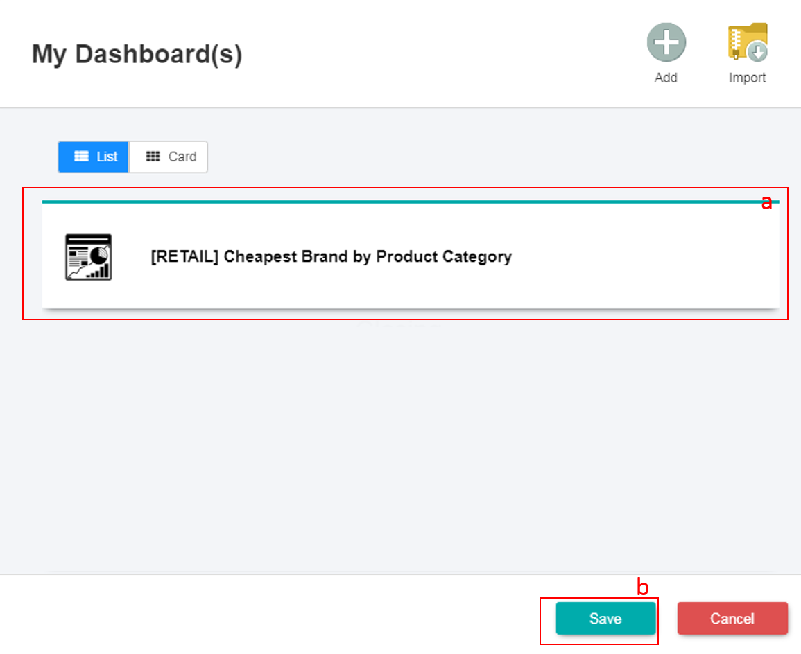
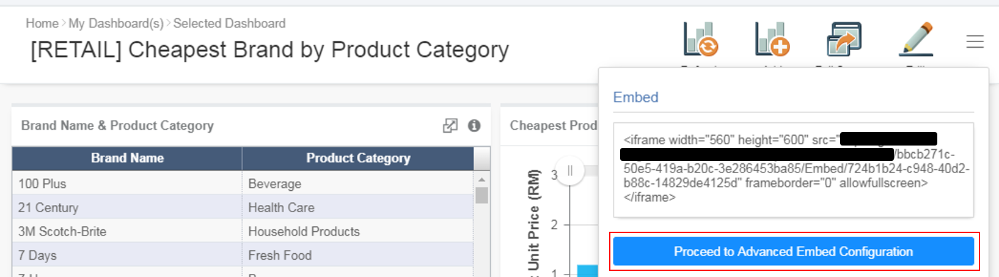
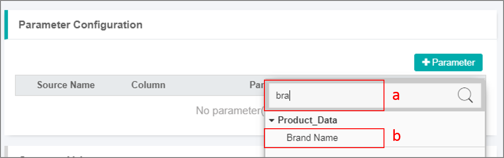
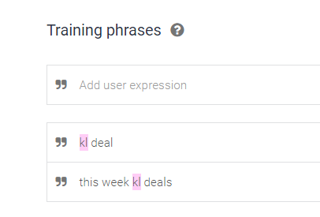
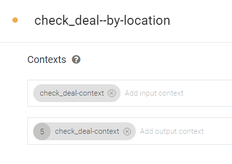
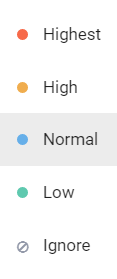
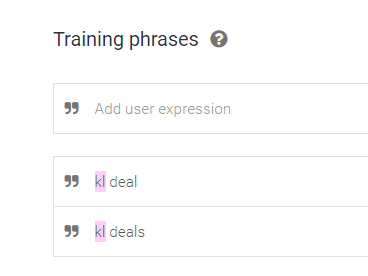
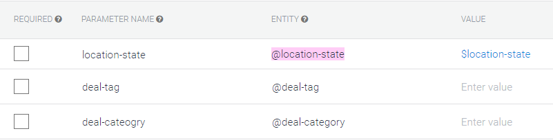

# Chatbot Design Guidelines
This guide is intended as a quick reference for you to design a chatbot.
There are two parts involved - **Setup in Dialogflow** and **Setup in GIANT**.
The chatbot configured in this guide mainly illustrates on how to use the **Analytics Response** answer type.
You can refer to [this guide](./getting-started.md) to learn more on how to configure the other response types available in GIANT.

### Pre-Requisites
1. A Dialogflow account (required to setup the bot, Intents and Entities in Dialogflow)
2. A GIANT account (required to setup the bot in GIANT and link with the bot in Dialogflow)
3. A data source (required to setup the dashboard. Answers shown in the chatbot will originate from the dashboard)

## Part 1: Setup in Dialogflow
_NOTE: Please [refer here](./setting-up-chatbot-agent-in-dialogflow.md) for the detailed steps on creating a chatbot agent, creating Entities and Intents in Dialogflow._

1. Create the **Entities** for the Intent to detect the keywords related to your data source. The **Entities** will also be used in the **Response/Action** Configuration. 

2. Define the synonyms for each of the **Entities** created. 

	_NOTE: The values in the first column have to be EXACTLY the same as the values in the data source. Please take note that it is case-sensitive._

3. Create the **Intents** to capture the parameters within the **Training Phrases**. 

4. Add the **Responses** for the Intent. 

## Part 2: Setup in GIANT

_NOTE: Please [refer here](./setting-up-chatbot-agent-in-giant.md) for the detailed steps on creating a chatbot agent in GIANT and linking the GIANT chatbot agent to Dialogflow._

### 2.1 Creating a Dashboard and an Embed Link

1. Upload the data source in GIANT. Then, click on **My Dashboard(s)** to start creating your dashboard. 

2. Click on **+ADD** to add a new dashboard. 

3. **Rename** your dashboard by clicking on the title and type in the new name. Then, click on **VIEW DASHBOARD**. 

4. Click on **+ADD** to add a new chart into the dashboard. 

5. Select a **chart** from the list to visualize the data, followed by the **Source** button. 

6. Select the **data source** from the list shown, followed by the **Proceed** button. 

7. The **New Chart** screen is shown for you to configure the chart. Edit the **title** of your chart by highlighting the text and entering a new chart title. 

8. Locate the **Setting** bar on the right side of the screen. Select the respective options and perform the data binding for the fields for the data to be shown in the chart. 

9. Click on the **Menu** icon on the top right to display the hidden icons. You can change the chart's styling based on your needs.

10. Click on the **Save** button to save the changes made to the chart. 

11. In the pop-up window shown, select the dashboard to save the chart into. Then, click **Save** again. 

12. Access the dashboard to check on the chart created. 

13. Click on the **Edit** icon to make adjustments on the chart. 

14. Click and drag the bottom right corner to resize the chart. 

15. Once done, click on the **Save** button. 

16. Repeat **Step 4-15** to add more charts into the dashboard. Since the charts from the dashboard will be displayed as an answer in the chatbot, it is advisable not to add too many charts (not more than 4 charts). 

17. Rearrange the charts in your dashboard according to the order for displaying in the chat conversation (top row, left-most chart will be shown first followed by the chart next to it and so on)

18. Click on the **Menu** button and select **Embed** icon.

19. Click on **Proceed to Advanced Embed Configuration** button. 

20. The **Advanced Embed Configuration** pop-up window will be shown. Click on **Add** button. 

21. Enter a title for the **Filter Set Name**. Click on **Parameter Configuration** to expand the section. 

22. Click on **+ Parameter**. Select the data source used to build the charts in the dashboard. 

23. Select the column that corresponds to the **Entity** and **Parameter** setup in Dialogflow. 

24. Key-in the **Parameter** name as per the **Entity Name** created in Dialogflow. You can leave the **Default value** field blank. 

25. Repeat **Step 23-24** if you have more than one parameter to add for the **Filter Set**. Once done, click on the **Generate** button. 

26. The following screen is shown once the Embed link is generated. Click on **Cancel** button to dismiss the dialog box. 

### 2.2 Configuring the Action in the Intent

1. Access the related Intent in GIANT. Click on **CREATE ACTION** button and select **Analytics Response** in the drop down menu.  

2. Click on **Dashboard**. Select the **Dashboard Name** shown in the drop down list. 

3. Once the **Dashboard Name** is selected, the other column details will be filled up automatically. 

4. Click on the **Tick** icon and click on the **Save** button to save the changes made. 

5. Launch your chatbot **Simulator** to test on the responses.

## Part 3: Design Tips

### Tips on designing responses
- Use card replies to provide more information on responses.  
Before: Replies without information   
   
After: Replies with informative icon and description   
   

- Use different font type to emphasize text.   
Before: Replies with same font   
   
After: Replies with different font type to emphasize text   
   

- Use different font color to emphasize text.   
Before: Replies with same font colour   
   
After: Replies with different font color to emphasize text   

### Do

1. Use different types of responses as it makes User Interface cleaner and User Experience better.

	1.1 Use Quick Replies when you need to ask user a question and continue with a followup intent based on the user's response.

	

	1.2 Use Rich Text when you need to show user a reply that contains a lot of information.

	

	1.3 Use Card Response to showcase different entities in the nicest way.

	

2. Maintain consistency throughout the design

	2.1 Use same font types, font colors, font sizes, highlights etc. to make the bot looks consistent.

	2.2 Use consistent elements for similar operations (Quick Replies, Rich Text, Card response).

### Don'ts

1. Don't use the default text responses in Dialogflow. Instead, configure the responses from GIANT.

2. Don't give meaningless names to intents. Follow the naming convention.

3. Don't write all information in one paragraph. Split the information for better readability.

4. Don't use only text responses from dialogflow. Combine them with the various response types in GIANT.

### Problems
- Two or more intents may use the same keyword(s) for training in Dialogflow. This may cause unexpected output.
- Contexts need to be handled with care to avoid unexpected output.

### Instruction on design of modifiers and its usage

* What is modifier intent?

Modifier intents are used to modify context of a base intent. For example, imagine you have a base intent `check_weather`. Modifiers can be used to modify its context parameters such as `location`, `scale` and `date`.

* When to use it?

Imagine you have a base intent `check_weather`. By default, when users type `weather` they will get a weather forecast for their current location, current date and in Celsius scale.
But if you want to let users to modify their requests and search for `weather forecast in Penang next week`, you need to pass parameters into `check_weather` intent and process it.
But what if an user doesn't understand Celsius scale and wants to get a forecast in Fahrenheit scale?
The user will probably type something like `Fahrenheit` and expect it to be added as a parameter into the previous search `weather forecast in Penang next week`.
If we don't make use of modifiers here then the new request `Fahrenheit` will  actually override previous search and th user will see today temperature in KL in Fahrenheit scale. We don't want that, so we will add a new modifier called `check_weather-scale` to pass value `Fahrenheit` into the current `check_weather` context.

* How to use it?

1. First of all, we need to create a base intent, let's call it `check_deal`.

2. This intent will have output context `check_deal-context` where we will pass current parameters and no input context as we don't want it to remember these parameters.

3. Assume we use `kl deal` and all similar training phrase to access this intent

4. We add 3 parameters for this intent `location-state`, `deal-tag` and `deal-category`. All of them have no default values.

If we will type `kl deal` now, we will get results for deals in KL, however, if we type `Shopping` after that, it will show shopping deals everywhere

5. Let's create a modifier and call it `check_deal--by-location`

6. This intent will have input and output context `check_deal-context`, so it could take parameters from `check_deal` and modify it.

7. Take a look at priority. We set the higher priority for this intent so that it could be triggered whenever it's possible over `check_deal` intent.

8. We set the same training phrase `kl deal` to trigger this intent.

9. Our modifier will also have 3 parameters: `location-state`, `deal-tag` and `deal-category`. However, this time around we will set default values for those parameters which we don't want to modify `deal-tag` and `deal-category`.

Our first modifier is ready... If we type `shopping` now, we will get shopping deals, and if we type `Kl deal`, it will modify the previous request and show us shopping deals in kl.
The other pros is that if we type `kl deal` first, it will trigger `check_deal` and not our modifier and will still work as expected.