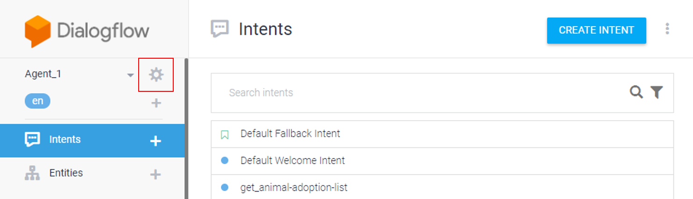

# Granting Administrator Rights in Google Cloud Platform (GCP)

### Pre-Requisite
1. Dialogflow account with the chatbot agent configured.
2. Owner rights to the chatbot agent that you need to configure the access for other user(s).

## Steps
1. Access the link [https://dialogflow.com/](https://dialogflow.com/)
2. Click on the **Go To Console** link located at the top right of the screen.
3. Sign in to your Google account (e.g. xxx.xxx@gmail.com).
4. Upon successful authentication, Dialogflow will route you to the Intents listing screen.
(_NOTE: If you have more than one chatbot agent created, the last agent that you accessed will be shown by default._)

5. Select the chatbot agent that you want to grant the Administrator rights to the other user(s).

	

6. Click the **cog icon** next to the Agent Name.

	

7. Click on the **Project ID** shown in the screen.

	

8. The Google Cloud Platform (GCP) console will be shown.
 
 	
 
 9. Hover your mouse cursor over the **IAM & admin** menu. Select **IAM** from the submenu shown.
 
 	
 
 10. The next screen shown will enable you to manage your project's permission (which also applies to the agent). Click **+ ADD** icon.
 
		
 
 11. Fill-in the details required to grant the access:
 - New members: Enter the Google email address of the user(s)
 - Select a role: Assign the Project Owner role
 - Click **SAVE** to save the changes made.
 
 	
 
 12. The selected user(s) will be added to the list of members that have the permission to the project.
 A **yellow icon** is shown to indicate that the user **has not accepted** the invitation to the project.

		

13. Once the invitation is accepted, the **yellow icon** will disappear from the user's name.

	

14. When you access your chatbot agent's **Setting** screen, the user will be listed as **Admin** under the **Share** tab.

	

## Reference on Sharing Rights

Dialogflow documentation on **Sharing** rights is accessible [here.](https://dialogflow.com/docs/concepts/sharing)