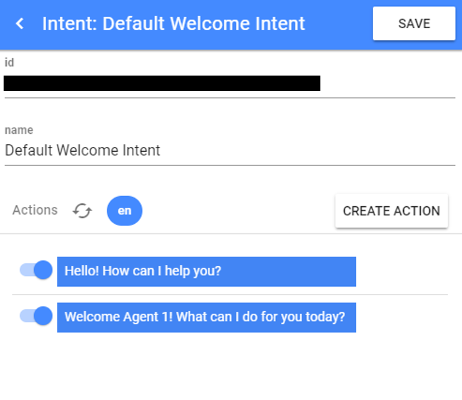
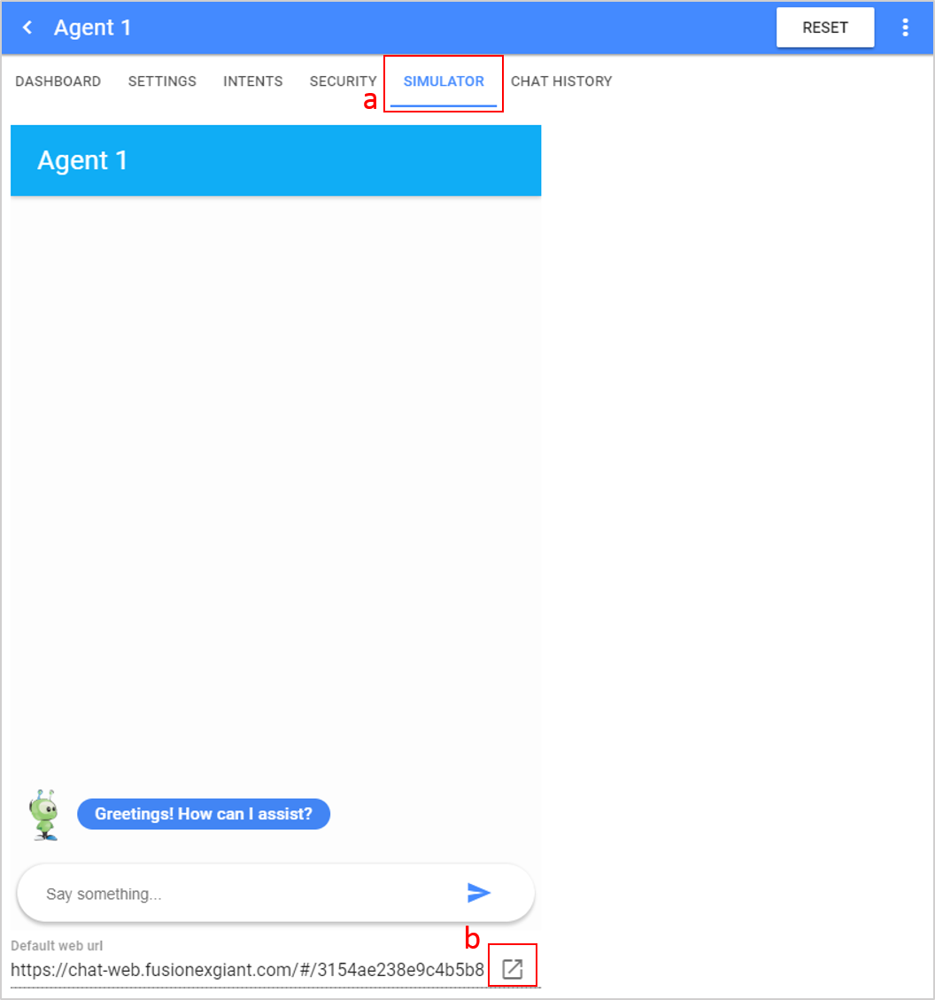
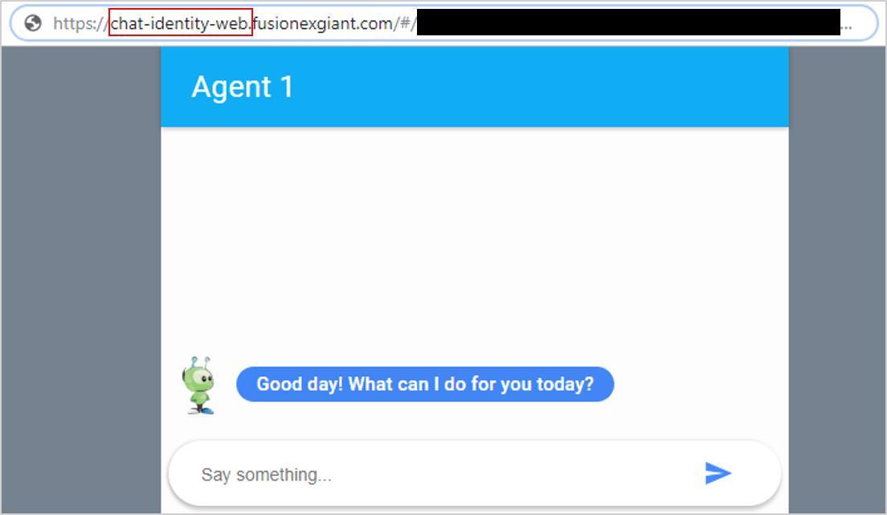
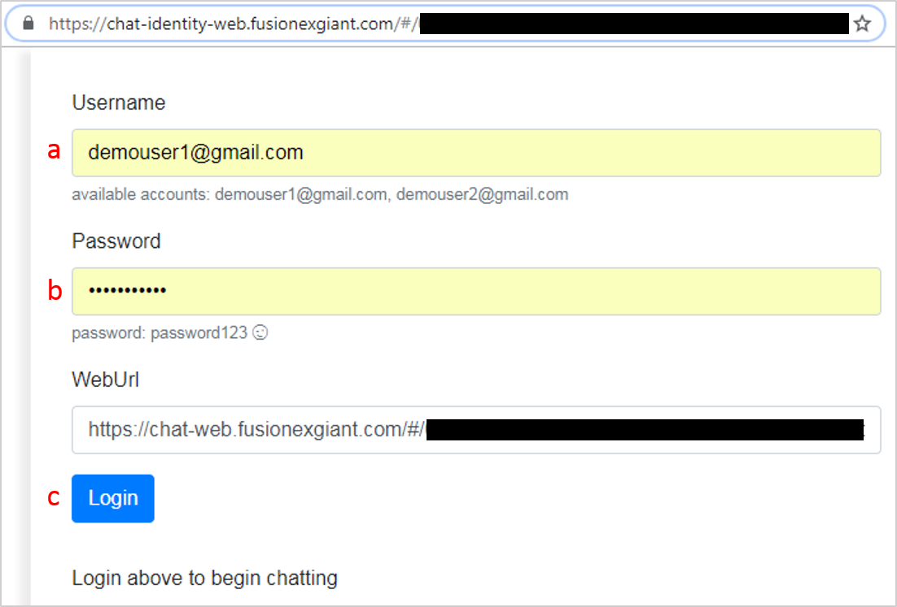
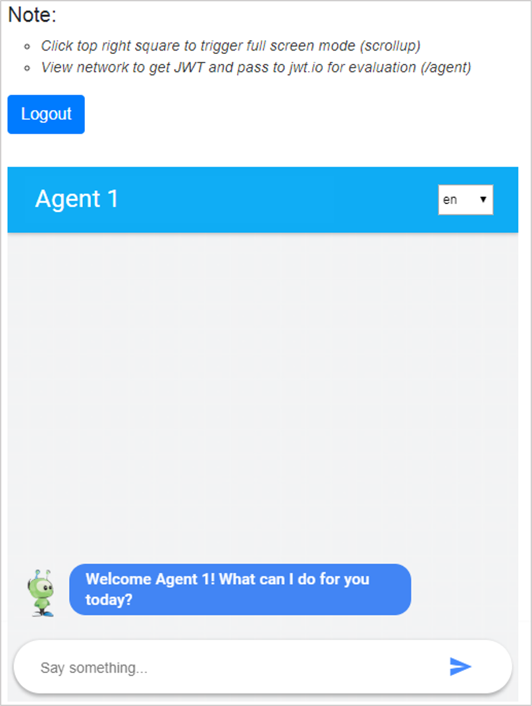
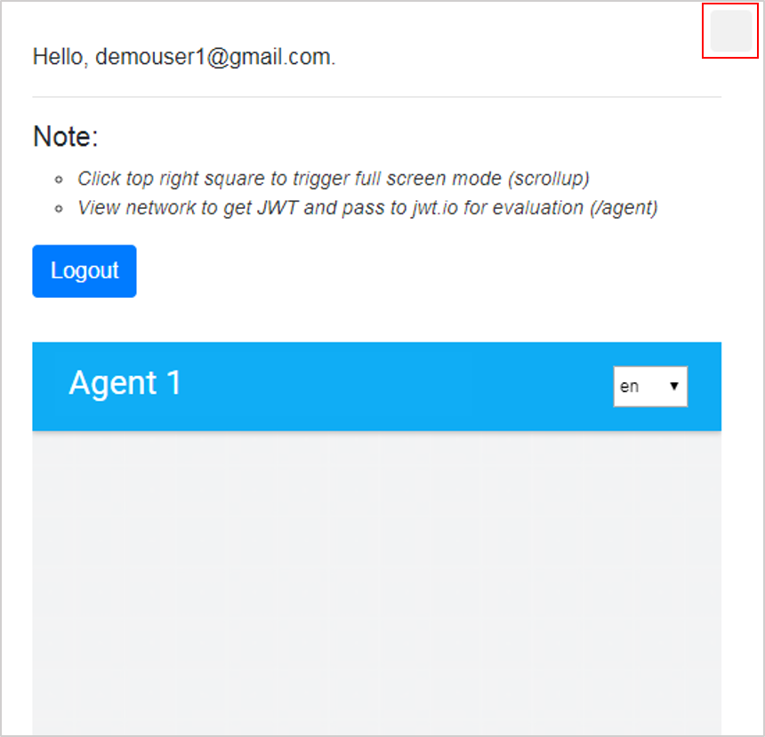

# Chatbot With Authentication

This is a feature related to the users' log in status. There will be cases whereby the chatbot needs to display different replies depending on whether the user is logged in during the chat session or accessing the chatbot as an anonymous user (non-logged in user). 

In this example, when the user is logged in, the bot will be able to recognize and greet the user based on his name. Whereas, when the user is not logged in, a generic Welcome message will be shown instead. The _Default Welcome Intent_ will be used to explain the entire setup.

### Pre-Requisites
1. Agent created in Dialogflow and linked to the chatbot agent in GIANT. The _Default Welcome Intent_ is available upon agent creation in Dialogflow.
2. A valid Username and Password are needed for the chatbot user login purpose. 

_Note: The value **jwt:sub** needs to be configured as the Intent Parameter value for the respective action/answer._

## Part 1: Setup in Giant

1. Click into the _Default Welcome Intent_ and add another response to show for a logged-in user. 
    

2. Configure the _Intent Parameter_ for the answer to show to a non-logged in user (i.e. _perform the action when **jwt:sub** is **not provided**_). 
    

3. Configure the _Intent Parameter_ for the answer to show to a logged in user (i.e. _perform the action when **jwt:sub** is **provided (any value)**_). 
    

## Part 2: Test Using the User Side Simulator

1. Click on the **Simulator** tab and access the **Default web url** in another browser tab. 
    

2. Amend the URL shown in the address bar by adding "**-identity**" between the word "**chat**" and "**-web**" for it to become **chat-identity-web**. 
    

3. The user login page will be shown. Key in the registered _Username_ and _Password_. Then, click on the _Login_ button. 
    

4. Upon successful authentication, the Chatbot will show the message configured for the logged in user. 
    

5. Scroll to the top and click on the square icon shown on the top right screen to launch the chat window in the full screen mode. 
    

