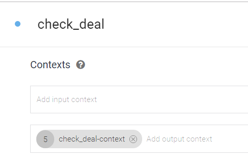
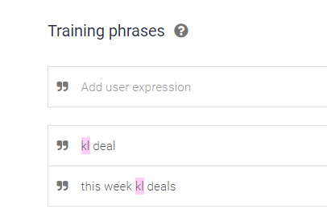
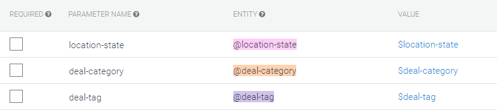
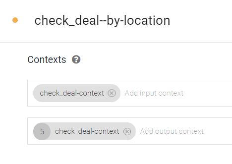
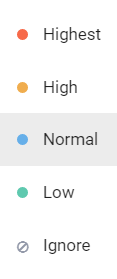
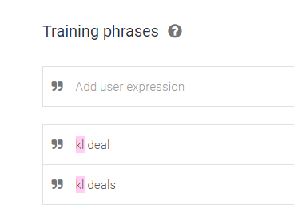
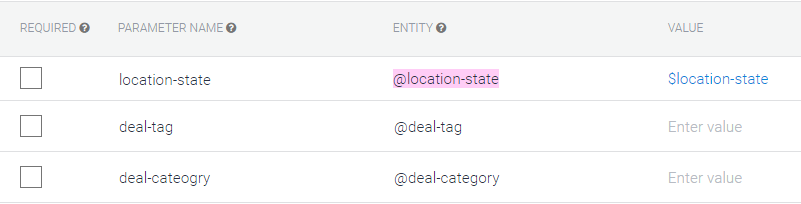

### Instruction on design of modifiers and its usage

* What is modifier intent?

Given an intent that allows the user to ask about weather. Let's say we want to modify its context parameters. We may use the same intent to modify it's own context but the issue would be that we either lose the previous context or we can't clear it at all. Therefore, the better solution would be to use modifiers.
Modifier intents are used to modify context of a base intent. For example, imagine your base weather intent is `check_weather`. Modifiers can be used to modify its context parameters such as `location`, `scale` and `date`.

* When to use it?

Imagine you have a base intent `check_weather`. By default, when users type `weather` they will get a weather forecast for their current location, current date and in Celsius scale.
But if you want to let users to modify their requests and search for `weather forecast in Penang next week`, you need to pass parameters into `check_weather` intent and process it.
But what if an user doesn't understand Celsius scale and wants to get a forecast in Fahrenheit scale?
The user will probably type something like `Fahrenheit` and expect it to be added as a parameter into the previous search `weather forecast in Penang next week`.
If we don't make use of modifiers here then the new request `Fahrenheit` will  actually override previous search and the user will see today temperature in KL in Fahrenheit scale. We don't want that, so we will add a new modifier called `check_weather-scale` to pass value `Fahrenheit` into the current `check_weather` context.

* How to use it?

1. First of all, we need to create a base intent, as an example, let's use another scenario and create an intent called `check_deal`.

2. This intent will have output context `check_deal-context` where we will pass current parameters and no input context as we don't want it to remember these parameters.

3. Assume we use `kl deal` and all similar training phrase to access this intent

4. We add 3 parameters for this intent `location-state`, `deal-tag` and `deal-category`. All of them have no default values.

If we will type `kl deal` now, we will get results for deals in KL, however, if we type `Shopping` after that, it will show shopping deals everywhere

5. Let's create a modifier and call it `check_deal--by-location`

6. This intent will have input and output context `check_deal-context`, so it could take parameters from `check_deal` and modify it.

7. Take a look at priority. We set the higher priority for this intent so that it could be triggered whenever it's possible over `check_deal` intent.

8. We set the same training phrase `kl deal` to trigger this intent.

9. Our modifier will also have 3 parameters: `location-state`, `deal-tag` and `deal-category`. However, this time around we will set default values for those parameters which we don't want to modify `deal-tag` and `deal-category`.

Our first modifier is ready... If we type `shopping` now, we will get shopping deals, and if we type `Kl deal`, it will modify the previous request and show us shopping deals in kl.
The other pros is that if we type `kl deal` first, it will trigger `check_deal` and not our modifier and will still work as expected.