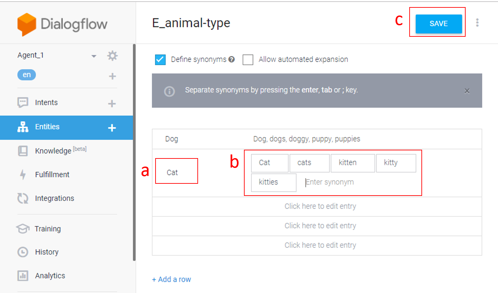
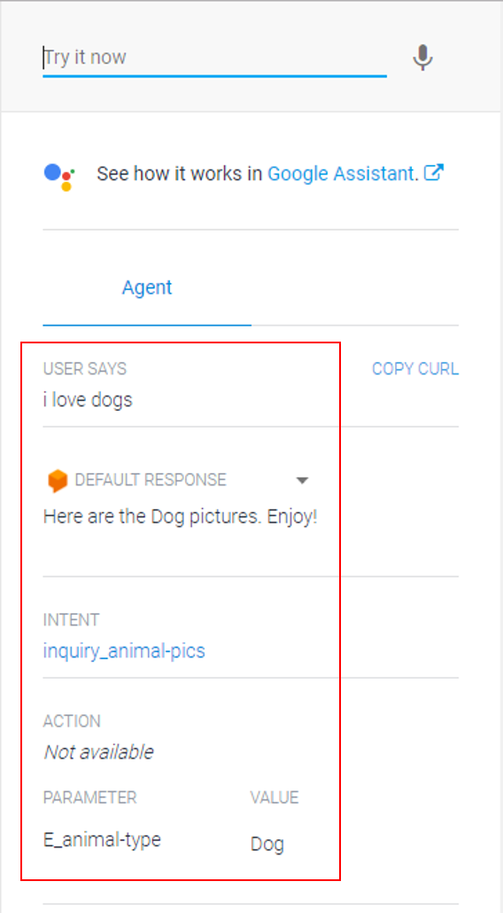
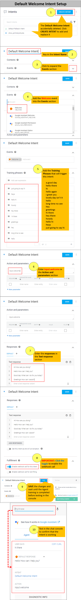
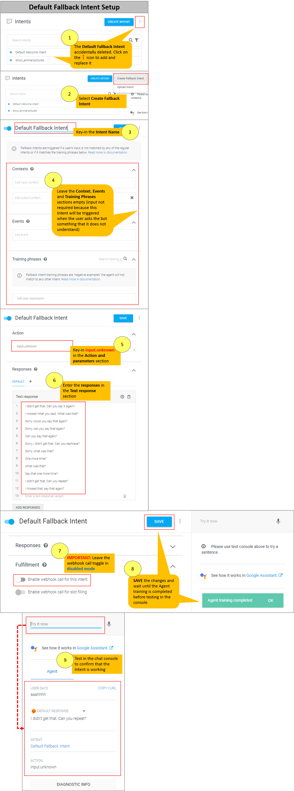

# Setting Up Chatbot Agent in Dialogflow

## Introduction

This guide provides instructions on how to:
- create a chatbot agent in Dialogflow
- create an Entity
- create an Intent

### Pre-Requisite
A Dialogflow account (required to setup the bot, Entities and Intents in Dialogflow). 

You can [refer here](./google-account-setup-in-dialogflow.md) for the steps on setting up your Google account in Dialogflow.

## 1.1 Creating a Chatbot Agent

1.	Login to Dialogflow at [https://dialogflow.com/](https://dialogflow.com/)
2.	Next, click on **Create Agent**. The **Create New Agent** screen will be shown.

	

3.	Key in a name for the Agent. Select the default language and time zone. Click on **Create** button.

4.	Once your agent is created successfully, you will be routed to the **Intents** list screen. There are two Default intents automatically created by Dialogflow shown in the screen. The name of your new agent is shown in the left panel.

	
 
5.	To change the name of your chatbot agent, click the cog icon. You can make the changes required in the next screen. Remember to click **SAVE** button to save the changes made.

	
    
6. Go back to the list of Intents by clicking on the **Intents** menu shown in the left panel. Note that there is a **test console** shown on the right side of the screen. Type in **hello** in the "Try it now" text field.

	

7. You can see that the **Default Response** from the **Default Welcome Intent** is returned. This shows that when the *User Says* matches with any of the Intent's **Training Phrase**, the bot will return the reply configured in the Intent.

	

## 1.2 Creating an Entity

You can use an Entity to group together several values that falls under the same category. This is useful when you want to manage responses to return to the user based on the value given by the user. For example, when the user says "I want to see dog pictures", the bot needs to show pictures of dogs to the user. Whereas, when the user says "I want to see cat pictures", the bot needs to show pictures of cats to the user. We can create an Entity called "E_animal-type" to manage these values and also assign synonyms to them.

*NOTE: To learn more on Entities, you can refer to Dialogflow’s documentation at [this link](https://dialogflow.com/docs/entities). Refer to the [Naming Convention](./naming-convention.md) document to get tips on the naming convention best practices.*

1. Click on the **Entities** menu shown in the left panel to go to the Entities screen.
2. From the **Entities** list screen, there are three ways for you to create an Entity:

	a)	Click on the **+** icon shown next to the Entities menu from the left panel

	b)	Click on the **CREATE ENTITY** button shown on top, right side of screen.

	c)	Click on the **Create the first one** link shown in the screen.
 
	 

3. The **Create New Entity** screen will be shown. Key-in a name for your entity.

	 

4. Next, fill-in the values and the synonyms for the entity. Once done, click **SAVE** to save the changes made.

	
    
5.	You will see the following notifications shown at the bottom, right side of the screen once you have saved the changes; beginning with “**Entity saved**”, followed by “**Agent training started**” and “**Agent training completed**”.

	

## 1.3 Creating an Intent

Intents are used to match the *User Says* with the Intent's Training Phrases. As a result, the corresponding response will be returned to the user. As the responses returned may also be based on certain values provided by the user, the Training Phrases in the Intents may contain Entities to manage the values.

For example, when the user says "I want to see dog pictures", the bot needs to show pictures of dogs to the user. Whereas, when the user says "I want to see cat pictures", the bot needs to show pictures of cats to the user. An Entity called "E_animal-type" is created to manage the values of "dog" and "cat". Entering the statement "I want to see dog pictures" as an Intent's Training Phrase enables the matching of the *User Says* with the Entity and Intent. The bot can then return the expected response based on these values. 

*NOTE: To learn more on Intents, you can refer to Dialogflow’s documentation at [this link](https://dialogflow.com/docs/intents). Refer to the [Naming Convention](./naming-convention.md) document to get tips on the naming convention best practices.*

1.	From the **Intents** list screen, there are three ways for you to create an Intent:

	a)	Click on the **+** icon shown next to the Intents menu from the left panel

	b)	Click on the **CREATE INTENT** button shown on top, right side of screen.

	c)	Click on the **Create the first one** link shown in the screen.
 
	 

2.	The **Create New Intent** screen will be shown. Key in a name for your intent. 

	*NOTE: As your Chatbot will contain many intents, it is advisable to assign **Intent Name** that matches with the user’s action or the action to be executed by the Intent e.g. “inquiry_animal-pics”, “get_animal-adoption-list”, "show_membership-form"*
 
	 
 
3.	Key in the different ways of user asking on or communicating regarding a topic in the **Training phrases** section. Note that the **Entity** is automatically detected based on the value entered in the Training phrase.

	 

4.	Add the reply in the **Responses** section. Then, click on **Save** button to save the changes made. 
 
	 

4.	You will see the following notifications shown at the bottom, right side of the screen once you have save the changes; beginning with “**Intent saved**”, followed by “**Agent training started**” and “**Agent training completed**” .

	

5.	Once the Agent Training is completed, you can try to ask a question or key in a statement in the **Test Console** based on the Training Phrase entered for the Intent created. When it matches with the Intent created, you can see the results returned in the Test Console.
	
    *NOTE: The Test Console helps you in identifying whether the Training Phrases (which corresponds to what the users are saying) can be matched to the correct intent. You may need to amend your Training Phrases if the user statements can’t be matched to the intended intent.*
    
	
    
    
## Pro Tips

Tips on things to do when things go wrong:

1. Check the documentation on debugging tips [here](./chat-simulator-debugging-tips.md) if your Agent, Intents or Entities are not working as expected.   

2. Ensure that the Intent's **webhook is enabled** after you make any changes to the Intent. Sometimes, it can get turned off somehow and this affects the results in Dialogflow's Test Console or GIANT's chat simulator.  

3. **Special note on Context** - the Intent that shows the parameter(s) collected from the previous Intent(s) needs to have the **webhook disabled** for the response configured in the Intent to show all parameters provided by the user. Refer to the documentation on [debugging tips](./chat-simulator-debugging-tips.md) for more details.  

4. If you **accidentally deleted** the **Default Welcome Intent** and **Default Fallback Intent** which were automatically created by Dialoglow when you created your agent, just add a new Intent with the same name to replace the Intent that you deleted. You can refer to the images below on the required configuration for the default intents. To know more on the default intents, refer to Dialogflow documentation [here](https://dialogflow.com/docs/intents/default-intents).

	

	
