# Setting Up Chatbot Agent in GIANT

## Introduction

This guide provides instructions on how to:
- create a chatbot agent in GIANT
- link GIANT chatbot agent with Dialogflow's agent
- linking Intents to GIANT chatbot agent

### Pre-Requisite
1. GIANT account with form **Conversation Flow** access.
2. You **MUST** have a Chatbot agent set up in Dialogflow before proceeding with the steps below.

You can [refer here](./setting-up-chatbot-agent-in-dialogflow.md) for the steps on setting up a chatbot agent in Dialogflow.

## 1.1 Creating an Agent

1. Launch the browser and log in into GIANT. Access the **Conversation Flow** main screen by clicking on **My Form(s)** menu in the left panel, followed by **All Form(s)** menu. Then, click on Conversation flow's **VIEW FORM** button.

2. Click on **Create a new agent**.

   *NOTE: Please contact GIANT Administrator if you are unable to see the **Create new agent** button in the screen. Your account permission needs to be configured to enable your access to this feature.*
    
   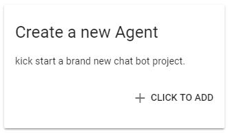
     
3. The **Create New Agent** screen will be shown. Fill-in the following mandatory info in the screen:

   a) Agent ID

   b) Display Name

   c)Dialogflow Credentials

   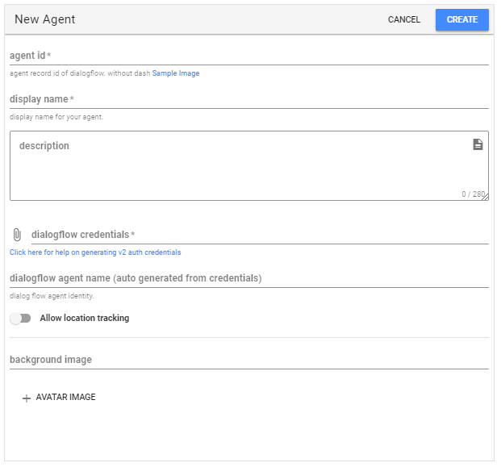

   Refer to the steps below for information on how to fill-in the above mandatory information:
    
   **a) Agent ID**
    
        i. To get the Agent ID, go to Dialogflow screen and access the agent that you want to link in GIANT.
	   Click on on the triangle icon (shown next to the agent name), then click on "View all agents".
        
      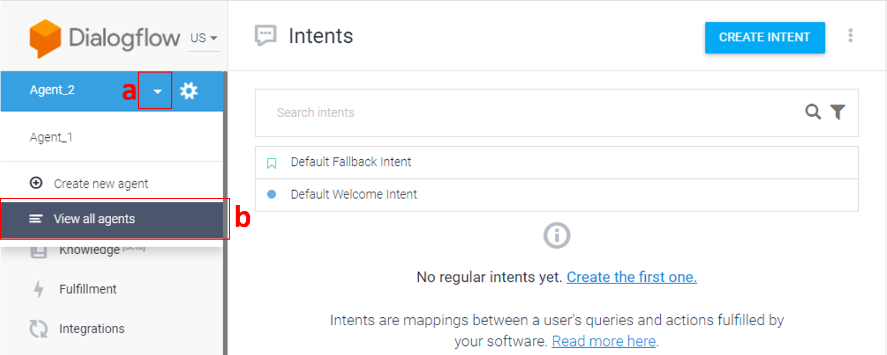

        ii. All the chatbot agents that you have access to will be shown in the next screen.
	    Press F12 to launch the browser's developer console.
	    Switch to "Network" tab, then click on "XHR" tab.
	    
      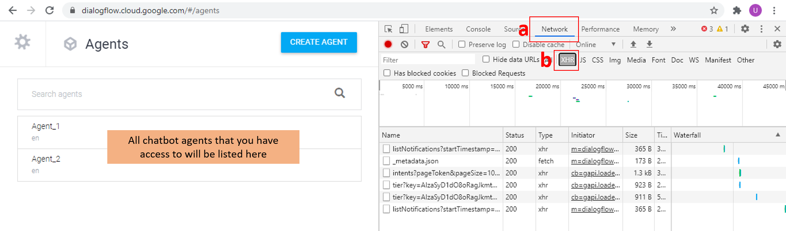
	
        iii. Press "Clear" icon to clear the request items from the list.
	     Click in the agent list window, then press F5 to load the list again.
	     The request items will be loaded again in the console.
      
      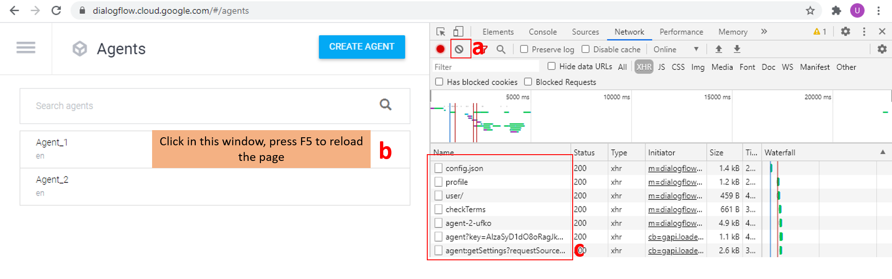	     

        iv. Click on "agent:search?requestSource=DIALOGFLOW_CONSOLE......." request item.
	    Then, click on Preview tab. Under the list of agents, locate your chatbot agent name and expand the item.
	    The Agent ID is available here.
	    
      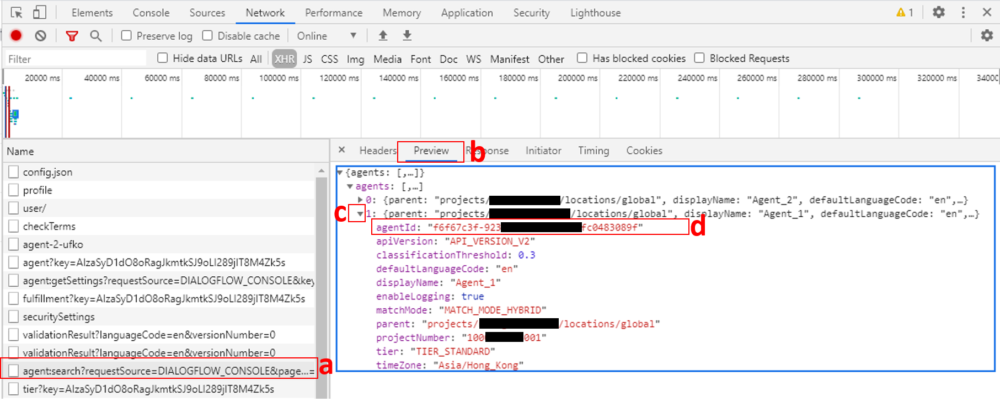	    
	
        v. Copy the Agent ID from the console into the Agent ID field in GIANT EXCLUDING the “-” available in the original Dialogflow’s Agent ID. For example:

			Dialogflow Agent ID: a23dfc353-62df-47f9-bad5-1bd432e0cd33
			ID to copy into GIANT: a23dfc35362df47f9bad51bd432e0cd33
    
   **b) Display Name**
    
        This refers to the Name that you want to assign to your chatbot agent
        
   **c) Dialogflow Credentials**
    
        i. To get the Dialogflow Credentials, go to Dialogflow screen and access the agent that you want to link in GIANT. 
	   Click on the cog icon shown next to your agent’s name.
        
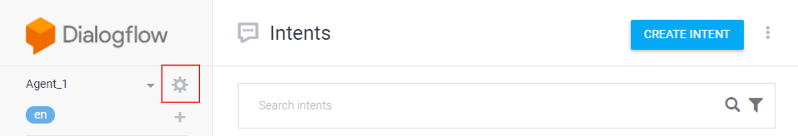

        ii. The Edit Agent screen will be shown. Click on the hyperlink shown next to the Service Account field. 
        
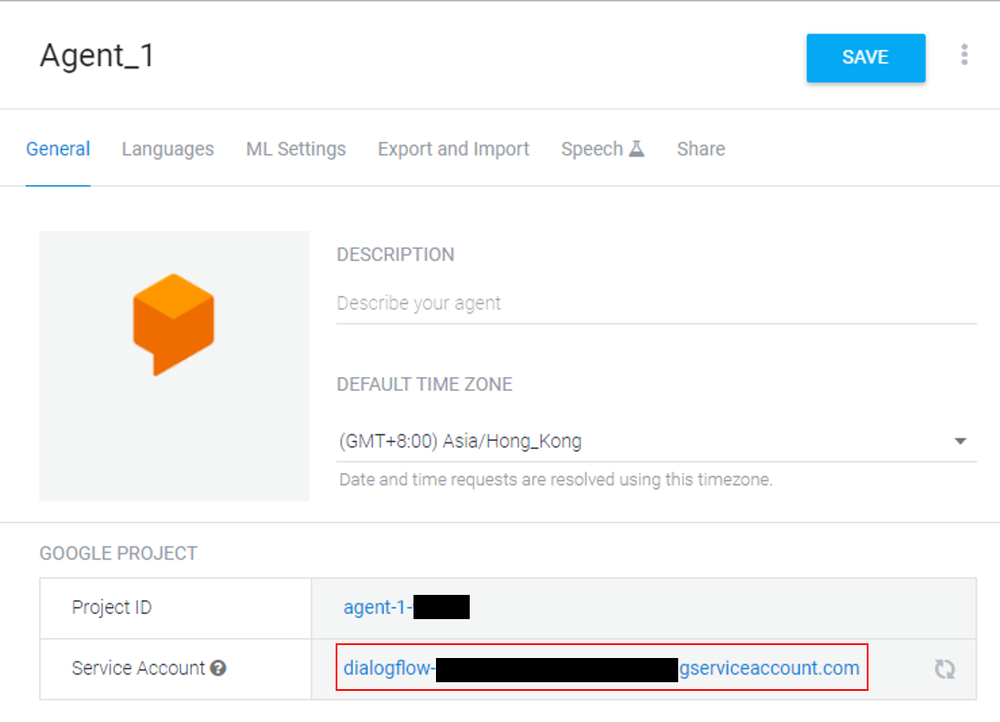
 
        iii. You will be routed to a new tab or new window. Accept the Terms of service to proceed. 
        
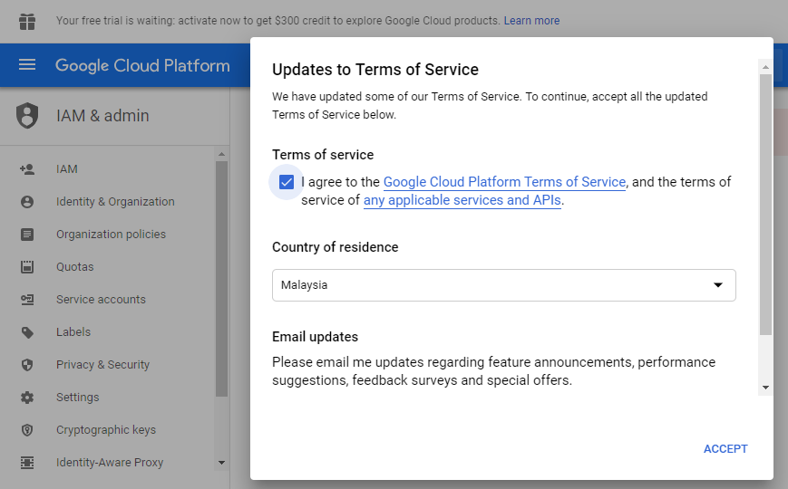
 
        iv. Click + Create Service Account button shown on the top of the browser.
        
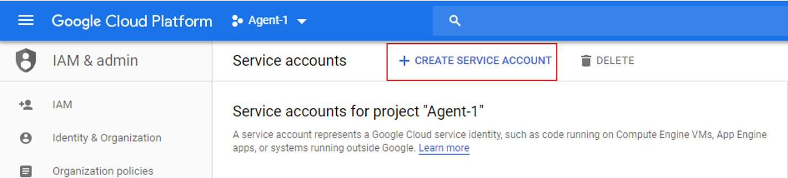

        v. You will be routed to the Create Service Account screen. Key in the name for the Service Account. Then, click on CREATE button.
        
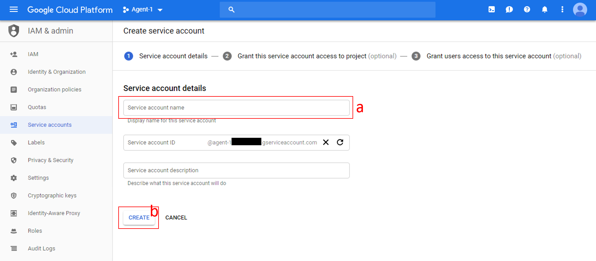
 
        vi. Next, assign the role "Dialogflow API Admin" to the Service Account. Then, click CONTINUE button to proceed. 
		
*NOTE: Please ensure that you have sufficient role **(Project IAM Admin)** within the GCP project to create the required service account and configure service account role. Please contact GIANT Administrator if you are unable to configure service account role. Your account permission needs to be configured to enable your access to this feature.*
        
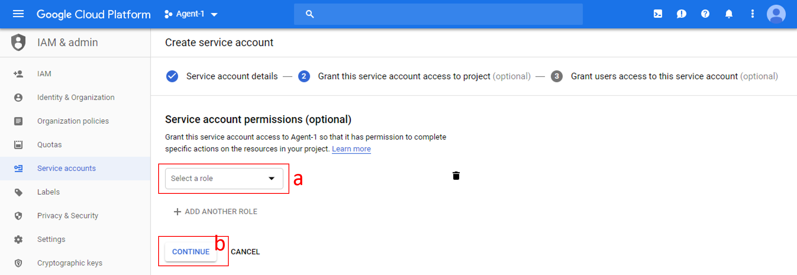
 
        vii. Click on + CREATE KEY button. (If Keys already exist, click on EDIT, then click on + CREATE KEY button.)
        
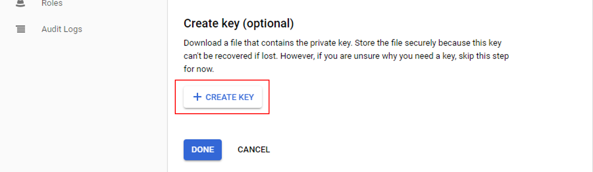
        
        A panel will be shown on the right side of the screen. Select the Key Type “JSON”, then click on CREATE button. The JSON file will be downloaded to your machine.
        
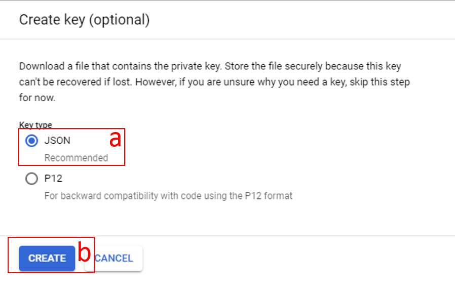
 
        The following message is shown once the JSON file is generated and downloaded to your machine.
        
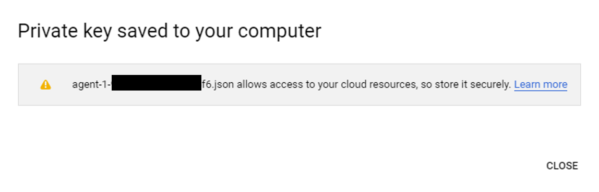 

        viii. Go back to GIANT’s Create New Agent screen. Click the attachment icon shown in the dialogflow credentials field in GIANT and attach the JSON file.
        
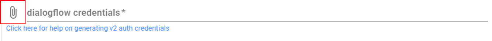
    

4. Click on **CREATE** button on the top right.

   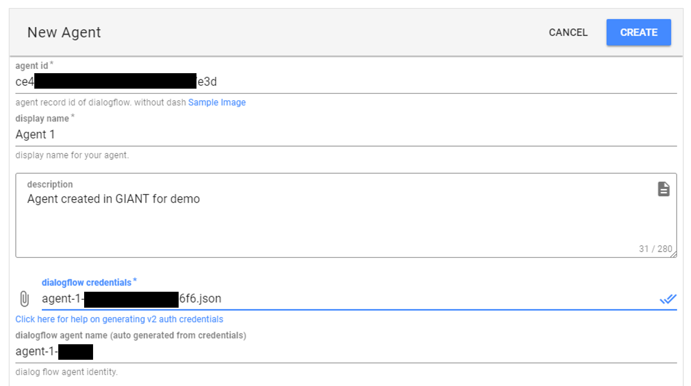

5. Once your agent is created in GIANT, you will be routed to the agent’s **Setting** screen.

   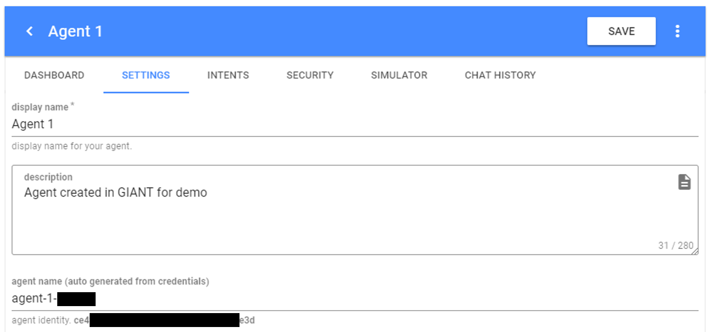
    
6. Click on the **INTENTS** tab. You should see a list of intents *exactly* as per the Intents listed in the Dialogflow agent's Intent screen. This indicates that the agent setup is successful.

   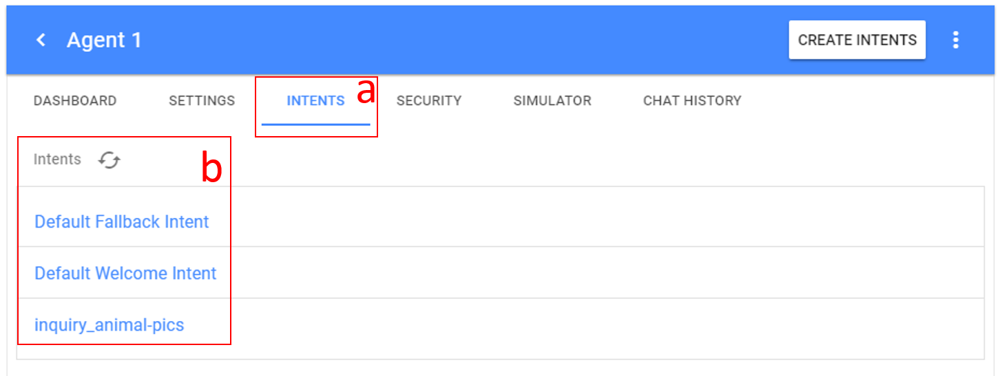

## 1.2 Linking GIANT Chatbot Agent with Dialogflow's Agent

1. Access your GIANT chatbot agent’s **Setting** screen
2. Scroll down to the section that displays the **Dialogflow webhook URL** information. Copy the URL shown in this field.

   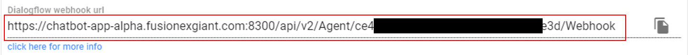
 
3. Go to the Dialogflow screen and access the agent that you want to link with GIANT.  
Click on the **Fulfillment** menu. The Fulfillment main screen will be displayed.

   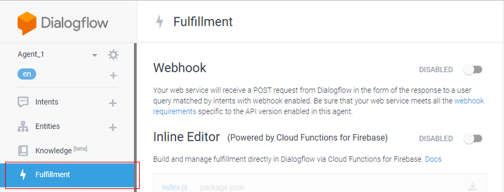

4. Click on the toggle to **enable the Webhook URL**.

   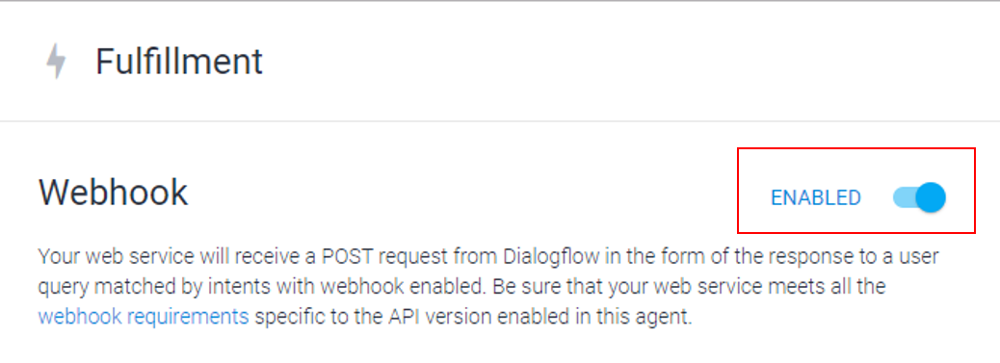

5. **Paste the URL** copied from GIANT’s chatbot agent Setting screen in Step 2 into **Dialogflow’s Webhook URL** field.
 
   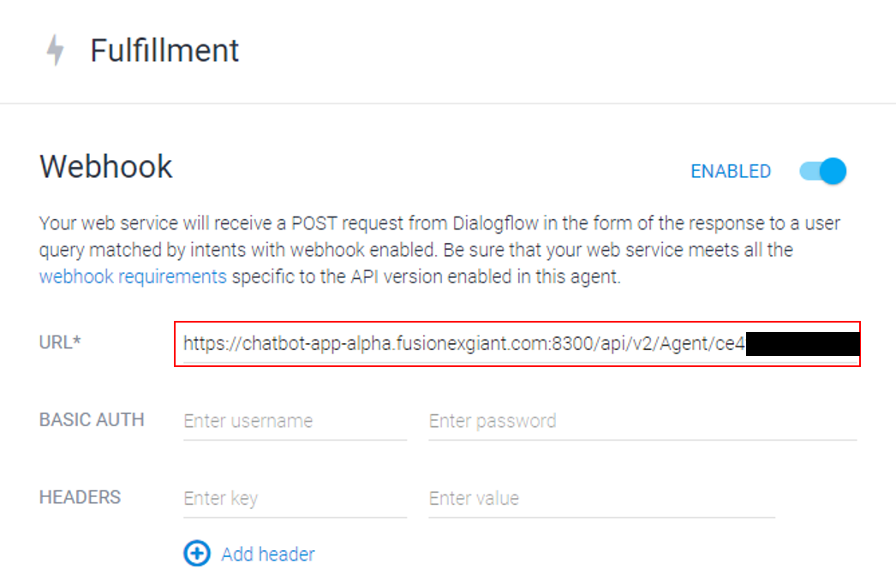
 
6. Next, go back to GIANT’s chatbot agent **Setting** screen. Click on the **Security** tab.

   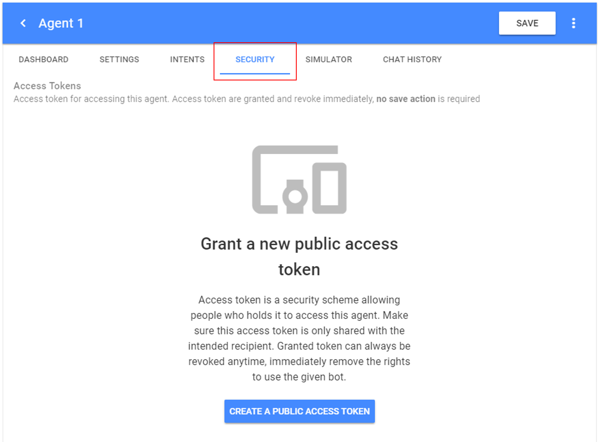

7. Click on the **CREATE A PUBLIC ACCESS TOKEN** button. Then, **copy the token** generated in the screen.

   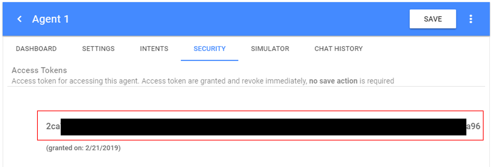

8. Go back to the agent’s **Fulfillment** screen in Dialogflow. Enter the word **“authorization”** in the **HEADERS** field, followed by **“Bearer[space]GIANT Access Token”** copied in Step 7. Scroll down the Fulfillment page and click on **SAVE** button to save the changes made.

   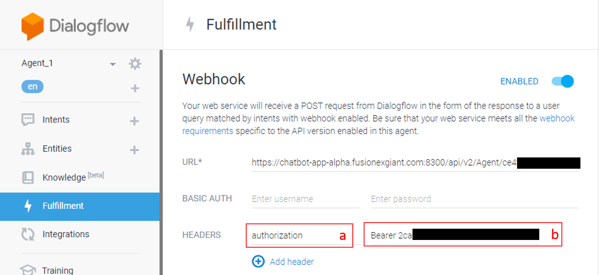

## 1.3 Linking Intents to GIANT Chatbot Agent

To enable you to manage the responses for the Intents created in Dialogflow from GIANT, perform the steps below to link the Intents you created in Dialogflow with the GIANT chatbot agent. After that, you can manage the responses to display for the Intents from GIANT.

1. Access the agent in Dialogflow that you have linked to GIANT.
2. Click on the **Intent** that you want to link with GIANT.

   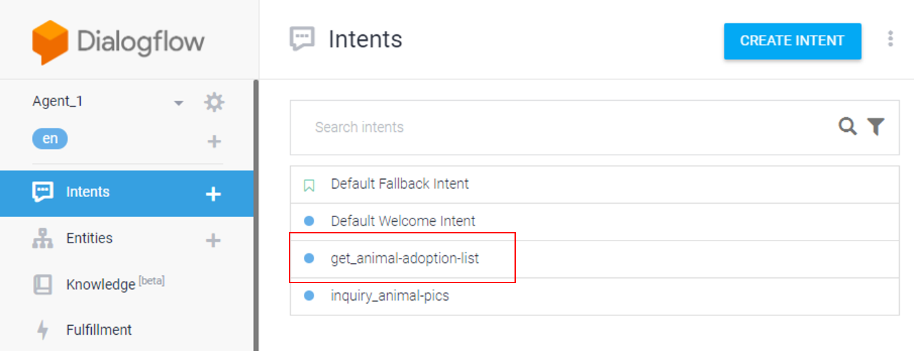
 
3. The selected Intent will be displayed in edit mode. Scroll down to the **Fulfillment** section. Click on the arrow icon to expand this section. Then, click on **ENABLE FULFILLMENT** hyperlink.

   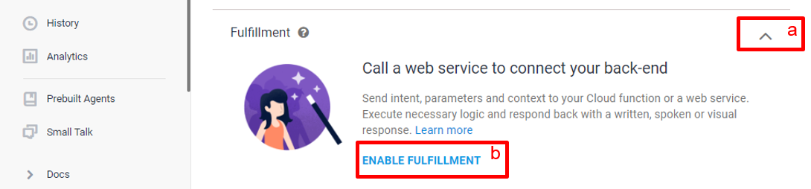

4. Click on the toggle to **enable the webhook call** for the Intent. Click **SAVE** button to save the changes made. 

   *NOTE: You can also enable the intent’s webhook the first time that you create the intent. **THIS IS AN IMPORTANT STEP**. If the webhook is not enabled, it might be one of the reason(s) that you fail to get the expected response to show in the chat simulator*
    
   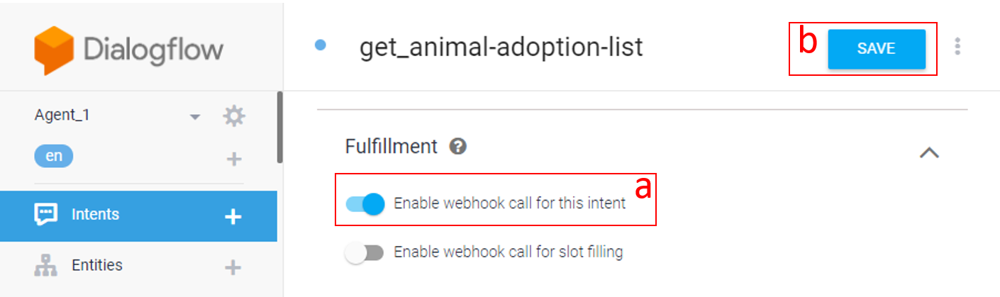
 
5. Go back to the agent that you setup previously in GIANT. When you click on the **INTENTS** tab, you will be able to see all the Intents that you created in Dialogflow displayed in the screen. To refresh the list, you can click on the **Refresh** icon shown next to the Intents label.

   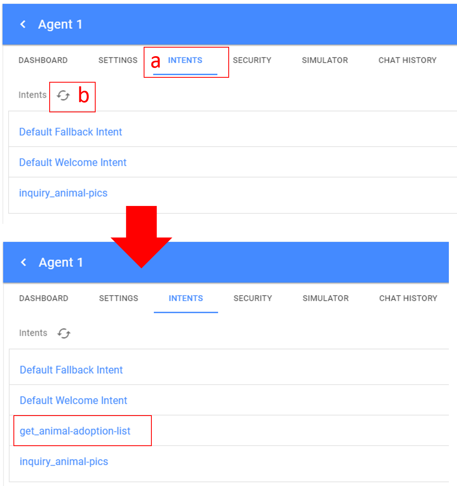

6. You can now proceed with managing the responses for the Intent from GIANT.

## Pro Tips

Tips on things to do when things go wrong:

1. Check the documentation on debugging tips [here](./chat-simulator-debugging-tips.md) if your Agent, Intents or Entities are not working as expected.   

2. Ensure that the Intent's **webhook is enabled** after you make any changes to the Intent. Sometimes, it can get turned off somehow and this affects the results in Dialogflow's Test Console or GIANT's chat simulator.  

3. **Special note on Context** - the Intent that shows the parameter(s) collected from the previous Intent(s) needs to have the **webhook disabled** for the response configured in the Intent to show all parameters provided by the user. Refer to the documentation on [debugging tips](./chat-simulator-debugging-tips.md) for more details.  

4. If you **accidentally deleted** the **Default Welcome Intent** and **Default Fallback Intent** which were automatically created by Dialogflow when you created your agent, just add a new Intent with the same name to replace the Intent that you deleted. You can refer to the Pro Tips section [in this document](./setting-up-chatbot-agent-in-dialogflow.md) for the detailed steps. To know more on the default intents, refer to Dialogflow documentation [here](https://dialogflow.com/docs/intents/default-intents).

5. If you **accidentally deleted** any of the intents in GIANT, you can click on the **Refresh** icon. GIANT will update the Intent List and include the deleted Intent by getting it from Dialogflow. After that, you need to **reconfigure the response** for the intent. However, if the intent is deleted both at Dialogflow and in GIANT, you will first need to recreate the intent in Dialogflow before refreshing the Intent List in GIANT.

   

6. You also need to refresh the Intent List in GIANT after you created any new Intents in Dialogflow. Newly-added Intents in Dialogflow **will not automatically appear** in GIANT's Intent List.

   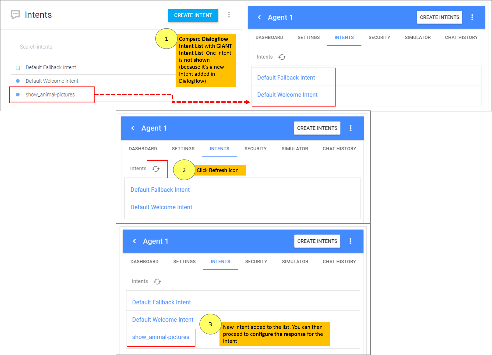

7. Ensure that all the parameters in RICH TEXT RESPONSE action for the intents in GIANT are get the parameter by adding a `$` infront. At the same time, ensure the parameter is configured in Dialog Flow parameter.

>> Sample Configuration:

>- Parameter Name in Dialog Flow: `package-type` 
  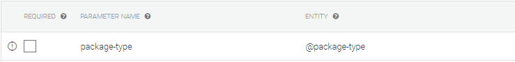
>- Way to get parameter in GIANT Intent Response: `$package-type`
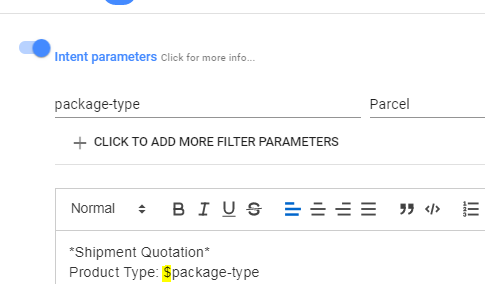

8. If you would like to configure the default value for specific parameter when user's answer hit specific intent's, you will need to create an event action in GIANT intent with specific condition to fullfill.

>>8.1 Create EVENT action in GIANT Intent

>>8.2 Add in conditions required to meet based on parameter (optional)

>>8.3 Configure follow-up event based on which follow-up event you wanted to attach to.

>>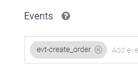

>>8.4 Configure parameter name and default value.

>>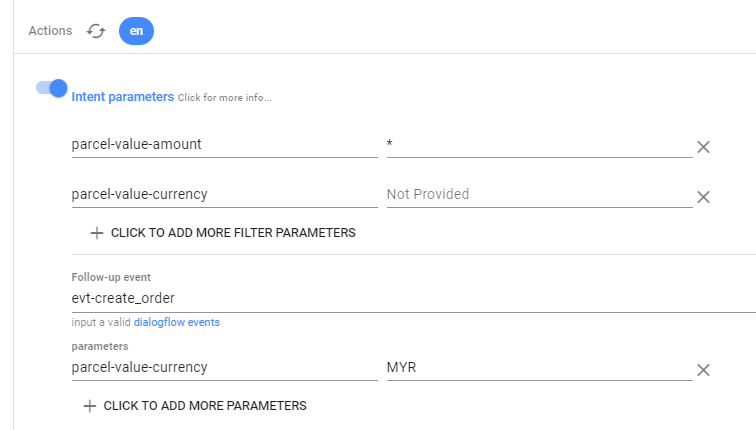
