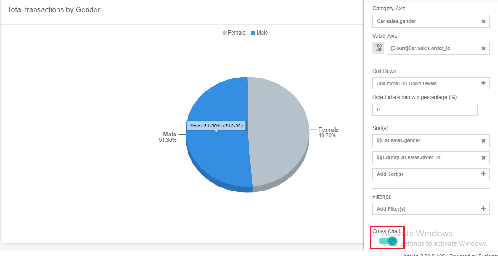

# Analyse using top 10 and cross chart with GIANT 

## Introduction
This guide is to show you top 10 and cross chart functions in GIANT and how to use it to show top 10 products in your analytics works. This guide includes:
- How to create a pie chart for category and a data matrix for top 10 products
- How cross chart function aids the analysis of top 10 products in each category

### Prerequisite
* Have an account to access to GIANT
* A data source to use for visualization

## Uploading Source to GIANT and creating a Dashboard
1. In case you are new to Giant, refer to [GIANT for beginner](https://github.com/fx-giant/giant-documentations/blob/master/giant/giant-for-beginner.md) to know how to upload source, create a dashboard and charts in GIANT
2. Download `sample_data.csv` in sample-data\analysing-using-top-10-and-crossfilter, then upload it in GIANT
3. Create a dashboard with the name: Use cross filter to aid top 10 products analysis in GIANT

### Background

Company A is a selling-car company. Company A wants to know top 10 purchased cars among male and female customers.

### Determine total Transactions by Gender

Company A wants to know top 10 purchased cars among male and female customers. To visualise this, a Gender pie chart can be created to get a clear view on total transactions by gender

1. Click on `Add` icon then choose `Pie` chart icon and click `Source` icon. Name the pie chart as "Total transactions by Gender"

    

2. Select uploaded `sample_data.csv` from `Connection Source Seletion` and click `Proceed` icon.
3. In `Setting` area, select "gender" for `Category-Axis` and `Count` of "order_id" for `Value-Axis`. The "Total transactions by Gender" pie chart is created.

    

4. In `Setting` are, scroll down and make sure `Cross Chart` function is on (As showed in the screenshot).
5. Click `Save` and choose "Use cross filter to aid top 10 products analysis in GIANT" dashboard to save the pie chart.

### Display top 10 purchased cars information

A data matrix is created to display information of top 10 purchased cars which have the highest number of transactions.

1. Click `Add` icon, select `Data Matrix` icon and click `Source` icon. Name the data matrix as "Top 10 purchased cars information".

    

2. Choose `sample_data.csv` and click `Proceed` icon.
3. Under `Column(s)` section, click `Add Dimentions(s)` and choose "car_maker" column. Rename it as "Car Maker" and click `Apply`.

    

4. Choose "car_model" as another dimension
5. Click `Add Measurement(s)` and choose "car_id" column. Rename it as "Total Transactions" and click `Apply`.
6. Under `Sort(s)`, drag `[Count]sample_data.car_id` to first position. The click it and choose `Descending`. The data matrix will display information of car with the highest number of transactions first.

    

7. The data matrix displays the information of all cars, to displays only 10 cars, use `Top` function. Under `All/Top/Bottom`, click `All` and choose `Top`, enter 10 as value and click `Set`. Now 10 products are displayed in the data matrix. 

    

### Use cross filter function to aid the analysis

In the dashboard, top 10 purchased cars information of both male and female can be seen 

`Cross Chart` function is useful now for visualising top 10 purchased cars among male customer. In the pie chart, click Male segment to see the "magic" of `Cross Chart` function

By choosing the gender segment in pie chart, you can visualise 10 top cars for Male, Female or both.

After reading this documentation, you now know how `Cross Chart` and `Top` functions work. It's your turn to practice and use these function on your analysis.