## Advanced Embed

Advanced Embed is used when you want to restrict the data based on the parameters you set. The example use case I will be using is with stationary sales.

<<<<<<< HEAD
    When you have a dashboard that showcases the sales from the same company within different regions, you need embeded links to showcase the sales to specific branches within those regions. It does not make sense to show a branch within the east region the sales of the west region because they wouldn't be interested in the information. Thus we use advanced parameters to show our targeted user information they would be interested in. I will be using more examples such as items and time to showcase the filtering system of advanced embedding.

## Filtering by region

Proceed with Advanced embedding by clicking on the **Proceed to Advanced Embed Configuration** button.
=======
> When you have a dashboard that showcases the sales from the same company within different regions, you need embeded links to showcase the sales to specific branches within those regions. It does not make sense to show a branch within the east region the sales data of the west region because they wouldn't be interested in the information. Thus, we use advanced parameters to show our targeted users information they would be interested in. I will be using more examples such as item type and time to showcase the filtering system of advanced embed.

## Filtering by Region

Proceed with Advanced Embedding by clicking on the **Proceed to Advanced Embed Configuration** button.
>>>>>>> 45142919fbe4da0e1babbc1f9bc9dabf4c476f7d

A pop-up window should appear. Click on the **add** button to start setting your parameters.

First, fill in the **Filter Name**. In this case I want to filter by region to showcase info for the specific region I want.

<<<<<<< HEAD

Select your column you are filtering in order to generate the **Embed url**. In this case it is region because that is what we are filtering by.

Click the **generate** button to proceed with your advanced embedding.

The advanced embed URL's will then be generated based on the parameters you chose. In this case we have 5 regions to show, thus there are 5 embed links to show data specified to each region because that is what we chose to filter by. Copy and paste this link into your browser to view the dashboard with the given parameters.

From the dashboard, the charts will be shown when you access the Advanced Embed URL. Data availability depends on the advanced embed parameters you set for the dashboard.

### Dashboard

### Embedded Dashboard given links

As you can see, all the charts have changed to show the given info only in the **West region** based on the filtering we chose of our advanced parameters. The other embedded links will show the information displayed on the charts within different regions. 

## Filtering by region & item

If your targeted audience only wanted to see data relative to a specific region and a specific item being sold, they would filter like this:

When adding a new advance parameter, you add your **Filter Set Name** according to everything you want to filter by. In this case it is both Item and Region.

Since your filtering by item now, you have to add a parameter to filter by the item you want your targeted audience to view. In this case we want the audience to view data linked to erasers only. We choose the column (item) and the parameter which is our chosen column and the Default value which is the item we want to filter by.

After this, create unique URL's by value to get your embedded links. Since we want to filter by region first we choose to create urls filtered by **region**.

Do not forget to click the **generate** button!

This gives us the 5 embed links that is filtered by regions. Each link is specified to different regions but only includes data about erasers being sold.

The normal dashboard before shows us the original data. The embedded dashboard shows us data filtered by the west region and by the item erasers. If our targeted audience was a branch store in the west and only cared about the sales of erasers, we would provide them this embedded link.

### Dashboard

### Embedded Dashboard given links

## Filtering by region, item & month

When adding an advanced embed, since we are filtering by region item & month, we want to fill in the **Filter Set Name** by our given filters.

Add your parameter by what item you want to filter by. In this case we want to filter by erasers only.

Since we want to filter by month we have to add a constant value. In this case if our targeted audience only wanted to see data from January to September, we would filter it by choosing the column **Month** and filtering it so it does not include data from Oct, Nov and Dec.

Because we are filtering by region also, we want to create unique URL's by the column **Region**.

This specific embed link shows only data linked to erasers for the branch in the west region given data in the time period of January to September. As you can see by the *Dashboard* and *Embed Dashboard* the data is clearly different given the filters we chose. This embed link would be provided to an audience who would only be interested in data of overall sales of erasers in the west region within the time period of January to September.

## Dashboard

## Embedded Dashboard

=======
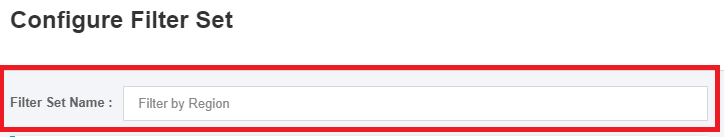

Select the column you are filtering in order to generate the **Embed url**. In this case, it is "Region" because that is what we are filtering by.

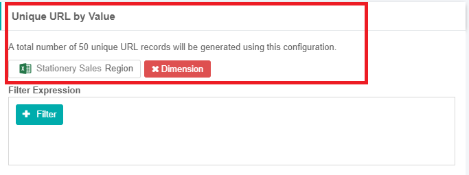

Click the **generate** button to proceed with your advanced embedding.

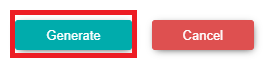

The advanced embed URL's will then be generated based on the parameters you chose. In this case, we have 5 regions to show (North, South, East, West, Central). Thus, there are 5 embed links to show data specific to each region because that is what we chose to filter by. Copy and paste this link into your browser to view the dashboard with the given parameters.

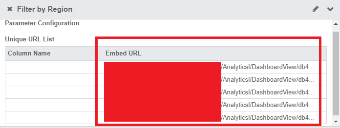

The charts from the dashboard will be shown when you access the Advanced Embed URL. Data availability depends on the advanced embed parameters that you set for the dashboard.

### Data as Viewed in Dashboard

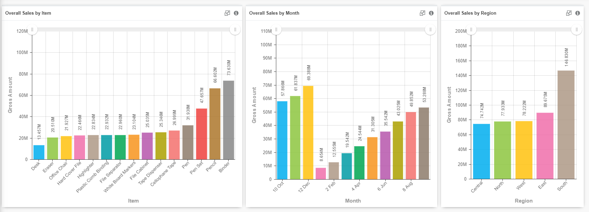

### Data as Viewed via Advanced Embed Links

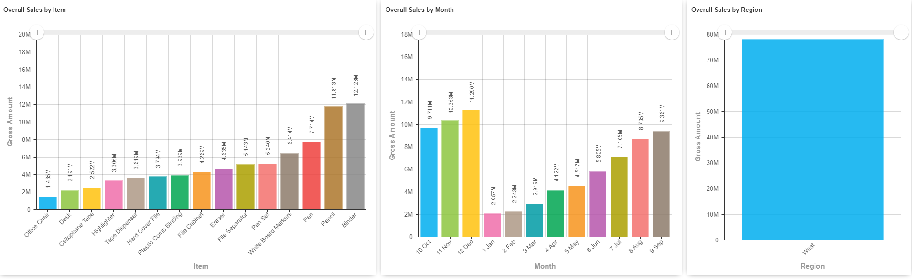

As you can see, all the charts have changed to show the given info only in the **West region** based on the filtering we chose of our advanced parameters. The other embedded links will show the information displayed on the charts within different regions. 

## Filtering by Region & Item

If your targeted audience only wants to see data related to a specific region and a specific item being sold, they can configure the filters like this:

When adding a new advanced embed parameter, add your **Filter Set Name** according to everything you want to filter by. In this case, it is both Item and Region.

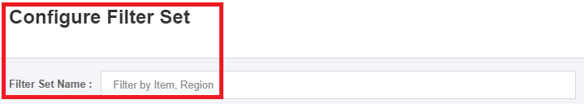

Since you need to filter the data by item, you have to add a parameter to filter by the item you want your targeted audience to view. In this case, we want the audience to view data related to "Erasers" only. We choose the column (Item) and the parameter (which is our chosen column) and the Default value (which is the item we want to filter by).

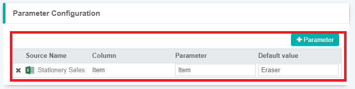

After this, create the unique URL's by value to get your embedded links. Since we want to filter by region, we choose to create URLs by **region**.

Do not forget to click the **generate** button!

This gives us the 5 embed links that is filtered by each region (North, South, East, West, Central). Each link is specified to different regions but only includes data about erasers being sold.

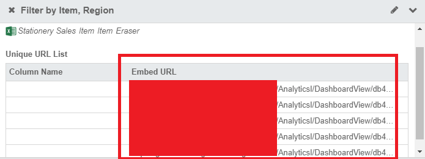

The normal dashboard before shows us the original data. The embedded dashboard shows us data filtered by the west region and by the item erasers. If our targeted audience was a branch store in the west and only cared about the sales of erasers, we would provide them this embedded link.

### Data as Viewed in Dashboard

### Data as Viewed via Advanced Embed Links

## Filtering by Region, Item & Month

When adding an advanced embed filter set, since we are filtering by region, item & month, let's fill in the **Filter Set Name** by the given filters.

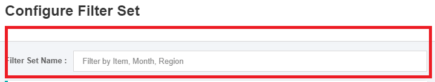

Add your parameter by what item you want to filter by. In this case, we want to filter by "Erasers" only.

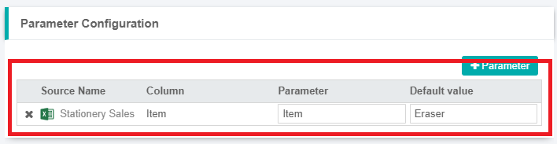

Since we want to filter by month, we have to add a constant value. In this case, if our targeted audience only wants to see data from January to September, we would filter it by choosing the column **Month** and add a filter condition to exclude data from Oct, Nov and Dec.

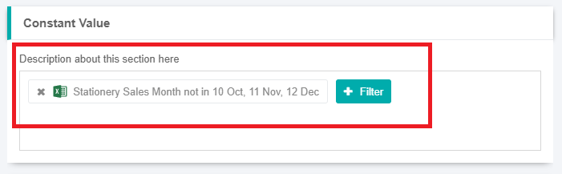

Again, we are filtering the data also by region. Hence, we want to create the unique URL's by the column **Region**.

The advanced embed links shows only data linked to "Erasers" for the time period of January to September, restricted by each Region (North, South, East, West, Central). As you can see, data shown on the actual *Dashboard* and via the *Embed Dashboard* links is clearly different given the filters we chose. The embed link would be provided to an audience who would only be interested in data of overall sales of erasers in the selected region within the time period of January to September.

## Data as Viewed in Dashboard

## Data as Viewed via Advanced Embed Links

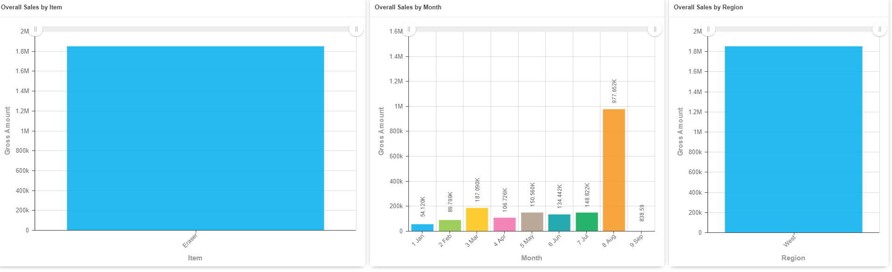
>>>>>>> 45142919fbe4da0e1babbc1f9bc9dabf4c476f7d
