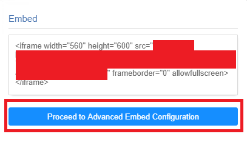
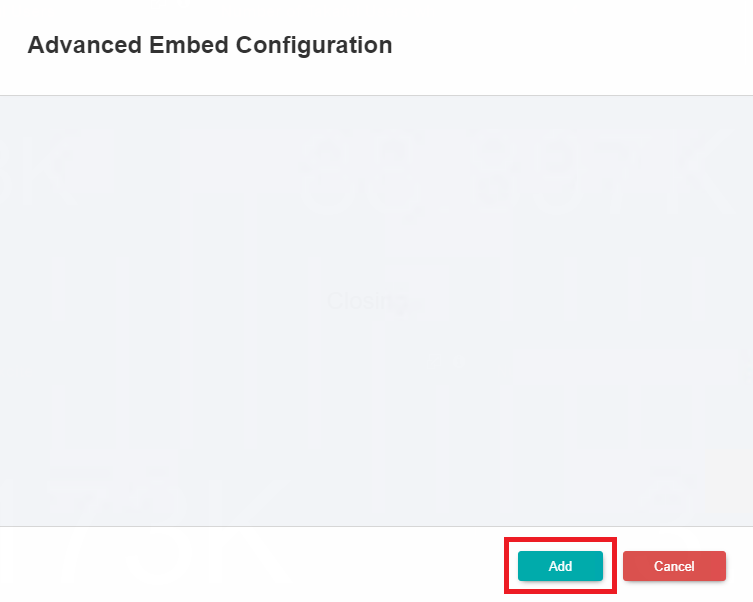
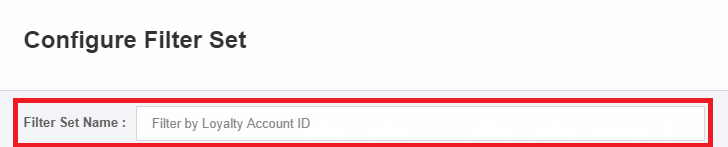
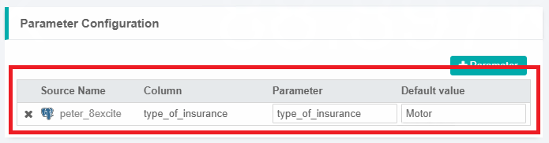
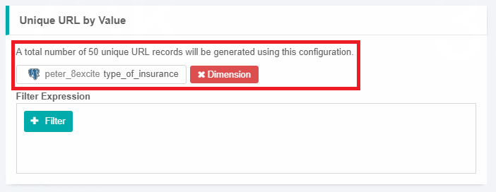
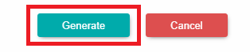
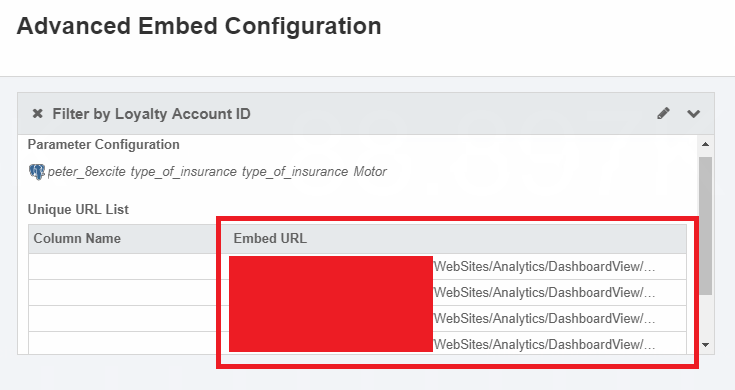

# Embedding GIANT Dashboards or Charts

Embedding is the basically getting the link of your dashboard or chart, then using the link at a third-party location so other users can see the dashboards or charts without login to GIANT.

There are three types of Dashboard embedding:

- Basic Embed

- Advanced Embed

- Chart Embed

## Basic Embed

If you want the audience to be able to view the data exactly as what you see in the dashboard, use **Basic embed**.

First, click the three lines shown at the top right side of the GIANT dashboard page.

After you click on it, there should be a pop-up window that shows various options. Click on the **Embed** button.

Once you click the **Embed** button, there will be a link in quotation marks that is your **Embed link** to give the audience to view the dashboard.

## Advanced Embed

Advanced Embed is used when you want to restrict the data based on the parameters you set. E.g. if you select region as one of the parameters, then the dashboard in Advanced Embed will show the data restricted by Region.

Proceed with Advanced embedding by clicking on the **Proceed to Advanced Embed Configuration** button.

A pop-up window should appear. Click on the **add** button to start setting your parameters.

First, fill in the **Filter Name**.

Then specify your parameters by choosing your source and values if required.

Select your column in order to generate the **Embed url**.

Click the **generate** button to proceed with your advanced embedding.

The advanced embed URL will then be generated based on the parameters you chose. Copy and paste this link into your browser to view the dashboard with the given parameters.

From the dashboard, the charts will be shown when you access the Advanced Embed URL. Data availability depends on the advanced embed parameters you set for the dashboard. That is why in this case the chart is not showing due to the parameters I set.

## Chart Embed

Chart embed is used when you want the audience to view only specific charts from your dashboard.

First, make sure you are in editing mode by clicking the **edit** button at the top right hand side of your GIANT dashboard page.

Once you are in editing mode, go to one of your existing charts and click the **edit** button.

Click on the **embed** button at the top right of your GIANT dashboard page.

A pop up window should appear showing the Embed URL you can give to the audience. This URL will only show the chart that you got the embed link from. 

Note: When embedding charts, make sure that it is a saved chart. If it has not been saved to your dashboard yet, the **embed icon** will not be there for the chart.

## When to use Embed feature
- When you need anonymous users to access your GIANT dashboards or charts without login to GIANT.
- When you need to display GIANT dashboards or charts at another location (e.g. display GIANT charts from company's website)
