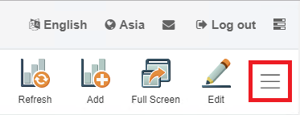

# Embedding Giant Dashboards or Charts

Embedding is the basically getting the link of your dashboard or chart so other users can see the dashboards or charts without logging in to GIANT.

There are two types of Dashboard embedding:

- Basic Embed

- Chart Embed

## When to use the Embed feature:

- When you need anonymous users to access your GIANT dashboards or charts without logging in to GIANT.

- When you need to display GIANT dashboards or charts at another location. (e.g. displaying GIANT charts from the company's website)

## Basic Embed

If you want the audience to be able to view the data exactly as what you see in the dashboard, use **Basic embed**.

First, click the hamburger icon/more options icon shown at the top right side of the GIANT dashboard page.

After you click on it, there should be a pop-up window that shows various options. Click on the **Embed** button.

Once you click the **Embed** button, there will be a link in quotation marks that is your **Embed link** to give the audience to view the dashboard.

## Chart Embed

Chart embed is used when you want the audience to view only specific charts from your dashboard.

First, make sure you are in editing mode by clicking the **edit** button at the top right hand side of your GIANT dashboard page.

Once you are in editing mode, go to one of your existing charts and click the **edit** button.

Click on the **embed** button at the top right of your GIANT dashboard page.

A pop up window should appear showing the Embed URL you can give to the audience. This URL will only show the chart that you got the embed link from. 

Note: When embedding charts, make sure that it is a saved chart. If it has not been saved to your dashboard yet, the **embed icon** will not be there for the chart.