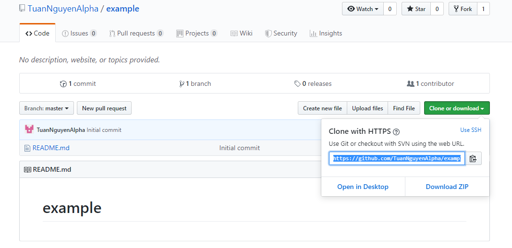
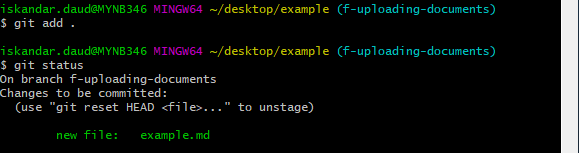

# Github for dummies

## Introduction

This guide gives tips on how to use github using bash. GitHub is a command line tool that allows users to upload useful files, documentation and code in the same place. This is particularly useful when working in teams because other team members can make changes to the files and all the changes can be reviewed.

### Pre-requisites:

- A git hub account that can be created here : [github.com](https://github.com/)

- Donwloading Git bash here : [Git bash download](https://git-scm.com/downloads)

### Using Bash in a local machine:

Repositories is a term commonly used in git. A repository is essentially a folder for a project. This is the place where files, documents and code will be uploaded to. 

For the sake of this example, we have to **fork a repository**. Forking a repository is copying someone else's repository to make  changes to. First, go to the link of the other repository. Here is an example repository to use : [example repository](https://github.com/TuanNguyenAlpha/example)

Once we log in to our account on [github.com](https://github.com/), click the **fork** button at the top right. Now we have a copy of the other repository.

We will be running through some basic git commands using this forked repository. Search **git bash** on the local machine and proceed to open it. A window will pop up looking like this:

We want to see all the files on the desktop so we change the directory to the desktop. Type `cd desktop` and then `ls`. Using `cd` will change the directory to whatever path set whilst `ls` will show all the files in the specified path. Next, type `git init` to initialize a repository in the desktop. Now we want to perform `git clone` on the **forked** repository.

On the github website click the **Clone or download** button and a message will pop up. Copy the **link** and type `git clone` **paste link here**. This will copy the files from the forked repository on git hub into the local machine. 

The output should look like this. 

Now we have a folder called example on the desktop in the local machine. Next we have to `git remote add` to link the forked repository to the **original** repository.

Go to the link of the original repository and click the **Clone or download** button. Copy the link it provides and type `git remote` **name of remote** `add` **link pasted here**.

In this case we call the remote **ogrepo**. Users normally name it **upstream** as it refers to the original repository. Type `cd` **folder_name** in order to be in the correct directory. In this case, we type `cd` **example** because that is what the file is named. 

Notice that next to the directory in git bash, it states **(master)**. **Master** represents the original branch that we **NEVER** want to make changes to. Each branch represents unique changes to a project. If we make changes to the **master** branch, it will affect all the changes others have made. We want to avoid this so we make a new branch and make the changes there. Name the branch to reflect what we are changing. Say we want to upload a document called **example.md** to the repository. First, type `git checkout -b` **f-name_of_branch**, in order to create a new branch and switch to it.

In this case, we create a new branch called **f-uploading-documents** and switch out to it. We name it **f-uploading-documents** because we are uploading new documents. Naming the branch doesn't always have to follow the changes being made to the repository. It can also be named based on the naming of the documents. For example, if we add multiple documents to the repository that share the name **Giant-101**, we name the branch **f-giant-101**. Now we can add the new file **example.md** to the repository.

Open the forked repository file in the local machine that we **cloned** using `git clone`. Then copy and paste the files from the local machine into the forked repository file.

In this case, we move **example.md** to the forked repository folder **example**. Now that the file we want is inserted into the cloned repository file, type `git status`.

The file we added is highlighted in red, this means it is untracked. Type `git add` **filename** to add a specific file or `git add .` to track all the files you have added. Then, type `git status` to see the tracked files.

Now the file we added is being tracked. This is shown as the file is **highlighted in green**. Now that we know the file is tracked we have to use `git commit -m` **"statement here"**. This command is essentially commenting what you are changing in the repository. Make sure to be **specific** because if the commit is too vague, the owner of the original repository will not know what changed. Avoid commiting using the same commit message as it may be confusing for the owner.

In this case, the command is `git commit -m` **"adding new example.md"** to reflect what we are changing to the repository. Next is the `git push` command. This command "pushes" the changes to the repository. Type `git push origin` **current_branch_name**. This will push all the changes made to the forked repository on github.com.

Now all the changes we made to the repository on the branch **f-uploading-documents** have now been pushed to the forked repository on github.com. 

In the forked repository under the branch we were working on, the document we added can be seen in the repository.

Now we have to submit a **pull request**. A **pull request** is essentially asking the owner of the original repository to merge the branch we made changes to with another branch of the original repository.

On the github website, once we have **pushed** our changes, a message pops up saying the branch we have been working on has been pushed. Click the **Compare & pull request** button. 

We are directed to this page where we can edit the title of the PR and add a description for finer details. The details of the **PR** (pull request) can be viewed here. This PR states we want to merge **f-uploading-documents** from the forked repository to the **master** of the original repository. Click the **Create pull request** button. Now we wait for the changes to be reviewed by the owner. 

## Important notes:

- All pull requests will have a number assigned to them. In the example below, the PR is #1. It is always helpful to notify the owner of the original repository the number of the PR to make it easier for them to find and review the PR. Alternatively, giving the **link** of the PR will help the owner find it.

- It is also possible to edit documents on the website rather than editing it from the local machine and going through this long process. When viewing any document on github, there will be an **edit icon** as shown below. Clicking this will let users edit the document, commit and push changes. However, a **PR** will still have to be created.

