# Setting Up Chatbot Agent in GIANT

## Introduction

This guide provides instructions on how to:
- create a chatbot agent in GIANT
- link GIANT chatbot agent with Dialogflow's agent
- linking Intents to GIANT chatbot agent

### Pre-Requisite
You **MUST** have a Chatbot agent set up in Dialogflow before proceeding with the steps below.

You can [refer here](./setting-up-chatbot-agent-in-dialogflow.md) for the steps on setting up a chatbot agent in Dialogflow.

## 1.1 Creating an Agent

1.	Launch the browser and log in into GIANT. Access the **Conversation Flow** main screen by clicking on **My Form(s)** menu in the left panel, followed by **All Form(s)** menu. Then, click on Conversation flow's **VIEW FORM** button.

2.	Click on **Create a new agent**.

	*NOTE: Please contact GIANT Administrator if you are unable to see the **Create new agent** button in the screen. Your account permission needs to be configured to enable your access to this feature.*
    
    
     
3.	The **Create New Agent** screen will be shown. Fill-in the following mandatory info in the screen:

	a)	Agent ID

    b)	Display Name

	c)	Dialogflow Credentials

	

	Refer to the steps below for information on how to fill-in the above mandatory information:
    
    **a) Agent ID**
    
		i. To get the Agent ID, go to Dialogflow screen and access the agent that you want to link in GIANT.
        
        

		ii. The Agent ID is available from the Dialogflow’s URL, shown in the browser’s address bar. 
        E.g. https://console.dialogflow.com/api-client/#/agent/[id]/intents
		
        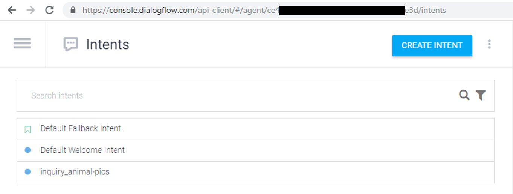

		iii. Copy the Agent ID from the browser’s address bar into the Agent ID field in GIANT EXCLUDING the “-” available in the original Dialogflow’s Agent ID. For example:

			Dialogflow Agent ID: a23dfc353-62df-47f9-bad5-1bd432e0cd33
			ID to copy into GIANT: a23dfc35362df47f9bad51bd432e0cd33
    
    **b) Display Name**
    
    This refers to the Name that you want to assign to your chatbot agent
        
    **c) Dialogflow Credentials**
    
    	i. To get the Dialogflow Credentials, go to Dialogflow screen and access the agent that you want to link in GIANT. Click on the cog icon shown next to your agent’s name.
        
        

		ii. The Edit Agent screen will be shown. Click on the hyperlink shown next to the Service Account field. 
        
        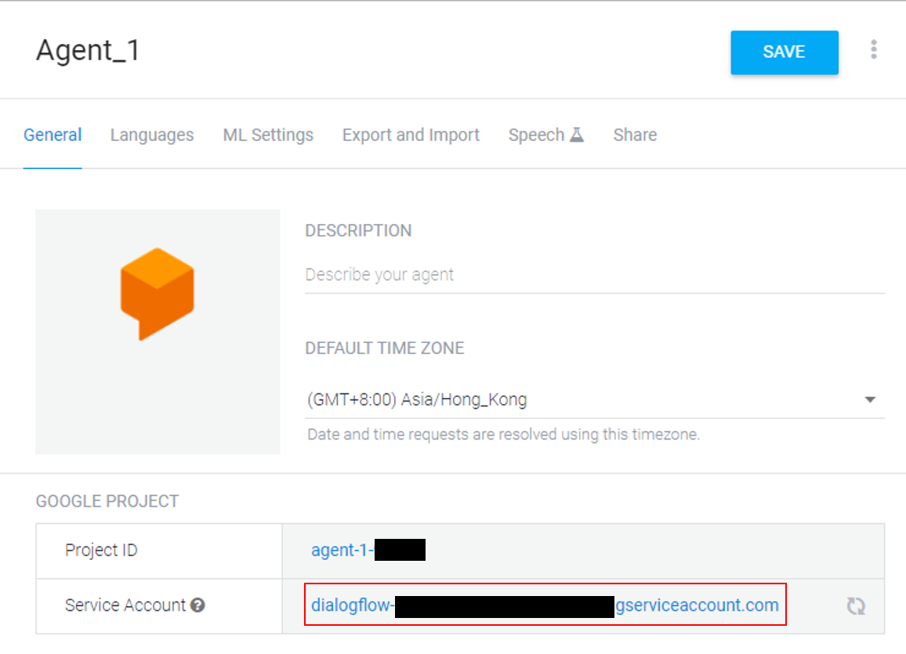
 
		iii. You will be routed to a new tab or new window. Accept the Terms of service to proceed. 
        
        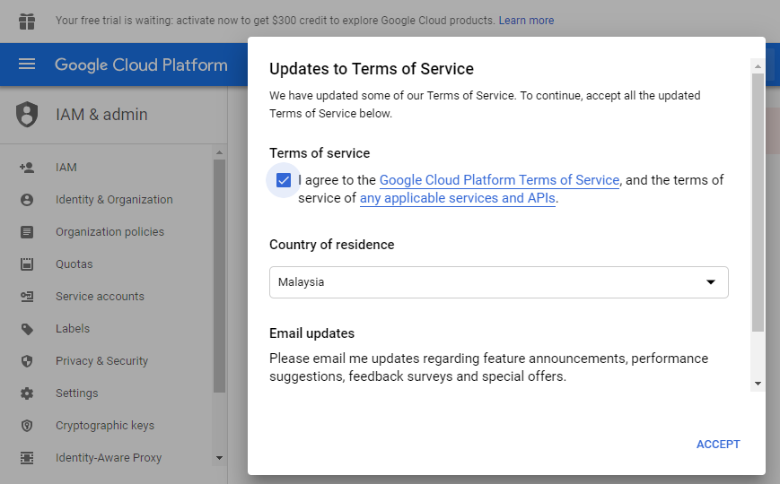
 
		iv. Click + Create Service Account button shown on the top of the browser.
        
        

		v. You will be routed to the Create Service Account screen. Key in the name for the Service Account. Then, click on CREATE button.
        
        
 
		vi. Next, assign the role Dialogflow API Admin to the Service Account. Then, click CONTINUE button to proceed. 
        
        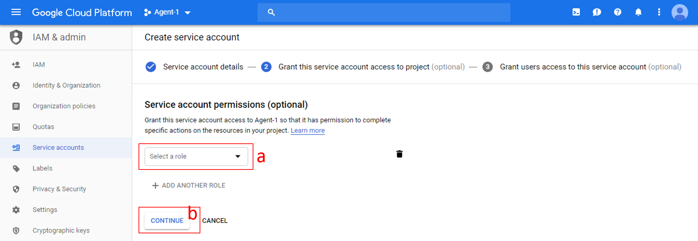
 
		vii. Click on + CREATE KEY button. 
        
        
        
        A panel will be shown on the right side of the screen. Select the Key Type “JSON”, then click on CREATE button. The JSON file will be downloaded to your machine.
        
        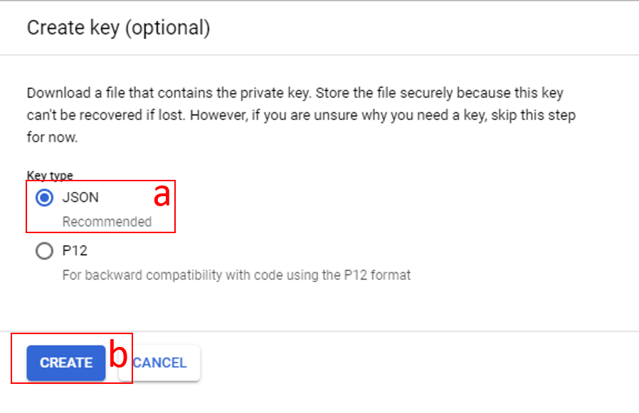
 
		The following message is shown once the JSON file is generated and downloaded to your machine.
        
         

		viii. Go back to GIANT’s Create New Agent screen. Click the attachment icon shown in the dialogflow credentials field in GIANT and attach the JSON file.
        
        
    

4.	Click on **CREATE** button on the top right.

	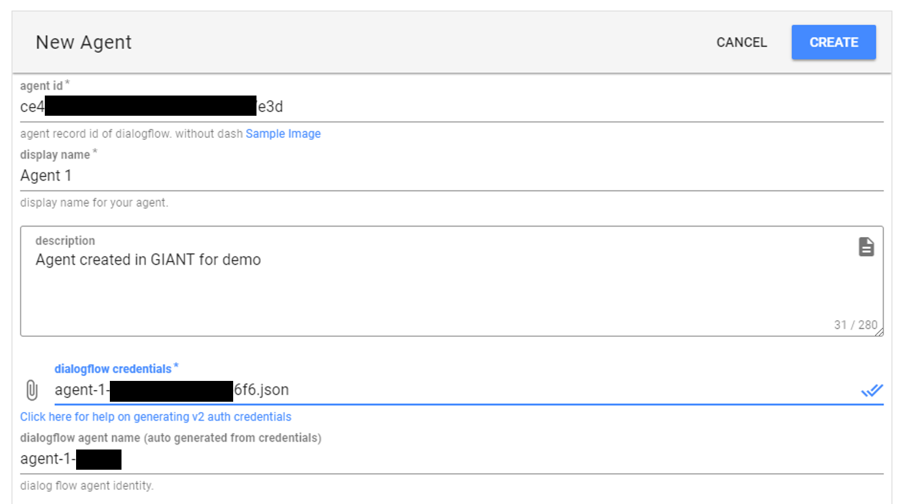

5.	Once your agent is created in GIANT, you will be routed to the agent’s **Setting** screen.

	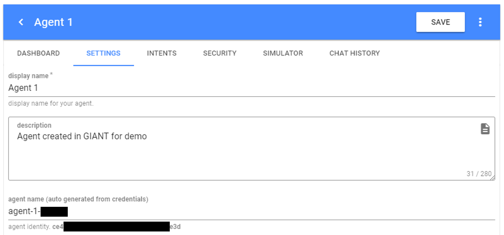
    
6. Click on the **INTENTS** tab. You should see a list of intents *exactly* as per the Intents listed in the Dialogflow agent's Intent screen. This indicates that the agent setup is successful.

	

## 1.2 Linking GIANT Chatbot Agent with Dialogflow's Agent

1.	Access your GIANT chatbot agent’s **Setting** screen
2.	Scroll down to the section that displays the Dialogflow webhook URL information. Copy the URL shown in this field.

 
3.	Go to the Dialogflow screen and access the agent that you want to link with GIANT.
Click on the Fulfillment menu. The Fulfillment main screen will be displayed.

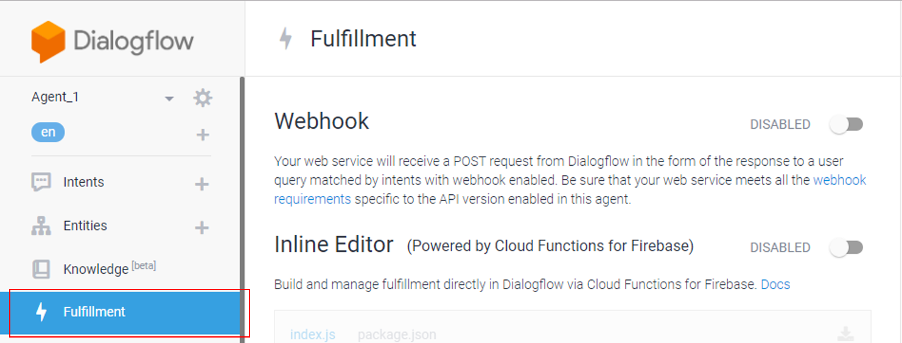

4.	Click on the toggle to enable the Webhook URL.

 
5.	Paste the URL copied from GIANT’s chatbot agent Setting screen in Step 2 into Dialogflow’s Webhook URL field.
 
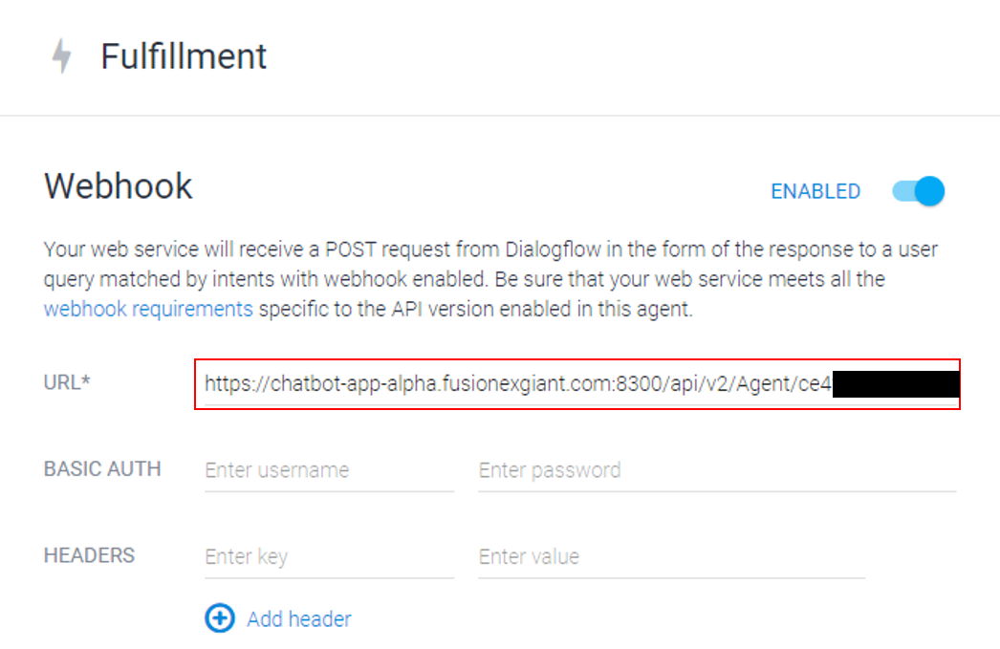
 
6.	Next, go back to GIANT’s chatbot agent Setting screen. Click on the Security tab.

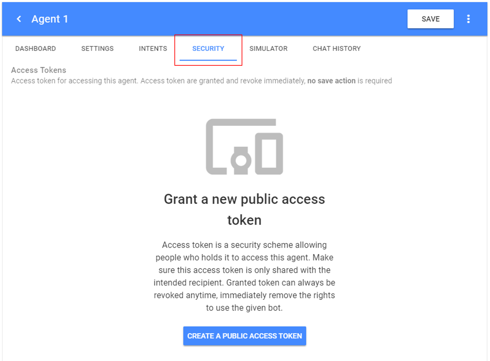

7.	Click on the CREATE A PUBLIC ACCESS TOKEN button. Then, copy the token generated in the screen.

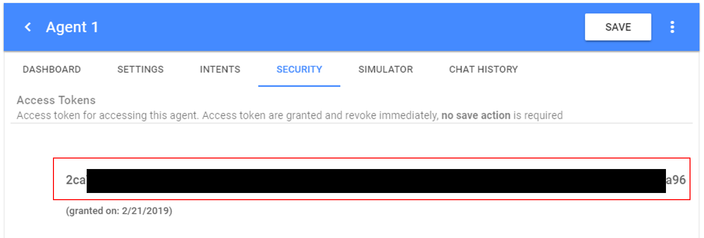

8.	Go back to the agent’s Fulfillment screen in Dialogflow. Enter the word “authorization” in the HEADERS field, followed by “Bearer[space]GIANT Access Token” copied in Step 7. Scroll down the Fulfillment page and click on SAVE button to save the changes made.

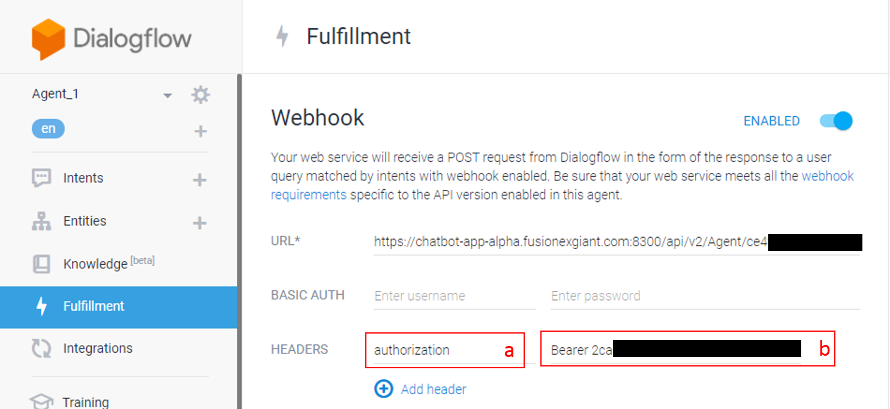

## 1.3 Linking Intents to GIANT Chatbot Agent

To enable you to manage the responses for the Intents created in Dialogflow from GIANT, perform the steps below to link the Intents you created in Dialogflow with the GIANT chatbot agent. After that, you can manage the responses to display for the Intents from GIANT.

1.	Access the agent in Dialogflow that you have linked to GIANT.
2.	Click on the Intent that you want to link with GIANT.

	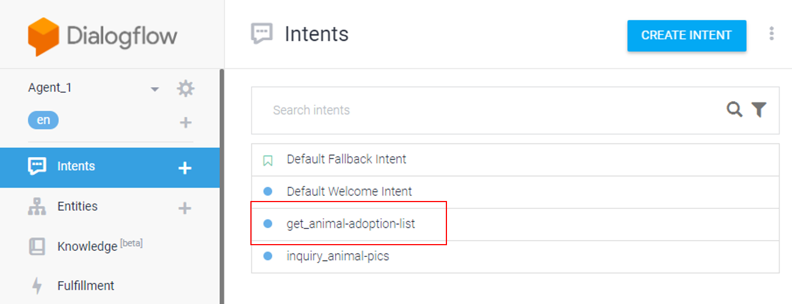
 
3.	The selected Intent will be displayed in edit mode. Scroll down to the Fulfillment section. Click on the arrow icon to expand this section. Then, click on ENABLE FULFILLMENT hyperlink.

	

4.	Click on the toggle to enable the webhook call for the Intent. Click **SAVE** button to save the changes made. 

    *NOTE: You can also enable the intent’s webhook the first time that you create the intent.*
    
	
 
5.	Go back to the agent that you setup previously in GIANT. When you click on the INTENTS tab, you will be able to see all the Intents that you created in Dialogflow displayed in the screen. To refresh the list, you can click on the Refresh icon shown next to the Intents label.

	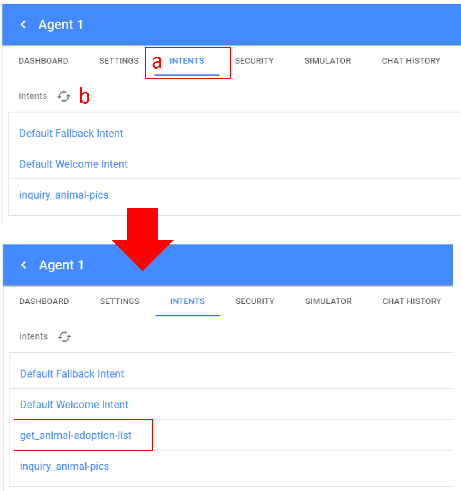

6.	You can now proceed with managing the responses for the Intent from GIANT.