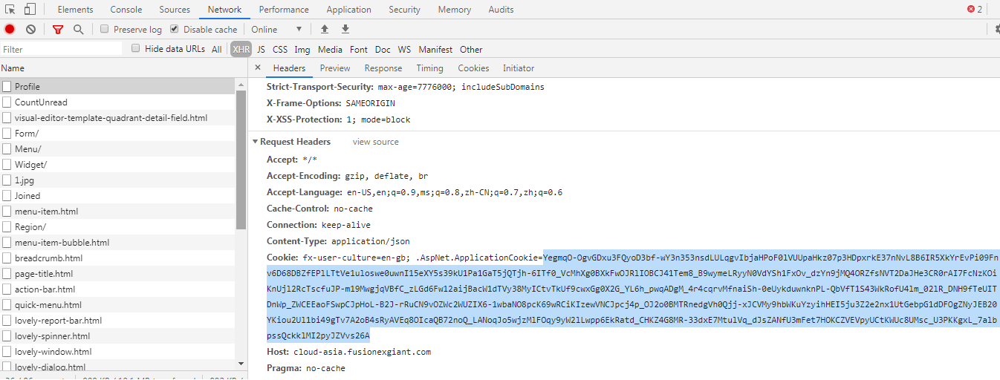
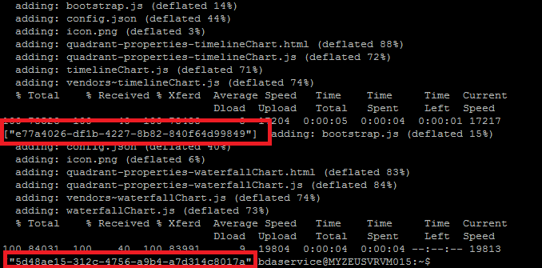

# Configuring GIANT for external visuals
Setting up GIANT with external visuals from GIANT marketplace.

## Getting Started

This guide will get you through the steps necessary to setup your GIANT for system visual pack provided by GIANT in GIANT marketplace. 
If you want to explore more on GIANT visual pack, please refer to [visual pack walkthrough](https://github.com/fx-giant/giant-documentations/blob/master/visual/visual-pack-walkthrough.md).

## Prerequisites
- GIANT URL
- GIANT user account with **System Administrator** rights. 
> recommend create a user account for visual pack installation purpose
- giant-gcr-reader-key.json file (acquire from GIANT release package)
- a linux terminal with docker

## Acquire GIANT authorization cookie
1. Open GIANT.
2. Open web debugger console by press ``F12``.
3. Switch to **Network** tab.
4. Login GIANT with System Administrator user account.
5. At debugger console, select one of the network action at the right panel.
6. Look for **Request Headers** of the network action.
7. Copy the cookie value of **.AspNet.ApplicationCookie**.



## Installing GIANT external visuals
1. Open a linux terminal with docker. You may use GIANT App server for this purpose.
2. Create a file at root with below command
```
sudo vi /giant-gcr-reader-key.json
```
3. Press ``i`` for start input to the file.
4. Copy the content from giant-gcr-reader-key.json which acquire from GIANT release package and paste into the file.
5. Press ``escape`` to end the editing.
6. Save the file by below command
```
:wq!
```
7. Login to GIANT docker repo with below command
```
sudo docker login -u _json_key -p "$(cat /giant-gcr-reader-key.json)" https://gcr.io
```
8. Install for GIANT external visuals with below command. Replace GIANTUrl and GIANTAuthorizeCookies with value acquire above.
```
sudo docker run --rm -e GIANT__URL=GiantUrl -e GIANT__PROFILE_COOKIES=GiantAuthorizeCookies -e GIANT__SYSTEM_LEVEL=true gcr.io/giant-rnd/giant-visual-pack-installer:v2.5.1
```
9. Once success, you should see a GUID return in the terminal. 

