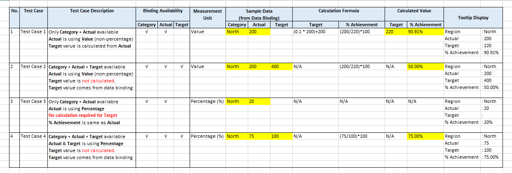

# Categorical Cylinder Gauge
Categorical cylinder gauge is similar to the cylinder gauge, but it has multiple cylinder instead of only one big cylinder for data categorization just like a column chart.

 Although cylinder charts do not add any additional data, sometimes using this shape allows to achieve a better visual appearance of your data. 

When you have to compare percentage achivement between the categorical values, this chart is recommended for use

## Diagram Design / Configuration

### Binding

- The mandatory bindings are `Category` and `Actual`

    - `Category` shows a name for a certain category. (label & tooltip view)

    - `Actual` stores the actual or current values of the categories (tooltip view)

    - `Measurement Type`, choose the option `Value` if the `Actual` and `Target` values are using the `actual amount`. If you're binding only `Actual field` using a `percentage amount`, select the option `Percentage`

- The optional binding is `Target`

    - `Target` stores the target values of the categories and can be autogenerated with specific scenario (tooltip view)

### Calculation Scenario

  

### Generated Data for Chart Visualization
Based on binded values that come from Excel Sheet, several required values will be automatically calculated.

* These values are:
    * `Actual Percentage` show the actual values in percentage capped at 100% (chart view) 
    * `Target Percentage` show the target values in percetage (chart view)
        > Target Percentage = (100% - Actual Percentage)
    * `% Achievement` Value reflects the uncapped version of  `Actual Percentage` based on `Calculation Scenario` (chart & tooltip view)

## Use cases

### Actual & Target Sales of Software Applications
   
Actual target and sales of applications developed by a company

Sample data download [here](./sample-data/categorical-cylinder-gauge/categorical-cylinder-gauge-sample-data-app-sale.csv).

### Monthly Aircraft Fuel Consumption

Sample data download [here](./sample-data/categorical-cylinder-gauge/categorical-cylinder-gauge-sample-data-monthly-fuel.csv).

