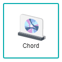
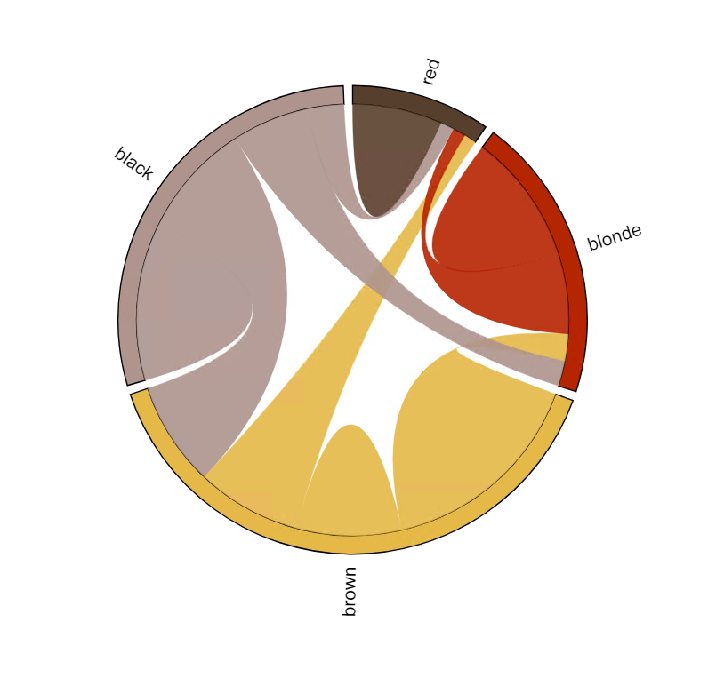
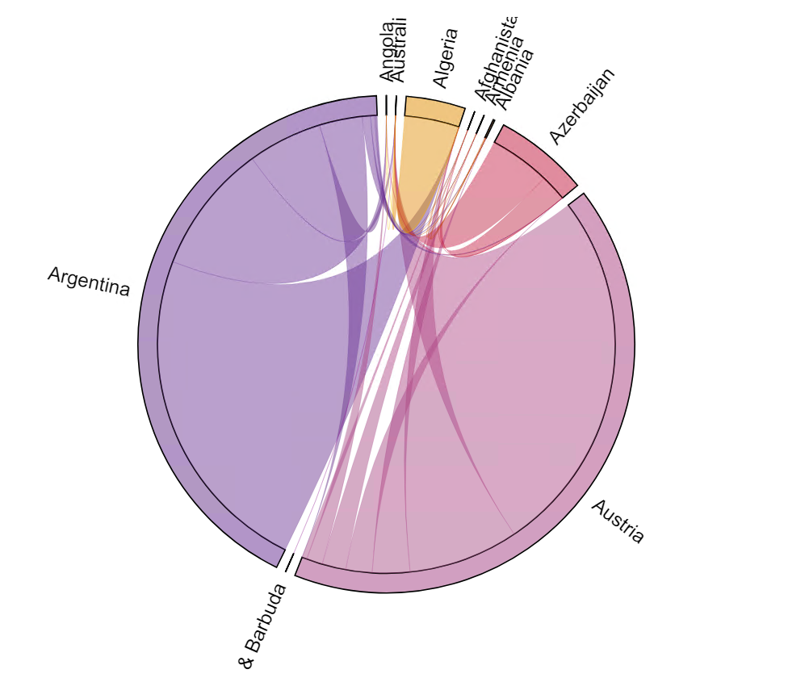

# Chord Diagram

Chord Diagram visualises the flows or connections between several entities. The entities are represented by the fragment on the outer part of the diagram, where their connections are used to display the similarities between each entity. This makes Chord Diagrams ideal for comparing the similarities within a dataset or between different groups of data. Each connection will have a value assigned to it, represented proportionally by the size of each arc. Furthermore, the usage of colour is used to differentiate the categories, which aids in making comparisons and distinguishing groups.

> *NOTE:* An issue that could occur within Chord Diagrams is overcluttering if there are too many connections being displayed at once.

## Data Binding

For the chord diagram, there are a few mandatory bindings to generate the chart which are the **Source**, **Destination** and **Actual** properties. For each property, there are specific data types need to fulfill in order for the combination chart to render correctly, such as can be seen below:

For each field, specific data type need to be fulfilled in order for the Word Cloud chart to render correctly, as shown below:

|Bindings |Data Type|
|---|---|
|Source|Text|
|Destination|Text|
|Actual|Numeric|

### Source

A field with text data type can be used for **Source** binding. This will be displayed as the Category or Entity values.

### Destination

A field with text data type can be used for **Destination** binding. This will also be displayed as another Category or Entity value **BUT** it is needed to be paired with the **Source** binding to properly generate the relationship.
### Actual

A field with numeric data type can be used for **Actual** binding. The size of each arc will correspond to the value of Actual field binding i.e. sum of data with bigger values will be shown in a larger arc size.

## Other Settings

### Sort

You can use this setting to arrange your data points based on the field that you need. For example, to sort by Country in ascending order.

### Filter

Another setting that can be used is **Filter** whereby specifiying the filter(s) will restrict the values shown so that users can focus on analysing the filtered data shown in the chart.

## Use Cases

### Hair Preferences among Teenagers in the USA
A dataset showing the hair colour preferences among teenagers in the United States of America is displayed within this use case.  By using the Chord Diagram, the relationship between the categories can be visualised from its source to its wanted destination. Download sample data [here](./sample-data/chord-diagram/hair.csv).

Below are the fields used for the data binding to generate the chart:

|Bindings |Field to Select|
|---|---|
|Source|Has|
|Destination|Prefers|
|Actual|Count|

Displayed in the chord diagram are the count value of the teenagers that either **Has** or **Prefers** the hair colours respectively. The values are represented through the different segments of the diagram with the size and colour of the arcs. From this, it can be seen that teenagers with the most **Has** value of brown colour much more **Prefers** to change their hair colour, as opposed to the teenagers with the least **Has** value of red colour would much rather **Prefers** to maintain their hair colour.

**Output**

### Import Trade of Certain Countries that Start with 'A'
This dataset shows a list of the import trade within the year of 2009 among the countries that start with the letter *'A'*. As the dataset has a few fields that have the value of 0, a Complex Chord Chart will be generated. Download sample data [here](./sample-data/chord-diagram/trade-a.csv).

As the dataset had provided several similar fields, only a few of the fields would need to be used to generate the diagram accordingly. The **Importer1** and **Importer2** fields will be used as they are the countries used to reflect the relationship. The **Flow2** field is used for adding a numerical value for the arcs within the chord diagram to appear.

|Bindings |Select|
|---|---|
|Source|Importer1|
|Destination|Importer2|
|Actual|Flow2|

The conclusion of the use case chart displays the countries that have the highest count of import trading among other countries, which are Austria and Argentina. This can be said as their segments within the chord diagram is the largest compared to the rest.

**Output**

>*NOTE:* Due to the length of some country names being too long, some labels were cut off/extended outside the diagram.

**Analysis**

By analysing the chart deeper, the import trade happens frequently within Argentina, Austria, Azerbaijan and Algeria, meaning that these countries could either require more resources or afford more resources from around the world compared to the rest of the countries within the visualised diagram. As the chart had generated a complex chord diagram, further filtering could be done based on particular conditions within the current diagram to drill down on certain data required to focus on. This allows the possibility to add in more values within the importer1 and importer2 fields to create a more complex chart which could provide more insight on figuring out the relationships.