# Getting started
This is a code snippet to help you build your own visual pack.

## Prerequistie
* Visual pack knowledge

### Quadrant properties HTML and JS

These files define the quadrant controls presented on the quadrant-properties panel. Here are some frequently used controls:

- [single dimension binding](#single-dimension-binding)
- [single measurement binding](#single-measurement-binding)
- [multiple paths binding](#multiple-paths-binding)
- [separator](#separator)
- [textbox](#textbox)
- [select/drop-down-list](#select/drop-down-list)
- [switch](#switch)
- [top and bottom filter](#top-bottom-filter)
- [sort](#sort)
- [filter](#filter)
- [cross chart filter](#cross-chart-filter)
- [hide header](#hide-header)
- [color palette](#color-palette)


#### # single dimension binding

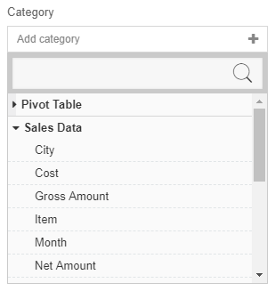

- `labelKey` defines the label presented above the control.
- `addLabelKey` defines the placeholder label in the control before anything gets selected.
- `excludedBindings` defines the bindings to be excluded after they have been selected somewhere else.
- `selectedBindingContext` defines the currently selected binding and is updated when the user changes the binding.
- `*Binding` define the methods that are called to add, delete and update the binding in Visual parameters.

```html
<quadrant-control params="
    controlType: 'singleBinding',
    labelKey: 'Category',
    addLabelKey: 'Add category',
    bindingType: 'dimension',
    selectedConnectionSource : selectedConnectionSource,
    excludedBindings: excludedDimensionBindings,
    selectedBindingContext: categoryPathBindingContext,
    addBinding : addCategoryPath,
    deleteBinding: deleteCategoryPath,
    updateBinding: updateCategoryPath">
</quadrant-control>
```

```javascript
var me = this;
$.extend(true, me, {
    // skipped some bindings above...
    selectedConnectionSource: koSelectedConnectionSource,
    excludedDimensionBindings: koExcludedDimensionBindings,
    categoryPathBindingContext: koCategoryPathBindingContext,
    categoryPath: koCategoryPath,
    addCategoryPath: addCategoryPath,
    updateCategoryPath: updateCategoryPath,
    deleteCategoryPath: deleteCategoryPath
});
```

#### # single measurement binding

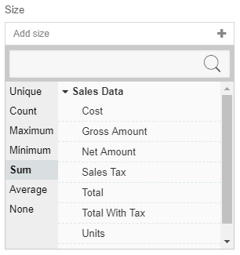

Refer to [single dimension binding](#single-dimension). Measurement binding has aggregate operators like `None`, `Sum`, `Avarage`, etc. that help you group your raw data.

```html
<quadrant-control params="
    controlType: 'singleBinding',
    labelKey: 'Size',
    addLabelKey: 'Add size',
    bindingType: 'measurement',
    selectedConnectionSource : selectedConnectionSource,
    excludedBindings: excludedMeasurementBindings,
    selectedBindingContext: sizePathBindingContext,
    addBinding : addSizePath,
    deleteBinding: deleteSizePath,
    updateBinding: updateSizePath">
</quadrant-control>
```

```javascript
var me = this;
$.extend(true, me, {
    // skipped some bindings above...
    selectedConnectionSource: koSelectedConnectionSource,
    excludedMeasurementBindings: koExcludedMeasurementBindings,
    sizePathBindingContext: koSizePathBindingContext,
    sizePath: koSizePath,
    addSizePath: addSizePath,
    updateSizePath: updateSizePath,
    deleteSizePath: deleteSizePath
});
```

#### # multiple paths binding
- `addDimensionLabelKey ` defines the placeholder label in the control before anything gets selected.
- `addMeasurementLabelKey` defines the placeholder label in the control before anything gets selected.

> Notes: If either dimension or measurement binding is not needed, exclude its respective functions.

```html
<quadrant-control params="controlType: 'multiBinding',
                                        labelKey: 'qpColumns',
                                        addDimensionLabelKey: 'qpAddDimensionColumns',
                                        addMeasurementLabelKey: 'qpAddMeasurementColumns',
                                        selectedConnectionSource : selectedConnectionSource,
                                        bindings: columnsBindingContexts,
                                        addDimensionBinding : addDimensionColumn,
                                        addMeasurementBinding : addMeasurementBindingFunction,
                                        deleteBinding: deleteColumns,
                                        updateBinding: updateColumns>
</quadrant-control>
```

```javascript
//#region shorthand
var getBindingName = fxUtil.bindingName;
var bindingChartDisplayName = fxUtil.bindingChartDisplayName;
var bindingPropertyType = fxUtil.bindingPropertyType;

//#region private properties
var projectionEntityManager = quadrantComposer.projectionEntityManager;
var projectionEntityManagerPush = projectionEntityManager.push.bind(projectionEntityManager);

//#region public properties
var addMeasurementBindingFunction = (!koIsLiveSource())
    ? addMeasurementColumn
    : null;

function addDimensionColumn(binding) {
    checkBlankSuggestion();
    setColumns(binding, enumPropertyTypeDimension);
    addNPushProjections(binding, koColumnsBindingContexts);
}
function addMeasurementColumn(binding) {
    checkBlankSuggestion();
    setColumns(binding, enumPropertyTypeMeasurement);
    addNPushProjections(binding, koColumnsBindingContexts);
}

function checkBlankSuggestion() {
    var projections = koProjections();
    if (projections.length > 0)
        return;
    var visual = koVisual();
    visual.columns = [];
}

function setColumns(binding, propertyType) {
    var visual = koVisual();
    var newColumnPath = getBindingName(binding);
    var newTitle = bindingChartDisplayName(binding);;
    visual.columns.push({
        dType: "textGridColumn",
        header: newTitle,
        valuePath: newColumnPath
    });
    bindingPropertyType(binding, propertyType);
}

function deleteColumns(binding) {
    var visual = koVisual();
    var deletedColumnPath = getBindingName(binding);

    //currently will always remove the 1st match column in visual
    var matchedColumn = _.find(visual.columns, function (column) {
        return column.valuePath === deletedColumnPath;
    });
    visual.columns = _.reject(visual.columns, function (column) {
        return column === matchedColumn;
    });

    deleteProjections(binding);
    koColumnsBindingContexts.remove(binding);
}

function updateColumns(existingBinding, newBinding) {
    var visual = koVisual();
    var columns = visual.columns;
    var originColumnPath = getBindingName(existingBinding);
    var newColumnPath = getBindingName(newBinding);
    var newTitle = bindingChartDisplayName(newBinding);
    var originBindingPropertyType = existingBinding.bindingType;

    var columnIndex = _.indexOf(_.pluck(columns, 'valuePath'), originColumnPath);
    columns[columnIndex].valuePath = newColumnPath;
    columns[columnIndex].header = newTitle;
    bindingPropertyType(newBinding, originBindingPropertyType);

    var newBindingContext = updateProjection(existingBinding, newBinding);
    koColumnsBindingContexts.replace(existingBinding, newBindingContext);
}

function addNPushProjections(binding, koObservableArrayObject) {
    var bindingContext = addProjections(binding);
    koObservableArrayObject.push(bindingContext);
}

function addProjections(binding) {
    var bindingContext = projectionEntityManagerPush(binding);
    //User pass in single object, single object will be return as well
    if (!isArray(binding))
        return bindingContext[0];

    bindingContext.bindingType = bindingPropertyType(bindingContext.entity);
    return bindingContext;
}

function deleteProjections(binding) {
    projectionEntityManagerDelete(binding);
}

var me = this;
$.extend(true, me, {
    // skipped some bindings above...
    columnsBindingContexts: koColumnsBindingContexts,
    addDimensionColumn: addDimensionColumn,
    addMeasurementColumn: addMeasurementColumn,
    addMeasurementBindingFunction: addMeasurementBindingFunction,
    updateColumns: updateColumns,
    deleteColumns: deleteColumns,
});

```

>Notes: Example of multiple paths binding can refer to data matrix chart in GIANT.

#### # separator

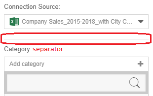

The horizontal line between the quadrant controls.

```html
<hr class="quadrant-properties__seperator">
```

#### # textbox

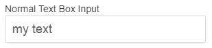

Make sure that you have `normalTextBoxInput` binding exported in the `viewModel`.

```html
<div class="sandbox__row">
    <div class="sandbox__label">Normal Text Box Input</div>
    <div class="text-box text-box--white">
        <div class="text-box__input">
            <input type="text" data-bind="value: normalTextBoxInput">
        </div>
    </div>
</div>
```

```javascript
var refreshQuadrant = fxQuadrant.refreshQuadrant;

var koNormalTextBoxInput = ko.observable().extend({ rateLimit:600 });

function initValues() {
    var visual = koVisual();
    var parameters = visual.parameters || {};
    if (parameters.yourTextProperties)
        koNormalTextBoxInput(parameters.yourTextProperties);
}

function initEvents() {
    koNormalTextBoxInput.subscribe(function(newValue) {
        var visual = koVisual();
        var parameters = visual.parameters;
        parameters.yourTextProperties = newValue;
        refreshQuadrant();
    });
}

var me = this;
$.extend(true, me, {
    // skipped some bindings above...
    // observables
    normalTextBoxInput: koNormalTextBoxInput
});
```

#### # select/drop down list

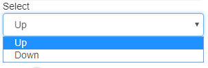

```html
<div class="sandbox__row">
    <div class="sandbox__label">Select</div>
    <div class="quadrant-properties_dropdown-list-container">
        <drop-down-list params="items: selectItems, selectedItem: mySelect"></drop-down-list>
    </div>
</div>
```

```javascript
var refreshQuadrant = fxQuadrant.refreshQuadrant;

var koSelectItems = ko.pureComputed(function(){
    var options = [];
    //name is the display name show in the drop down list
    //value is the key value of the option
    options.push({ name: "Up", value: "up" });
    options.push({ name: "Down", value: "down" };
    return options;
});

var koMySelect = ko.observable();

function initValues() {
    var visual = koVisual();
    var parameters = visual.parameters || {};
    if (parameters.yourSelectProperties) {
        var selectedItem = findOptionByValue(koSelectItems(), parameters.yourSelectProperties);
        koMySelect(selectedItem);
    }
}

function initEvents() {
    koMySelect.subscribe(function(newSelect) {
        var visual = koVisual();
        var parameters = visual.parameters;
        parameters.yourSelectProperties = newSelect.value;
        refreshQuadrant();
    });
}

function findOptionByValue(options, value) {
    for (var i in options) {
        if (options[i].value == value)
            return options[i];
    }
    return null;
}

var me = this;
$.extend(true, me, {
    // skipped some bindings above...
    // observables
    selectItems: koSelectItems,
    mySelect: koMySelect
});
```

#### # switch

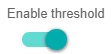

```html
<div>
    <div class="quadrant-properties__label">Enable threshold</div>
    <div class="quadrant-properties__databind-item">
        <switch params="value: isThresholdEnabled, isLabelVisible: false"></switch>
    </div>
</div>
```

```javascript
var refreshQuadrant = fxQuadrant.refreshQuadrant;

var koIsThresholdEnabled = ko.observable().extend({ rateLimit:600 });

function initValues() {
    var visual = koVisual();
    var parameters = visual.parameters || {};
    if (parameters.yourBooleanProperties != undefined)
        koIsThresholdEnabled(parameters.yourBooleanProperties);
}

function initEvents() {
    koIsThresholdEnabled.subscribe(function(newValue) {
        var visual = koVisual();
        var parameters = visual.parameters;
        parameters.yourBooleanProperties = newValue;
        refreshQuadrant();
    });
}

var me = this;
$.extend(true, me, {
    // skipped some bindings above...
    // observables
    isThresholdEnabled: koIsThresholdEnabled
});
```

#### # top-bottom-filter
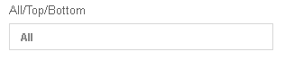
```html
<quadrant-control params="controlType: 'topBottom',
                          quadrantComposer: quadrantComposer,
                         selectedConnectionSource: selectedConnectionSource">
</quadrant-control>
```

#### # sort
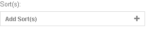
```html
<quadrant-control params="controlType: 'sorting',
                          quadrantComposer: quadrantComposer,
                          selectedConnectionSource : selectedConnectionSource">
</quadrant-control>
```

#### # filter
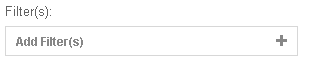
```html
<quadrant-control params="controlType: 'multiCondition',
                          quadrantComposer: quadrantComposer,
                          selectedConnectionSource: selectedConnectionSource,">
</quadrant-control>
```

#### # cross chart filter
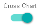
```html
<quadrant-control params="controlType: 'filterSubscriber',
                          quadrant: quadrant">
</quadrant-control>
```
- To publish the selected data using cross chart, use the below code in `app.js`
    ```js
    export default {
        extend(quadrant) {
            selectedDataPoint: ko.observable()
        },
        render(quadrant, callback) {
        //More codes above
        const { namePath } = parameters;
        
        //More codes

        //This is to get the value of the selected value. You can get the value in your own way for your visual
        var selectedDropDown = d3DropDownList.property("value");
        //To get the binding of the path (required by createInclusionCondition)
        var binding = quadrant.getBinding(namePath);

        if(leesa && leesa.model && leesa.model.binding) {
            
            if(quadrant.selectedDataPoint == allText){
                unpublishCrossChart(namePath, quadrant)
            }
            else{
                publishCrossChart(namePath, selectedDropDown, quadrant);
            }
        }

        //more codes below
        function publishCrossChart(bindingPathName, arrayOfValuesForPublish, quadrant) {
            //leesa is giant function
            var bindingModel = leesa.model.binding;
            //create inclusion condition is used to create the condition to be publish to all the chart
            var createInclusionCondition = bindingModel.createInclusionCondition; 

            //pass the bindingPath and selected value to create the inclusionCondition
            var inclusionCondition = createInclusionCondition(arrayOfValuesForPublish, bindingPathName);
            
            //set the selecteDataPoint to selectedDropDown to use it when unpublish
            quadrant.selectedDataPoint(selectedDropDown);

            //quadrant.publishCondtiion is to publish the condition and filter all the charts based on the conditions.
            quadrant.publishCondition(inclusionCondition);
        }

        function unpublishCrossChart(bindingPathName, quadrant) {
            var bindingModel = leesa.model.binding;
            //create inclusion condition is used to create the condition to be publish to all the chart
            var createInclusionCondition = bindingModel.createInclusionCondition; 

            //pass the bindingPath and previously selected to create the inclusionCondition
            var inclusionCondition = createInclusionCondition(quadrant.selectedDataPoint(), bindingPathName);

            //publish the condition to unfilter the condition
            quadrant.publishCondition(inclusionCondition, true);

            //set the selectedDataPoint to empty 
            quadrant.selectedDataPoint("");
        }
    ```

- To disable filter subscriber (disable other from filtering), use the below code in `quadrant-properties.js`
    ```js
        //more codes
        var visualFilterSubscriber = fxUtil.visualFilterSubscriber;
        function viewModel(params) {
            //more codes
            function initValues() {
                var visual = koVisual();
                var parameters = visual.parameters || {};

                //add this code to disable it.
                visualFilterSubscriber(visual, false);

                //more codes
            }
        }
    ```
- Usage of publish condition
    - Filter all the charts by jan when Jan on the drop down list is selected.

    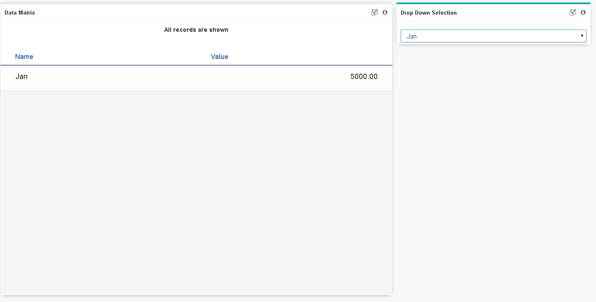

    - Show all the data back when All on the drop down list is selected.
    
    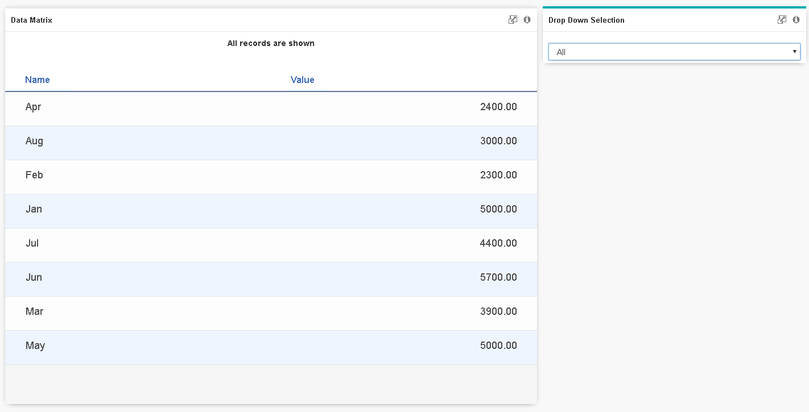

#### # hide header
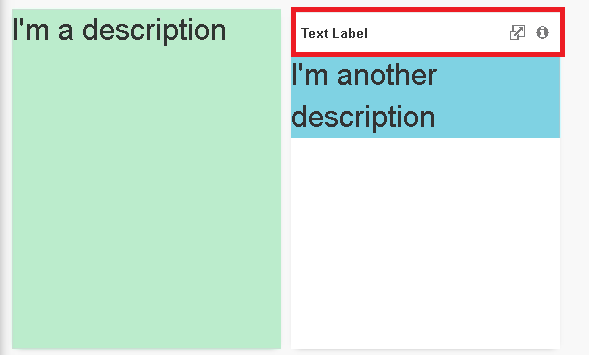
```js
function hideHeader(myQuadrant) {
    var localURL = document.URL;
    if (!_.isEmpty(localURL.match(/Workspace/)))
        return;
    
    var container = d3.select(d3.select(myQuadrant).node().closest(".leesa__cell.leesa__cell--noFooter.leesa__cell--grid"));
    
    if (!container.select(".your_visual_class_name").empty()) {
        container.attr("style", "background-color: transparent; box-shadow: none");
        d3.select($(container).closest(".grid-stack-item-content.leesa__flipContainer")[0])
          .attr("style", "background-color: transparent; box-shadow: none");
        container.select(".leesa__header").style("display", "none");
        container.select(".leesa__content").attr("style", "padding-top: 0");
    }
}
```
> Notes: The JS functions to be implemented can be referred from other charts or samples.

#### # color palette


- To use color palette, go to `config.js` file and add `"canConfigureColor": true` in 
```js
install: {
    ...//versionfile and output

    visualConfig: {
        ...///groupId, packageId, visualName, displayName
        "canConfigureColor": true
    },
    ...//more codes
}
```
- To use color chosen from the palette, in `app.js` get the colors by `const colors = parameters.color` or `const {colors} = parameters`.
> Notes: colors is an array of color codes.

