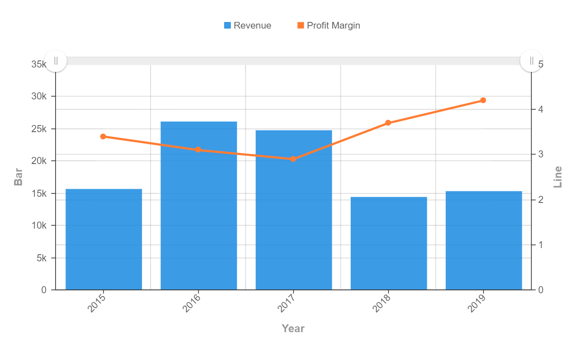
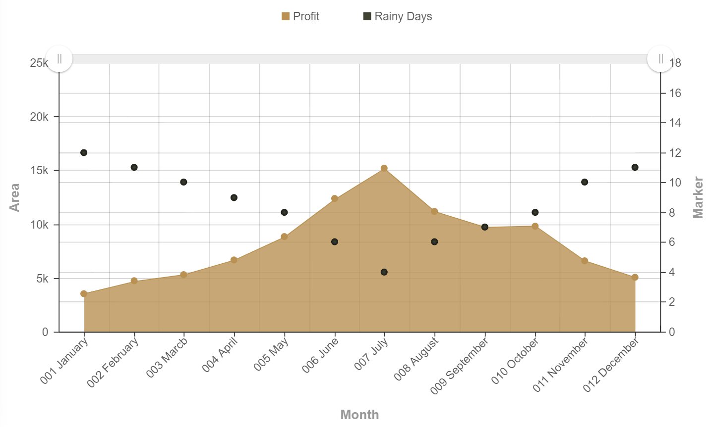

# Combination Chart

Combination Chart is a chart that combines the features of the different graphs onto a single chart. Generally, the combination chart is a mix of a bar graph and a line graph, but there are other options that are available to be used within GIANT. The chart is used to display data using a number or bars or lines to represent a category, where the different categories would be compared against one another. Combination charts are most useful for following trends and identifying outliers in the data that may require further investigation.

## Data Binding

For the combination chart, there are a few mandatory bindings to generate the chart which are the **X-Axis** and **Y-Axis** properties. However, for Combination Chart analysis to make sense, you will need to also fill in more than one **Y-Axis** field. For each property, there are specific data types need to fulfill in order for the combination chart to render correctly, such as can be seen below:

|Bindings |Data Type|
|---|---|
|X-Axis|String|
|Y-Axis|Numeric|

### X-Axis

A field with String data type can be used for **X-Axis** binding. This will be displayed as the Category values.

### Y-Axis

A field with numeric data type can be used for **Y-Axis** binding. The Y-Axis values would be filled in by numerous fields as the Combination chart requires more than one **Y-Axis** field to properly be generated.

## Other Settings

### All/Top/Bottom

This setting is used to focus on the amount of categories the user wants to see, whether it would be **All** of the chart, the **Top** number within the chart, or even the **Bottom** number of the chart. By default, this setting will be placed on **All** to display the full chart accordingly.

>*NOTE:* Once reverting back to the **All** option, the **X-Axis** will not be arranged according to the initial arrangement.

### Drill Down

If your data contains hierarchy (for example: Region > Country > State), you can use this field to drill down your data from the highest level to the lower levels.

### Sort

You can use this section to specify the order in which your data should be arranged. For example, to sort by Country in ascending order.

### Filter

Add filters to restrict your data so that analysis will be focused on data which are shown in the chart.

## Use Cases

### ABC's Financial Performance
This dataset shows the revenue and profit margin of ABC company throughout the year of 2015 to 2019. A combination chart could be used to plot the annual revenue numbers of the company and show how the profit margin changes yearly. Download sample data [here](./sample-data/combination-chart/abc-financial-performance.xlsx).

Refer below on the field bindings used for the creation of the combination chart. For the **X-Axis** setting, the field chosen should have a general data type, making **Year** as the best option for the setting, whereas both **Rainy Days** and **Profit Margin** fields could be placed in the **Y-Axis** as they both are used for the analysis portion in the chart.

|Bindings |Select|
|---|---|
|X-Axis|Year|
|Y-Axis (Bar Graph)|Revenue|
|Y-Axis (Line Graph)|Profit Margin|

From the chart analysis, it can be concluded that although ABC company receives a low amount of revenue within some years, it can still manage to gain a high profit margin within the same years respectively. For example, the year 2019 shows the biggest difference between the total revenue gained against the profit margin calculated, noting that there could be other internal or external aspects of ABC company that could be affecting the profit margin drastically.

**Output**

### Newrock Funland's Profits on Rainy Days
Newrock Funland theme park had created a dataset that stores the information of their profits made monthly along with the total amount of rainy days within the month. A combination chart could be used to compare the different outcomes of each month by utilising the line and bar graph. Download sample data [here](./sample-data/combination-chart/nf-rainyprofits.csv).

Provided within the dataset are the necessary fields needed to generate the combination chart. As the **Rainy Days** and **Profit** fields are switchable with another for the **Y-Axis** field, it means that the **Month** field would be placed within the **X-Axis** field.

|Bindings |Field to Select|
|---|---|
|X-Axis|Month|
|Y-Axis (Bar Graph)|Rainy Days|
|Y-Axis (Line Graph)|Profit|

Displayed in the combination chart is the profit margin and rainy days that occur monthly for Newrock Funland. As there are more rainy days that occur, Newrock Funland would gain less profit within the month respectively, thus having better customer ratings during non-rainy seasons such as seen from May to October.

**Output**

**Analysis**

By analysing the chart deeper, it can be seen that the profit gained monthly by Newrock Funland is directly inversely proportional with the amount of rainy days that occur within the month. From this, the theme park management could refer to the combination chart trends to prepare for contigencies or back up plans to gain profit during the rainy season from November to April. Not only that, by knowing which months gain more profit, it can be assumed that there is a higher customer count that visits the theme park, thus enabling the management to set up other alternatives to gain an even higher profit margin within the future.