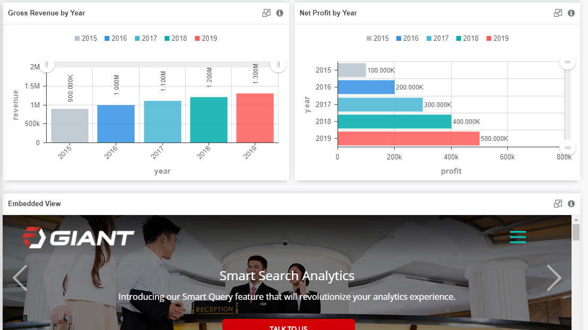

# Embedded View

Embedded View allows you to include an entire view inside another. Using this component allows you to select a view to display, and to pass parameters into the view. Because of this, views can easily act as templates for information.

## Data Binding

There are only two fields for this chart, which are **URL** and **Sandbox Parameters**. **URL** is the only mandatory field and **Sandbox Parameters** is optional. 

Do kindly take note that only websites that allow embedded view will work in this visual. Some websites disallow embedded view for security reasons. As for the **Sandbox Parameters**, the acceptable values are as shown in the table below:

|Value|Description|
|---|---|
|(no value)|Applies all restrictions|
|allow-forms|Allows form submission|
|allow-modals|Allows to open modal windows|
|allow-orientation-lock|Allows to lock the screen orientation|
|allow-pointer-lock|Allows to use the Pointer Lock API|
|allow-popups|Allows popups|
|allow-popups-to-escape-sandbox|Allows popups to open new windows without inheriting the sandboxing|
|allow-presentation|Allows to start a presentation session|
|allow-same-origin|Allows the iframe content to be treated as being from the same origin|
|allow-scripts|Allows to run scripts|
|allow-top-navigation|Allows the iframe content to navigate its top-level browsing context|
|allow-top-navigation-by-user-activation|Allows the iframe content to navigate its top-level browsing context, but only if initiated by user|

## Use Cases

### Embedded Website, Actionable Button & Video

There are more ways than one to utilise the visual - Embedded View. You could embed a website as long as the website allows embedded view, some might not due to security reasons. You could embed an actionable button like Twitter's Tweet button as well as videos such as YouTube.

Three different Embedded View charts could be generated with configuration as follows:

|Bindings|Input Value|
|---|---|
|URL|http://www.fusionexgiant.com|
|URL|https://platform.twitter.com/widgets/tweet_button.html|
|URL|https://www.youtube.com/embed/8cN7LWGO-gE|

**Output**

The output image as shown above, shows an embedded website of Fusionex Giant in which users could view and interact with the website via the embedded view visual.

The output image as shown above, shows an embedded actionable button of Twitter in which users could press on it to Tweet.

The output image as shown above, shows an embedded video of YouTube in which users could watch the video via the embedded view visual.