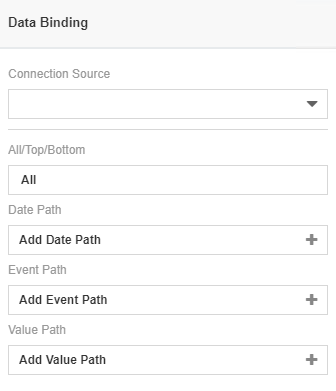
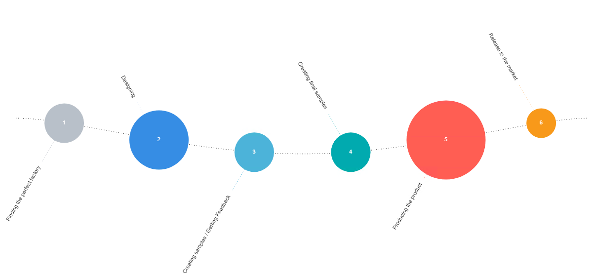
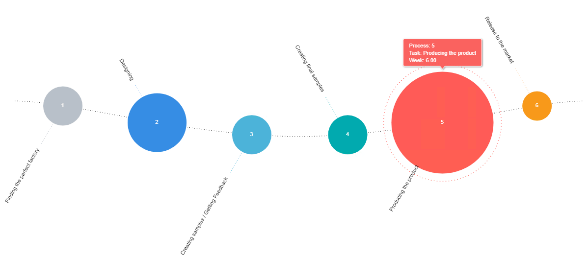

# Fishbone Timeline
### Description

Fishbone timeline is a graphical visualization that can be used to show the cause of a specific event. The chart is to used for product design, defect detection and prevention, and displaying factors causing a specific effect.

## Diagram Design / Configuration
---
### Binding
- The bindings required are 2 dimensions binding and 1 measurement binding.
	>Date and Category for dimensions binding and Value for measurement.
	
	
    
## Other Settings

### All/Top/Bottom

By default, the option selected is All (which means, all the data points will be shown in the chart). Select Top or Bottom, followed by the number of data points required to show the selected number of top-most data rows **OR** selected number of bottom-most data rows.

### Sort

For huge data sets, a setting called Sort can be used to alter the timeline chart on different specifics that the user wants to view or create on the chart.

### Filter

Another setting that could be used is Filter where it applies filters to restrict or focus on data shown in the chart.

### Cross Chart
You can use this setting if you wish to publish selected data across charts within dashboard.

## Use cases

### Production Timeline Flow
Current dataset displays the project management flow of a product release from the inception of the requirements until the launching of the product. Download sample data [here](./sample-data/fishbone-timeline/Production_Process.xlsx).

On the creation of this chart, we are able to see when the task started in the circle and, its task name which will showing in the label. The size of the circle will also represent the number of weeks that being used in the tasks and we can mouse over it to see more detail in the tooltips. 

|Bindings |Data Type|
|---|---|
|Category Path|Task Started|
|Event Path|Task|
|Value Path|Week|

**Output**

 
 
 
 
 **Analysis**

By analyzing the chart, the process flow of production are documented. It giving the managers a clear view on what should be focus on the process and how many time need for each process. It help them to schedule, plan, and evaluate production in order to work toward achieving the set goals.
