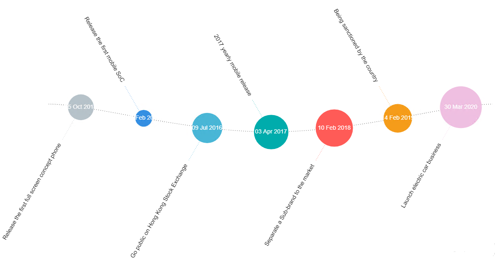

# Fishbone Timeline
### Description

Fishbone timeline is a graphical visualization that can be used to show the cause of a specific event. The chart is to used for product design, defect detection and prevention, and displaying factors causing a specific effect.

## Diagram Design / Configuration
---
### Binding
- The bindings required are 2 mandatory dimensions binding and 1 optional measurement binding.
	>**Category Path** and **Event Path** for dimensions binding and **Value Path** for measurement binding.
	
	
    
## Other Settings

### All/Top/Bottom

By default, the option selected is All (which means, all the data points will be shown in the chart). Select Top or Bottom, followed by the number of data points required to show the selected number of top-most data rows **OR** selected number of bottom-most data rows.

### Sort

For huge data sets, a setting called Sort can be used to alter the timeline chart on different specifics that the user wants to view or create on the chart.

### Filter

Another setting that could be used is Filter where it applies filters to restrict or focus on data shown in the chart.

### Cross Chart
You can use this setting if you wish to publish selected data across charts within dashboard.

## Use cases

### Company Revenue 2014 - 2020
The current dataset displays a mobile company's revenue together with the event that happened in 2014 until 2020. Download sample data [here](./sample-data/fishbone-timeline/mobile_company_revenue.xlsx).

On the creation of this chart, we can see the revenue in different sizes of the circle and, its event name which will show in the label. The size of the circle will also represent the revenue that has been earned every year and we can mouse over it to see more detail in the tooltips.

|Bindings |Data Type|
|---|---|
|Date Path|Event Date|
|Event Path|Event|
|Value Path|Revenue|

**Output**

 **Analysis**

By analyzing the chart, we know that the bigger the circle, the bigger the revenue will be. We can observe how the company event will affect its revenue. The revenue drop in 2015 because the company use their first mobile SoC chip in their phone. Due to its worsened performance compared to the other company, the revenue dropped 39.86% compared to 2014. After 2015, the revenue increased stabilizes. Until 2019, the company is sanctioned by the country which caused the revenue to drop 25.43% compare to the previous year. The revenue increased as the sanctions has been over and the company launches its electric car business on 30 March 2020.
