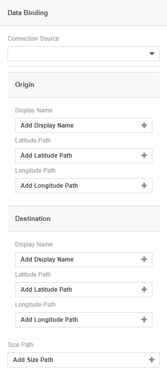

# Flight Route
### Description

A flight route map is a visualisation of a world map whereby the origins and its destinations are displayed on an interactive map. By clicking on the origin, we can know which destinations the origin can go to. It can be used for showing the air traffic network.

## Diagram Design / Configuration
### Binding
- The bindings required are 6 mandatory dimensions binding.
	
	
    
## Other Settings

### Sort

For huge data sets, a setting called Sort can be used to alter the timeline chart on different specifics that the user wants to view or create on the chart.

### Filter

Another setting that could be used is Filter where it applies filters to restrict or focus on data shown in the chart.

### Cross Chart
You can use this setting if you wish to publish selected data across charts within dashboard.

### Image URL
You can use this setting if you wish to change the default flight image by providing an image URL link.

### Label Title
You can use this setting if you wish to change the title of the label. E.g: This is a filght from `Origin`

## Use cases
**Airfreighter Flight Route**
 The current dataset displays a list of airfreighters' origin and together with its destinations. Download sample data [here](./sample-data/flight-route/flight_route.xlsx).
 
|Bindings |Data Type|
|---|---|
|Origin Path|Origin Name|
|Origin Latitude Path|Origin Latitude|
|Origin Longitude Path|Origin Longitude|
|Destination Path|Destination Name|
|Destination Latitude Path|Destination Latitude|
|Destination Longitude Path|Destination Longitude|

In the style tab, we set the image URL to `http://172.16.53.228/websites/analytics/images/cover_09.jpg`

Also set the label title to `Airfreighter from `

Here's the output of the chart once the fields above are bound:

The destinations of airfreighter has being show in the based on its latitude and longitude. By clicking the origin icon or **Click to change origin city** to show the flight's destination with lines. We also can mouse over the icon or the line to see more detail in the tooltips.
