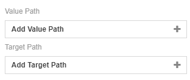
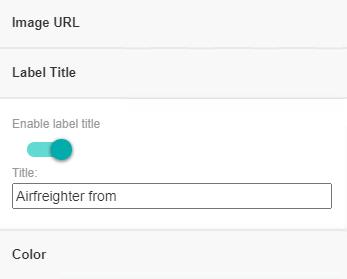

# Flight Route
### Description

A flight route map is a visualisation of a world map whereby the origins and their destinations are displayed on an interactive map. By clicking on the origin, we can know which destinations the origin can go to. It can be used for showing the air traffic network. The charts also can display the values. Values with higher amounts will have a stronger colour and a bolder line width, representing the higher density of the destination of the selected origin on the map.

## Diagram Design / Configuration
### Binding
- The bindings required are 6 mandatory dimensions binding.
	
	
	
-  The optional measurements binding.

	
	
### Target

A field with numeric data type can be used for **Target** binding. The color of each value within the line of the flight route map will change by the comparison among the value, also based on the **Threshold** setting which consists of the:

- Trending (Increasing Better/Decreasing Better)
- Range % of Target

## Other Settings

### Sort

For huge data sets, a setting called Sort can be used to alter the flight route map chart on different specifics that the user wants to view or create on the chart.

### Filter

Another setting that could be used is Filter where it applies filters to restrict or focus on data shown in the chart.

### Image URL

You can use this setting if you wish to change the default flight image by providing an image URL link.

### Label Title

You can use this setting if you wish to change the title of the label. E.g: This is a filght from `Origin`

### Line Color

You can choose the colour of the lines for the destinations of the selected origin in the map.

### Trending

When you have the **Measurement** field binding specified, you can choose the trending value either Increasing Better or Decreasing Better. For example, the trend Increasing Better is used to track Actual Sales vs Target Sales figures. The trend Decreasing Better is used to track the actual number of crime cases reported against the target number of crime cases.

### 3D

The chart can be view in 2D map or 3D globe by applying setting in **3D**.

Chart in 2D map

Chart in 3D globe

### Range (% of Target)

When you have the **Measurement** field binding, you can specify the threshold for the percentage achievement in this section. The default colours are Red for 0-30%, Yellow for 31-70% and Green for 71-120%.

## Use cases
### **Company Airfreighter Flight Route**
 The current dataset displays a list of airfreighters' origin and together with its destinations. Download sample data [here](./sample-data/flight-route/flight_route.xlsx).
 
|Bindings |Select|
|---|---|
|Origin Path|Origin Name|
|Origin Latitude Path|Origin Latitude|
|Origin Longitude Path|Origin Longitude|
|Destination Path|Destination Name|
|Destination Latitude Path|Destination Latitude|
|Destination Longitude Path|Destination Longitude|
|Value Path|Revenue (Million)|
|Target Path|Target|

In the style tab, we set the image URL to `http://172.16.53.228/websites/analytics/images/cover_09.jpg`

Enable the setting and set the label title to `Airfreighter from `

Lastly, set up the threshold.

Here's the output of the chart once the fields above are bound:

**Analysis**

The destinations of airfreight have been shown based on their latitude and longitude. By clicking the origin icon or **Click to change origin city**, the flight's destination with lines will be shown. The width of the line will represent the revenue earned on that airfreight. The thicker the line, the smaller the revenue. We also can mouse over the destination icon or the line to see more detail in the tooltips. As seen in the airfreighter from Krasnoyarsk, the flight to Bishkek earn the most profit which is 19 Million. The flight to Vilnius, Reykjavik, Oslo, Athens and, Bishkek, their actual revenue are hit their target revenue. The flight to Istanbul and Taipei earn less revenue which is 5 Million and 3 Million. Also, these two flights' revenue does not reach 50% of the target revenue. Therefore, the company should reduce the flight route to Dubai and increase more route to Paris in order to avoid unnecessary cost and earn more revenue.
