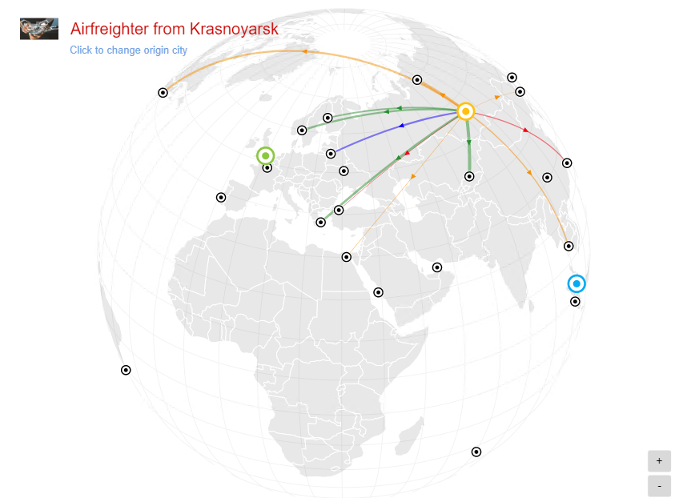

# Flight Route
### Description

A flight route map is a visualisation of a world map whereby the origins and their destinations are displayed on an interactive map. By clicking on the origin, we can know which destinations the origin can go to. It can be used for showing the air traffic network. The charts also can display the values. Values with higher amounts will have a stronger colour and a bolder line width, representing the higher density of the destination of the selected origin on the map.

## Diagram Design / Configuration
### Binding
- The bindings required are 6 mandatory dimensions binding.
	
	
	
-  The optional measurements binding.
-  
	
	
## Other Settings

### Sort

For huge data sets, a setting called Sort can be used to alter the flight route map chart on different specifics that the user wants to view or create on the chart.

### Filter

Another setting that could be used is Filter where it applies filters to restrict or focus on data shown in the chart.

### Cross Chart
You can use this setting if you wish to publish selected data across charts within dashboard.

### Image URL
You can use this setting if you wish to change the default flight image by providing an image URL link.

### Label Title
You can use this setting if you wish to change the title of the label. E.g: This is a filght from `Origin`

### Density Color
You can choose the colour to represent the data available for the destinations of the selected origin in the map.

## Use cases
### **Airfreighter Flight Route**
 The current dataset displays a list of airfreighters' origin and together with its destinations. Download sample data [here](./sample-data/flight-route/flight_route.xlsx).
 
|Bindings |Select|
|---|---|
|Origin Path|Origin Name|
|Origin Latitude Path|Origin Latitude|
|Origin Longitude Path|Origin Longitude|
|Destination Path|Destination Name|
|Destination Latitude Path|Destination Latitude|
|Destination Longitude Path|Destination Longitude|
|Size Path|Revenue (Million)|

In the style tab, we set the image URL to `http://172.16.53.228/websites/analytics/images/cover_09.jpg`

Set the label title to `Airfreighter from `

Lastly, set the color density.

Here's the output of the chart once the fields above are bound:

The destinations of airfreight have been shown based on their latitude and longitude. By clicking the origin icon or **Click to change origin city** to show the flight's destination with lines. The color and the width of the line will represent the revenue will be earned on that airfreight. We also can mouse over the destination icon or the line to see more detail in the tooltips. The airfreighter from Kuala Lumpur, the flight to Paris earn the most profit which is 25 Million. And the flight to Dubai earn the less revenue which is 3 Million. The company should reduce the flight route to Dubai and increase more route to Paris in order to avoid unnecessary and earn more profit.
