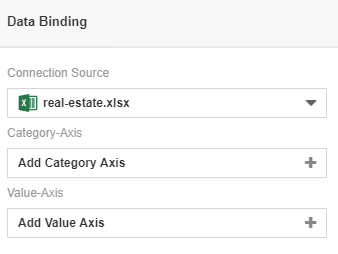
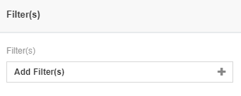
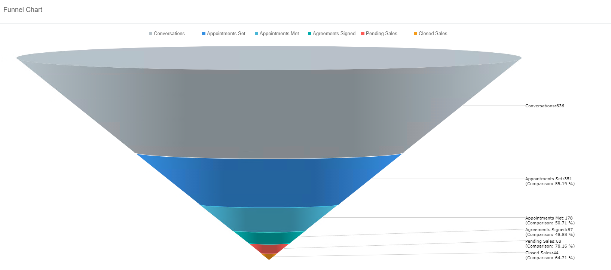
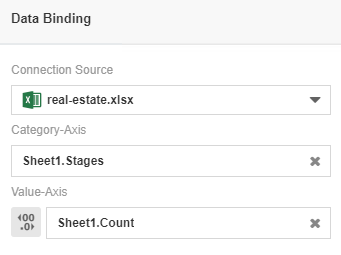
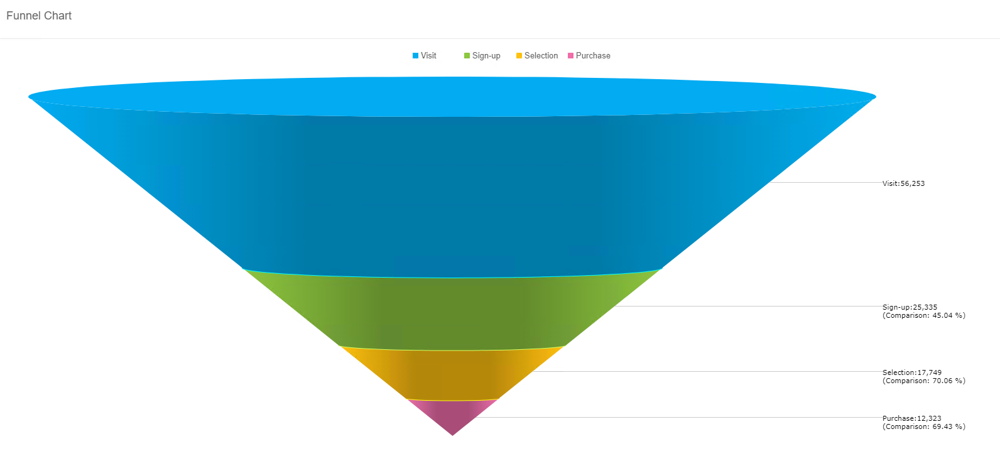
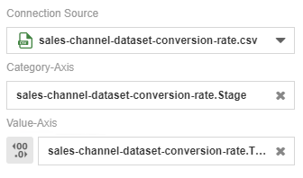

# Funnel Chart
Funnel chart is 

Funnel charts are often used to illustrate stages in a process to show anything that is decreasing in size. For example, the funnel chart is typically used to showcase a order fulfillment process or a sales process. Not only that, the funnel chart also helps identify the potential problem areas for an organisation's sales processes.

## Diagram Design / Configuration
### Binding
The minimum bindings required are Category Axis and Value Axis bindings. The Category Axis is where the field for stages are placed in, where the funnel chart will display through different levels. The Value Axis is for the numerical fields to show the total amount for the current stage that is placed for it.

### Sorting and Filtering
Filtering within the funnel chart helps in focusing on the specific data type that the user wants to see.

## Use Cases
### Real Estate Property Activity
A flow on the real estate activities done are documented down within this dataset, where a funnel chart could be used to display the information through a graphical manner. This use case has the necessary fields to create the funnel chart with easem as it has both stages and count. From the diagram, we can see the amount of customers reduce as the process continues, where it starts off with a high number of starting conversations to a small number of closed sales.

Download sample data [here](./sample-data/funnel-chart/real-estate.xlsx).

**Output**

**Binding**

The diagram below shows the data binding for real estate property purchasing use case 

### Multiple Sales Channel on Product Purchase Conversion Rates
Current dataset displays the process of multiple sales channels on their product purchase conversion rates. Within the dataset, there are five different categories where the conversion rates are caused through, those being Ads, Media, Affiliates, Referrals and Direct. Although, within the visualised chart below, all five categories are summed up to show the total flow of the sales process on the product purchase.

Download sample data [here](./sample-data/timeline-chart/sales-channel-dataset-conversion-rate.csv).

**Output**

**Binding**

The diagram below shows the data binding for multiple sales channel on product purchase use case 

