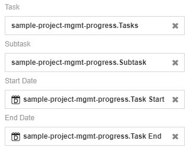

# Gantt Chart  
Gantt Chart is a type of bar chart that is typically used for project planning and to illustrate project or activity schedules. Each bar represents a task or an activity where the length of the bar is determined by the start and end date of the task.

## Diagram Design / Configuration
---

### Binding
- The bindings required are 4 dimensions binding.  
    >Task, Subtask, Start Date and End Date for dimensions.
      
  
  
- The optional binding is progress binding which binds the progress of the respective subtasks.

 
 
Sample data download [here](./sample-data/gantt-chart/sample-project-mgmt-progress.csv).

### Drill Down
**Drill Down** setting can be used to drill down data according to its hierarchy. 

### Sort
For large data sets, a setting called **Sort** can be used change the arrangement of the data according to user's preference.

### Filter
**Filter** setting can be used to choose the range of data displayed on the chart.

## Use cases

### Project Management Flow on Product Launching   
   
This dataset shows the project management flow of a product launch from the research to launch of the product. Download sample data [here](./sample-data/gantt-chart/sample-project-mgmt.csv).

This Gantt Chart is suitable to be used to illustrate the project management flow of the product launch as it consists of four fields, **Tasks**, **Subtask**, **Task Start** and **Task End**. 

|Bindings |Select|
|---|---|
|Task|Tasks|
|Subtask|Subtask|
|Start Date|Task Start|
|End Date|Task End|

Based on the chart, we can conclude that five teams have different subtasks to complete throughout the project duration. Each team has different number of bars depending on the number of subtasks to be completed by them.

From using this chart, project managers will be able to refer to this chart to determine if the scheduled deadlines are met. From the distribution of the subtasks, project managers will also be able to identify the amount of resources needed by each team to accomplish their tasks. 

