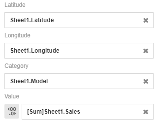
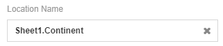
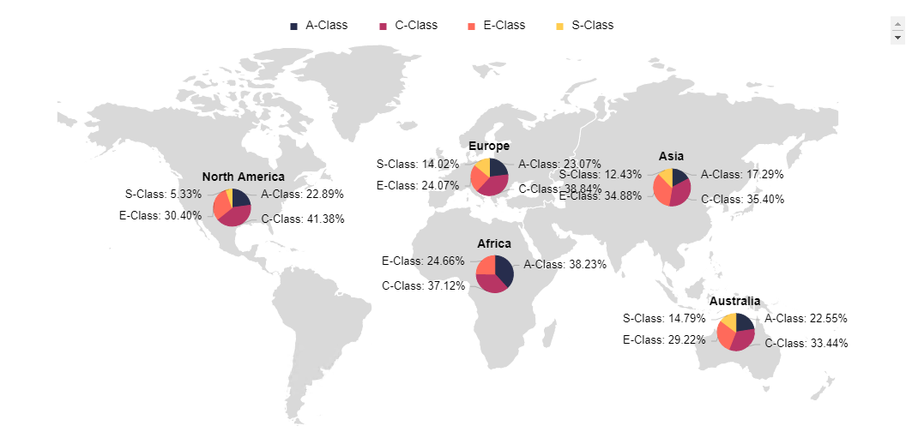

# Map with Pie Chart  
A map with pie chart is a form of data visualization that uses pie charts as markers for locations on the map. It is typically used to illustrate categorical data that are grouped according to its location. It gives a simple break down on the percentage of values being binded. The Pie Charts can be used to show the relationship between data categories, where one could see which data could be of more importance when compared to the rest.

## Diagram Design / Configuration
---

### Binding
- The bindings required are 3 dimensions and 1 measurement binding.  
    >Latitude, Longitude and Category for dimensions and Value for measurement.
      
  
  
- The optional binding is location name binding which binds the location name of the latitude and longitude binded.

 
 
Sample data download [here](./sample-data/map-pie/sample-mercedes-sale-location.xlsx). 

### All/Top/Bottom
By default, the option selected is All (which means, all the data points will be shown in the chart). Select Top or Bottom, followed by the number of data points required to show the selected number of top-most data rows **OR** selected number of bottom-most data rows.

### Drill Down
**Drill Down** setting can be used to drill down data according to its hierarchy. 

### Sort
For large data sets, a setting called **Sort** can be used change the arrangement of the data according to user's preference.

### Filter
**Filter** setting can be used to choose the range of data displayed on the chart.

## Use cases

### Mercedes Benz Car Sales by Continent
   
A dataset by Mercedes Benz is used to display the number of sales in the year of 2020 in major continents. Map with pie charts will be used to display the mentioned data. Download sample data [here](./sample-data/map-pie/sample-mercedes-sale-location.xlsx).

This chart is suitable to be used to display the sales made by Mercedes Benz in the year 2020 as it consists of four fields, **Latitude**, **Longitude**, **Model** and **Sales**. An additional field, **Location Name** can be used to label location name of the latitude and longitude of each pie chart. 

|Bindings |Select|
|---|---|
|Latitude|Latitude|
|Longitude|Longitude|
|Category|Model|
|Value|Sales|
|Location Name|Continent|

Based on the chart, we can observe that the dataset provided by Mercedes covers over 5 regions. Displayed within the pie charts are Mercedes' most well known car models that make up their own segment according to the total sales. As seen on the chart, most pie charts show that **C-Class** has the biggest segment size compared to other categories. 

From this, the management of Mercedes Benz can use this chart as an analysis tool to determine the car model they should put more promotional and campaign efforts in continents or countries to further boost the sales of each car model.

**Output**

