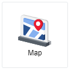
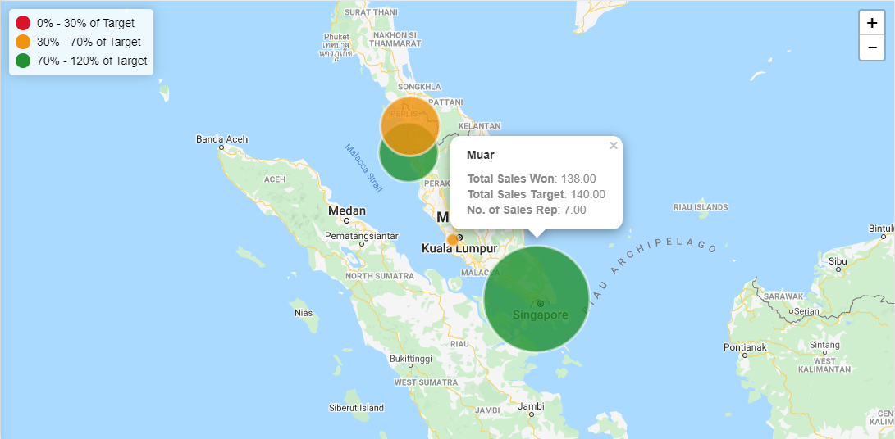

## Map

 

A Map chart allows us to visualize spatial relationships in data by indicating data on a geographical map. A map chart is used when specific 
locations are included such that there are longitude and latitude, as well as clear distribution or clustering. For example, you could
use a map chart to illustrate the business performance of each branch offices located in different regions.

 

## Data Binding

There are two mandatory bindings which are **Longitude** and **Latitude**.

|Bindings|Data Type|
|---|---|
|Longitude|Longitude value|
|Latitude|Latitude value|

### Longitude/Latitude

Both Longitude and Latitude values should be in numerical data type such that it is <0.000000>. It should not be in GPS coordinate values
such that it is <0° 0' 0" N> or <0° 0' 0" E>.

## Other Settings

### All/Top/Bottom

By default, the option selected is All (which means, all the data points will be shown in the chart). Select Top or Bottom, followed by the 
number of data points required to show the selected number of top-most data rows **OR** selected number of bottom-most data rows.

### Group

The **Group** binding determines the category to group the longitude and latitude values in the chart. It can be in Text or Numeric data type.

### Size

The **Size** binding determines the size of the data points marked on the map chart. It is a Numeric data type.

### Actual/Target 

The **Actual/Target** bindings are of Numeric data type.

### Size/Actual/Target Label

The **Label** text area allows you to input a description to define Size/Actual/Target bindings and be shown in the map chart. It can be in Text or Numeric data type.

### Threshold

You can choose between 'Increasing Better' or 'Decreasing Better' for Trending, and to set the number of threshold quartiles and the range of each
quartile. You can change the colour representing each quartile by clicking on the colour bar and choosing from the colour palette. You can also
add more quartile by pressing on "+ Add more" button or remove them by pressing on 'X' button beside the percentage symbol.

### Filter

Add filters to restrict your data so that analysis will be focused on data that are shown in the chart.

### Zoom In/Out

You could zoom in and out the map chart by using "+" and "-" buttons located at top right corner, respectively. Alternatively, you could
also use your mouse scroll wheel.

 

## Use Case
### Mobile Phone Sales Company
A mobile phone sales company that has sales representatives working across four branch offices throughout Malaysia, including Kedah, Penang,
Selangor and Johor. Each sales representative has a monthly sales target of 20 mobile phones sold. Each branch office has different number
of sales representatives hired, so the cumulative monthly sales target of each branch office is different. The thresholds defined by the sales
manager are such that, 14 - 24 sales are classified as Good, 6 - 14 sales are classified as Average, and 0 - 6 sales are classified as Bad.

The sales manager would like to have a look at the locations of each branch office, number of sales representatives hired in each branch
office, cumulative sales target of each branch office and the performance of Actual vs Target sales of each branch office.

Using the sample data [here](./sample-data/map/map.csv), configure the chart with settings as follows:

|Bindings|Select|
|---|---|
|Longitude|*longitude*|
|Latitude|*latitude*|
|Group|*branch_name*|
|Size|\[Count]*sales rep id*|
|Actual|\[Sum]*won_sales*|
|Target|\[Sum]*sales_target*|
|Size Label|No. of Sales Rep|
|Actual Label|Total Sales Won|
|Target Label|Total Sales Target|
|Trending|Increasing Better|
|Threshold|From 0%, To 30%, To 70%, To 120%|

**Output**

**Analysis**

Both Kedah and Penang have 5 sales representatives each, 3 in Selangor and 7 in Johor. Since each sales representative has a monthly sales
target of 20 and it is a cumulative sales target depending on the number of sales representatives in each branch office, sales target for
each branch office is then depicted as 100 for both Kedah and Penang, 60 for Selangor and 140 for Johor. By looking at the colour of each
data bubble on the map, we know that two of its branch offices are performing well and two are within the average threshold. The threshold
levels and its ranges can be seen on the top left corner of the map chart. As for the size of each data bubble, it is based on the number
of sales representatives each branch office has. As seen in the snippet provided above, Johor's branch office named "Lmaooo" has the largest
data bubble as it has the most sales representatives, at 7. From this chart, the sales manager could then drill-down into Kedah
and Selangor branch offices, look into the individuals that did not hit their sales target and to find out what is the cause/reason/issue.
Another perspective is that the sales manager could use the map chart to help in making decision whether certain branch offices should be
closed down as they are consistently having a loss in profit, or certain branch offices should be allocated more budget to operate as they are
consistently bringing in profit to the business. 
