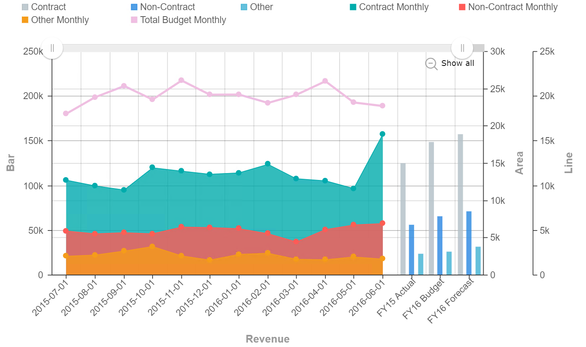

# Multisource Combination Chart

Multi-source Combination Chart is similar to Combination chart whereby it is useful when you have multiple measurements to show in a single chart, each one displayed as a different chart type. This chart is an enhanced version of the Combination chart that enables you to combine data from multiple data sources in a single chart, without having to merge the data sources into a single data source. Multi-source Combination chart also supports multiple Dimension binding, each Dimension bound from a different data source. For example, you can bind Region from Data Source 1, Country from Data Source 2 and bind Sales Amount from Source 1 and Source 2. They can be displayed together in the same chart for you to compare the figures.

*NOTE : Click here(**No current link since waiting for branch to be merged to master**) to find out more on Combination chart*

## Data Binding

To generate the multi-source combination chart, **multiple** data sources are needed (at least 2 data sources - they can be the same data source or different data source). Before you can proceed with the data binding, you need to first add the Connection Sources to the chart's setting panel. The data binding fields are then available under each of the connection source that you added.

### Source Bindings

The **Source Binding** section will be shown when you have added at least one Connection Source in the chart's Setting panel. Click the arrow icon shown at the end of the connection source name to expand the list of data binding fields for the chart.

*NOTE: Be sure that each data source that you added have relevance to one another for the data analysis to make sense.*

There are a few mandatory bindings to generate the chart within each of the added connection sources, which are the **X-Axis** and **Y-Axis** properties, at least for two different sources (i.e. Source 1 and Source 2). For each property, there are specific data types need to be fulfilled in order for the multi-source combination chart to render correctly, such as can be seen below:

Source #|Bindings|Data Type|Status|
|---|---|---|---|
|Source 1|X-Axis|String|Required|
|Source 2|Y-Axis|Numeric|Required|
|Subsequent source(s)|X-Axis|Text| Required to get the data to show, if additional source is added|
|Subsequent source(s)|Y-Axis|Numeric| Required to get the data to show, if additional source is added|

### X-Axis

A field with Text data type can be used for **X-Axis** binding. This will be displayed as the Category values. At least one column must be added to **X-Axis of Source 1** and one column to **X-Axis of Source 2** for the chart to generate the data

### Y-Axis

A field with Numeric data type can be used for **Y-Axis** binding. At least one column must be added to **Y-Axis of Source 1** and one column to **Y-Axis of Source 2** for the chart to generate the data.

## Other Settings

### All/Top/Bottom

By default, the option selected is All (which means, all the data points will be shown in the chart). Select Top or Bottom, followed by the number of data points required to show the selected number of top-most data rows **OR** selected number of bottom-most data rows.

### Drill Down

If your data contains hierarchy (for example: Region > Country > State), you can use this field to drill down your data from the highest level to the lower levels.

### Sort

You can use this setting to arrange your data points based on the field that you need. For example, to sort data by Country field in Ascending order.

### Filter

Another setting that can be used is **Filter** whereby specifying the filter(s) will restrict the values shown so that users can focus on analyzing the filtered data shown in the chart.

## Use Cases

### Gross Profit and Revenue Comparison of Apple
As this is a multisource combination chart, two separate datasets would be used to generate the chart. Thus, Apple documented their Annual Gross Profit and Revenue Sales throughout the years of 2009 until 2019, which could be used within the Multisource Combination chart as the data sources are seperated in two:
- *Gross Profit:* Download sample data [here](./sample-data/multisource-combination/apple-grossprofit.csv). 
- *Revenue:* Download sample data [here](./sample-data/multisource-combination/apple-revenue.csv).

Provided within both dataset are the necessary fields needed to generate the multisource combination chart. The **Year** field could be used as both **X-Axis** settings for the Sources, whereas the **Revenue** and **Gross Profit** fields would be placed within the **Y-Axis** setting respectively.

Source #|Bindings|Field to Select|
|---|---|---|
|Apple Revenue|X-Axis|Year|
|Apple Revenue|Y-Axis (Bar Graph)|Revenue (Millions in US$)|
|Apple Gross Profit|X-Axis|Year|
|Apple Gross Profit|Y-Axis (Area Graph)|Gross Profit (Millions in US$)|

Displayed in the multisource combination chart is Apple's Sales on their Gross Profit and Revenue. Throughout the years of 2009 to 2019,The Gross Profit is displayed using the bar graph, whereas the Revenue is displayed using the area graph. The Y-Axis on the left-hand side is meant for the Revenue values(auto-scaled to 400,000) and the right-hand side is meant for the Gross Profit values(auto-scaled to 160,000).

**Output**

**Analysis**

The conclusion of the use case chart displays that the Revenue Sales of Apple increase exponentially throughout the decade, which could also be said for their Gross Profit. Although the Gross Profit for each year does not equal to the Revenue, each year Apple manages to reach at least 50% margin, where they had peaked in the year 2012 and 2015, both years managing to reach a little less than 50%. Delving deeper into the analysis, Apple could refer to the multisource combination chart to check on their patterns or trends made within the years that had peaked for their Gross Profit Margin, in a sense that they could put in the same effort for what they did in their previous successful years, and implement it to their future years. 