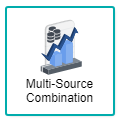

# Multisource Combination Chart

Multi-source Combination Chart is similar to Combination chart whereby it is useful when you have multiple measurements to show in a single chart, each one displayed as a different chart type. This chart is an enhanced version of the Combination chart that enables you to combine data from multiple data sources in a single chart, without having to merge the data sources into a single data source. Multi-source Combination chart also supports multiple Dimension binding, each Dimension bound from a different data source. For example, you can bind Region from Data Source 1, Country from Data Source 2 and bind Sales Amount from Source 1 and Source 2. They can be displayed together in the same chart for you to compare the figures.

*NOTE : Click here(**No current link since waiting for branch to be merged to master**) to find out more on Combination chart*

## Data Binding

To generate the multi-source combination chart, **multiple** data sources are needed (at least 2 data sources - they can be the same data source or different data source). Before you can proceed with the data binding, you need to first add the Connection Sources to the chart's setting panel. The data binding fields are then available under each of the connection source that you added.

### Source Bindings

The **Source Binding** section will be shown when you have added at least one Connection Source in the chart's Setting panel. Click the arrow icon shown at the end of the connection source name to expand the list of data binding fields for the chart.

*NOTE: Be sure that each data source that you added have relevance to one another for the data analysis to make sense.*

There are a few mandatory bindings to generate the chart within each of the added connection sources, which are the **X-Axis** and **Y-Axis** properties, at least for two different sources (i.e. Source 1 and Source 2). For each property, there are specific data types need to be fulfilled in order for the multi-source combination chart to render correctly, such as can be seen below:

Source #|Bindings|Data Type|Status|
|---|---|---|---|
|Source 1|X-Axis|String|Required|
|Source 2|Y-Axis|Numeric|Required|
|Subsequent source(s)|X-Axis|Text| Required to get the data to show, if additional source is added|
|Subsequent source(s)|Y-Axis|Numeric| Required to get the data to show, if additional source is added|

### X-Axis

A field with Text data type can be used for **X-Axis** binding. This will be displayed as the Category values. At least one column must be added to **X-Axis of Source 1** and one column to **X-Axis of Source 2** for the chart to generate the data

### Y-Axis

A field with Numeric data type can be used for **Y-Axis** binding. At least one column must be added to **Y-Axis of Source 1** and one column to **Y-Axis of Source 2** for the chart to generate the data.

## Other Settings

### All/Top/Bottom

By default, the option selected is All (which means, all the data points will be shown in the chart). Select Top or Bottom, followed by the number of data points required to show the selected number of top-most data rows **OR** selected number of bottom-most data rows.

### Drill Down

If your data contains hierarchy (for example: Region > Country > State), you can use this field to drill down your data from the highest level to the lower levels.

### Sort

You can use this setting to arrange your data points based on the field that you need. For example, to sort data by Country field in Ascending order.

### Filter

Another setting that can be used is **Filter** whereby specifying the filter(s) will restrict the values shown so that users can focus on analyzing the filtered data shown in the chart.

## Use Cases

### Annual and Monthly Budgeting for FY 2015 and 2016
As this is a multisource combination chart, two separate datasets would be used to generate the chart. Thus, FY documented their Annual and Monthly budgeting throughout the year of 2015 and 2016, which could be used within the Multisource Combination chart as the data sources are seperated in two:
- *Annual:* Download sample data [here](./sample-data/multisource-combination/AnnualBudgetForecast). 
- *Monthly:* Download sample data [here](./sample-data/multisource-combination/MonthlyBudgetForecast).

Provided within both dataset are the necessary fields needed to generate the multisource combination chart. The **Revenue** field could be used as both **X-Axis** setting, whereas the remainder of the fields should be listed down within the **Y-Axis** setting. The **Y-Axis** values should have tweaks within the settings as to display the current graph in a more understandable manner.

**Annual FY Dataset**

|Bindings |Field to Select|
|---|---|
|X-Axis|Revenue|
|Y-Axis (1st Area Graph)|Contract Monthly|
|Y-Axis (2nd Area Graph)|Non-Contract Monthly|
|Y-Axis (3rd Area Graph)|Other Monthly|
|Y-Axis (Line Graph)|Total Budget Monthly|

**Monthly FY Dataset**

|Bindings |Field to Select|
|---|---|
|X-Axis|Revenue|
|Y-Axis (1st Bar Graph)|Contract|
|Y-Axis (2nd Bar Graph)|Non-Contract|
|Y-Axis (2nd Bar Graph)|Other|

Displayed in the multisource combination chart is the total budget on the actual year and the forecasted year. The annual budget for FY15 and FY16 are displayed using the bar graphs, whereas the monthly budget for each month respectively is displayed using area graph, along with the expected total monthly budget represented by the line graph.

**Output**

**Analysis**

By analysing the chart deeper, it is shown within the chart that the FY15 Actual bar graph results total up to be the same with the revenue budgeting from the Total Budget Monthly area graph from the months of July to December. This proves that the two datasets are related to one another, thus further analysis and predictions could be done within the chart. The FY16 Budget and Forecast bar graphs is used to predict the total budgeting that FY would need to have in order to run their following year smoothly, where a further detailed display on the monthly contract, non-contract and others are represented within the chart. From the multisource combination chart, FY could refer to the chart as their guidance for the following years ahead, where they could list down their current revenue expenses, and forecast what their budget would be.