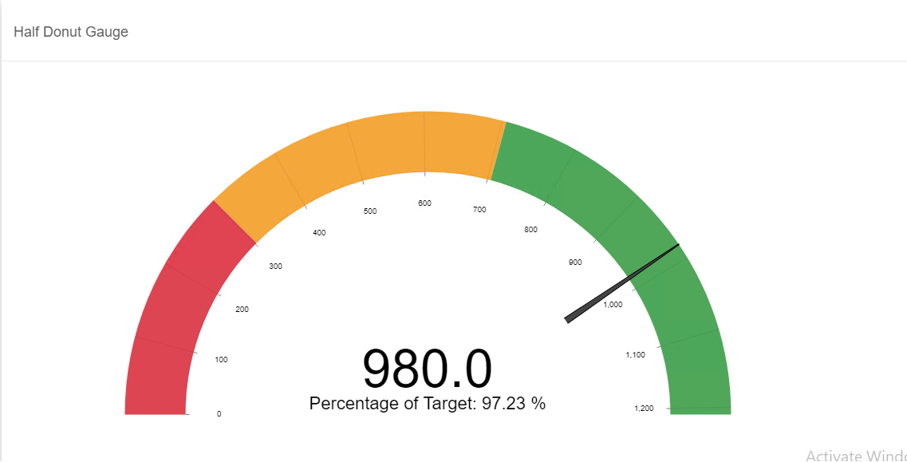

# MultiSource Half Donut Gauge

MultiSource Half Donut Gauge is a type of chart that displays overall performance of specific data. This chart is commonly used to show KPI, daily sales target and etc. 

## Diagram Design / Configutation
---
### Binding
- The bindings required to click the add the connection for the bindings

    
    
- The bindings required are
    >Actual and Target value

    

### Filter

There are few options as shown in the picture below to filter on data.

    

### Top Bottom Filter

There are three options to filter by row limit

    

- All
- Top
- Bottom

## Use Cases
---

### Facebook Total Visit (From 2019 February to 2020 February)

Through the gauge, you can visualize social media Facebook. Decision such as using Facebook to do a business or promote a product is a good choice for a business. Based on the diagram, we can conclude that the Facebook is currently available at an acceptable level.

Sample data download [Actual Data](./sample-data/half-donut-gauge/facebook_satistics.xlsx).

Sample data download [Target Data](./sample-data/half-donut-gauge/facebook_target.xlsx).

### Honda

This use case is total actual sold for Honda company,  gauge chart can be utilize to monitor whether the Honda sales is good or not. Based on the diagram, we can conclude the honda sales is not good , it's need to do more marketing campaign to increase the sales.

Sample data download [Honda Actual Sold](./sample-data/half-donut-gauge/honda.xlsx).

Sample data download [Honda Target](./sample-data/half-donut-gauge/honda_target.xlsx).