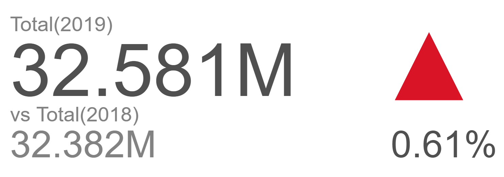
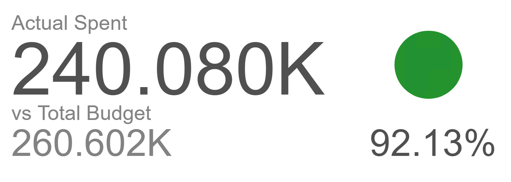

# Multisource Trend Chart

Multisource Trend Chart visualises the trend or traffic that happens between two different numeric values, where they are displayed to showcase the current performance progress towards reaching a goal, or a comparison between the two values. The multisource trend chart displays the values as the current actual value and the target goal to achieve. The data is visualised through text, where the actual value is stated above the target goal value, along with the percentage of trend or traffic on its left-hand side. This chart is regularly used in checking rate performance of a company between the years, or even in creating a progress bar for achieving predicted results.

## Data Binding

To generate the multi-source trend chart, only **TWO** data sources are needed (they can be the same data source or different data source). Before you can proceed with the data binding, you need to first add the Connection Sources to the chart's setting panel. The data binding fields are then available under each of the connection source that you added.

### Source Bindings

The **Source Binding** section will be shown when you have added at least one Connection Source in the chart's Setting panel. Click the arrow icon shown at the end of the connection source name to expand the list of data binding fields for the chart.

*NOTE: Be sure that each data source that you added have relevance to one another for the data analysis to make sense.*

There are a few mandatory bindings to generate the chart within each of the added connection sources, which are the **Actual** and **Target** properties, at least for two different sources (i.e. Source 1 and Source 2). For each property, there are specific data types need to be fulfilled in order for the multi-source trend chart to render correctly, such as can be seen below:

Source #|Bindings|Data Type|
|---|---|---|
|Source 1|Actual|Numeric|
|Source 2|Target|Numeric|

### Actual

Use this field to bind an **Actual** value to *compare against* the **Target** value. The Percentage of Achievement will be shown based on the Threshold setting (the default colours are Red and Green).

### Target

Use this field to bind a **Target** value to *compare against* the **Actual** value. The Percentage of Achievement will be shown based on the Threshold setting (the default colours are Red and Green).

## Other Settings

### Trend Indicator

This setting is used to display the *Trend* or *Traffic* that could be changed accordingly to fit the criteria of the use case. The *Trend* setting displays the difference percentage between the two values. The *Traffic* setting displays the progression percentage between the two values.

*NOTE: The output for **Trend Indicator** setting for **Trend**  is displayed by a triangle, whereas the **Traffic** is displayed by a circle.*

### Filter

Another setting that can be used is **Filter** whereby specifying the filter(s) will restrict the values shown so that users can focus on analyzing the filtered data shown in the chart.

### Threshold

When you have the **Actual** and **Target** field bindings, you can specify the threshold for the percentage achievement in this section. The default colours are Red for 0-100% and Green for 100-200%.

## Use Cases

### Traffic Indicator on Malaysia Population for 2018 and 2019
As this is a multisource trend chart, two separate datasets can be used to generate the chart. Thus, the datasets represent the total population of citizens and non-citizens that are in Malaysia during the years of 2018 and 2019. The data sources are seperated in two such as below:
- *Malaysia Population 2018:* Download sample data [here](./sample-data/multisource-trend/MY-pop18.csv). 
- *Malaysia Population 2019:* Download sample data [here](./sample-data/multisource-trend/MY-pop19.csv).

Provided within the dataset are the necessary fields needed to generate the multisource trend chart. The **Total(2019)** field could be used as the **Actual** setting, whereas the **Total(2018)** could be used as the **Target** setting. The **Trend Indicator** may be changed at any time to display both types of progress.

Source #|Bindings|Fields to Select|
|---|---|---|
|Malaysia Population 2019|Actual||
|Malaysia Population 2018|Target||
||Threshold|Set Trending to *Increasing Better*|
|||Set Range starting from 0 - 100%(Red), 100 - 200%(Green)|

Displayed in the multisource trend chart is the total population of citizens and non-citizens in Malaysia in 2018 and 2019. Both years display the total amount on the text, whereby they both have above 32 million(total of citizens and non-citizens). The traffic value can be shown at the right-hand side of the graph, where the circle is displayed with a green value at 100.61%, meaning that the total population for 2019 has increased by 0.61% from the total population for 2018.

**Output**

### Trend Indicator on Financial Budgeting for Actual and Target for Year 2016
A sample dataset of FY company's financial year for 2016 is used to see how their current budgeting compares to their forecasted budgeting. Thus, a multisource trend chart can be used to display their current progress for the year. Download sample data [here](./sample-data/multisource-trend/AnnualBudgetForecast2.xslx). 

Provided within the dataset are the necessary fields needed to generate the multisource trend chart. The **FY16 Budget** field could be used as the **Actual** setting, whereas the **FY16 Forecast** could be used as the **Target** setting. The **Trend Indicator** may be changed at any time to display both types of progress.

Source #|Bindings|Fields to Select|
|---|---|---|
|Annual Budget Forecast|Actual|FY16 Budget|
|Annual Budget Forecast|Target|FY16 Forecast|
||Threshold|Set Trending to *Decreasing Better*|
||*For Trend*|Set Range starting from 0 - 100%(Red), 100 - 200%(Green)|

Displayed in the multisource trend chart is the total budget on the actual year and the forecasted year. Both values of Budget and Forecast are represented through a text, where the total sum of both values are used. The trend value is also shown in the right-hand side of the graph, having a triangle facing downwards, meaning that the budget for 2016 has gone below by 7.87% the expected forecast for 2016.

**Output**

**Analysis**

The conclusion of the use case chart showcases that the FY16 Budget does not reach the expected value of FY16 Forecast, which it is displayed for its trend graph that was had the value lower than expected, making it a green triangle facing downwards. This means that FY company did not overspend their budget for 2016, saving their money for future prospects. The FY company could use this graph as a guide to check their progress throughout the year of 2016, where they could make notes on how they managed to cut costs to get below their forecasted results in company finance. Furthermore, FY company could also use this graph to predict their financial forecast for future years, setting this current graph as a reference, to ensure the company can manage their finance better in the coming years.