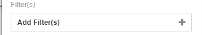
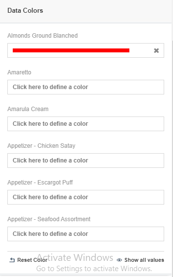

# Nested Donut

Nested donut chart (also known as Multi-level doughnut chart, Multi-series doughnut chart) allows you to display multiple series in a single visualization. The series are usually related but represent different categories or slices of data (like the distribution of some category values over different years, etc.)

## Diagram Design / Configutation
---
### Binding
- The bindings required are
    >Category, Inner Value and Outer Value

    

### Filter

There are few options as shown in the picture below to filter on data.

    

### Top Bottom Filter

There are three options to filter by row limit

    

- All
- Top
- Bottom

### Data Color

When want to change the data color it required to bind the categoryPath in order to change the data color.

## Use Cases
---

### Grocery Actual Sold VS Return Amount

Through the nested donut, you can visualize each of the item in the grocery actually the product is sold good or not. Based on the chart, some of the product is actual sold is higher then return amount, that means the product is actually sold in good condition, but if total return amount is higher then actual told , that is a bad condition, it need to take action about that product to investigate what is happening about that product.

Sample data download [Grocesary Data](./sample-data/nested-donut/grocesary.csv).

### Covid 19 Cases

This use case is actually see the sample data covid 19 cases in each country with positive cases and negative cases. So when some country are highly positive cases, so it can warm to the users don't travel to that particular country.

Sample data download [Covid 19 Data](./sample-data/nested-donut/covid19.csv).