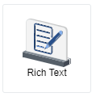
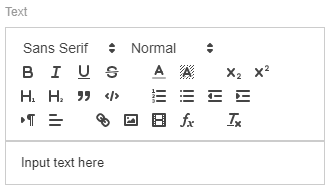
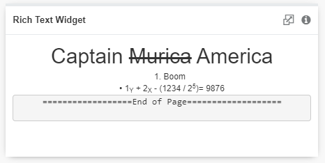
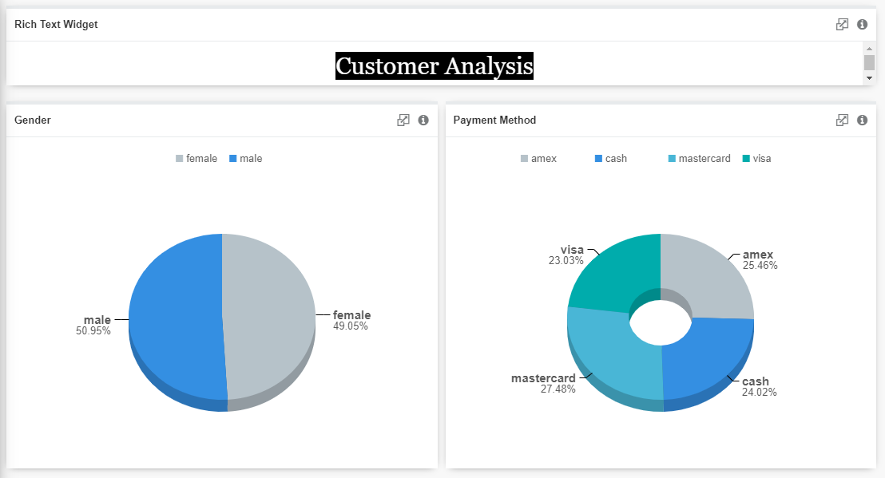
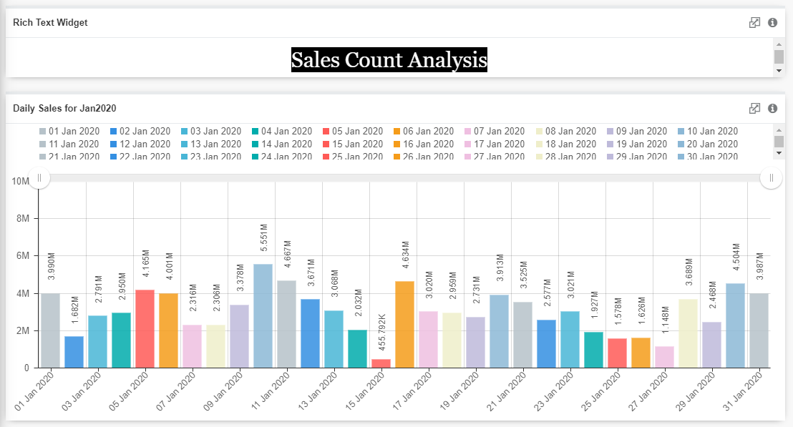

## Rich Text Widget

A Rich Text widget displays text that uses multiple different styles. It supports text formatting such as bold, italics and underlining, as well as different fonts, font sizes and coloured text. It is also capable to display subscript, superscript, links, images and embedded video.

## Data Binding
### Text

All the styles formatting available are as shown above. "Input text here" is the text area where you could input your text, links, images and videos.

## Other Settings

### Left Padding
Left Padding is the space on the left-hand side between its content and its border. The property values that it accepts include length and percentage. There are two types of lengths which are absolute lengths and relative lengths. (Refer to Padding Length Units section below)

### Top Padding
Top Padding is the space on the top between its content and its border. The property values that it accepts include length and percentage. There are two types of lengths which are absolute lengths and relative lengths. (Refer to Padding Length Units section below)

### Right Padding
Top Padding is the space on the right-hand side between its content and its border. The property values that it accepts include length and percentage. There are two types of lengths which are absolute lengths and relative lengths. (Refer to Padding Length Units section below)

### Bottom Padding
Top Padding is the space on the bottom between its content and its border. The property values that it accepts include length and percentage. There are two types of lengths which are absolute lengths and relative lengths. (Refer to Padding Length Units section below)

### Padding Length Units
### Absolute Lengths
The absolute length units are fixed and a length expressed in any of these will appear as exactly that size. 

|Unit|Description|
|---|---|
|cm|centimetres|
|mm|millimetres|
|in|inches (1in = 96px = 2.54cm)|
|px*|pixels (1px = 1/96th of 1in)|
|pt|points (1pt = 1/72 of 1in)|
|pc|picas (1pc = 12pt)|

*\*Note: Pixels (px) are relative to the viewing device. For low-dpi devices, 1px is one device pixel (dot) of the display. For printers and high resolution screens 1px implies multiple device pixels.*

### Relative Lengths
Relative length units specify a length relative to another length property. Relative length units scale better between different rendering medium.

|Unit|Description|
|---|---|
|em|Relative to the font-size of the element (2em means 2 times the size of the current font)
|ex|Relative to the x-height of the current font (rarely used)|
|ch|Relative to the width of the "0" (zero)|
|rem|Relative to font-size of the root element|
|vw|Relative to 1% of the width of the viewport*|
|vh|Relative to 1% of the height of the viewport*|
|vmin|Relative to 1% of viewport's* smaller dimension|
|vmax|Relative to 1% of viewport's* larger dimension|
|%|Relative to the parent element|

*\*Note: Viewport refers to the browser window size. It varies with the device type used to view the widget. If the viewport is 50cm wide, 1vw = 0.5cm.*

## Use Case
Rich Text widget can be used to showcase images, videos, links and some other styled text as shown below. 

### Output

## Use Case 2
Rich Text widget can also be used as a header in a dashboard as shown below.

### Output

