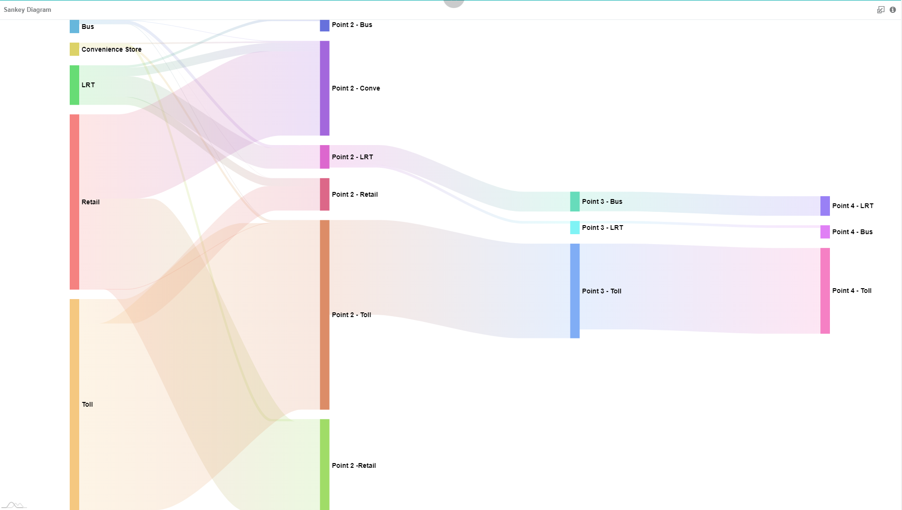
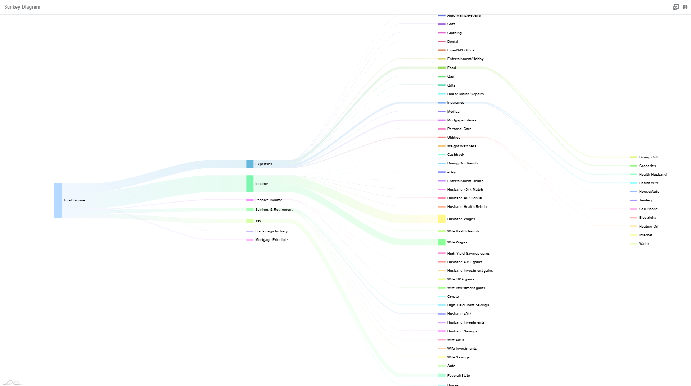

## About this chart

Sankey diagram displays the data flows and the respective quantities.   
This chat is typically used to show flow of money, materials, information and energy.   
The width of the thread connecting from one point to another shows the relative strength of the flow.

## Use cases

### eWallet Usage Points   
   
To show the number of users that uses e-wallet payment from Point 1 to the next subsequent points. You will be able to see in which group the majority of users falls into; those that use this payment method only 1-2 times a day or more than 2 times a day, also the journey that the users go through as they use the e-wallet payment system.

Sample data download [here](./sample-data/sankey-diagram/ewallet-usage-points.xlsx).

### Annual Finances of A Married Couple   
   
This dataset shows the finance flow of a married couple. It illustrates how their income is managed in terms of expenses and savings, also how the money flows.

Sample data download [here](./sample-data/sankey-diagram/annual-finances-of-a-married-couple.xlsx).