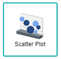
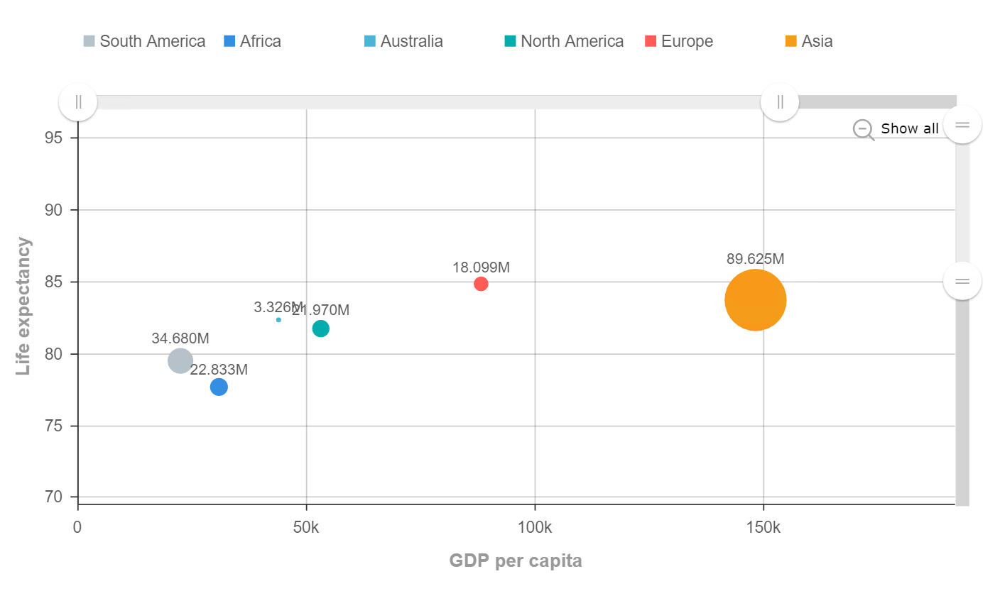

# Scatter Plot

Scatter plots are diagrams that uses dots to mark or represent values for two different numeric variables. Each individual data point within a dataset is indicated through the position of each dot within the horizontal and vertical axis. The scatter plot could be used to observe relationships between the variables, where patterns that happen within the chart are taken as a whole.

## Data Binding

For the scatter plot, there are few mandatory bindings to generate the chart which are the **X-Axis** and **Y-Axis** properties. For each property, there are specific data types need to fulfill in order for the timeline chart to render correctly, such as can be seen below:

|Bindings|Data Type|
|---|---|
|X-Axis|Numerical|
|Y-Axis|Numerical|

### X-Axis

For scatter plot generation, the **X-Axis** is uses one of the numerical fields in order to cross reference itself with the **Y-Axis** to find their relationship between one another is linear or non-linear.

### Y-Axis

For scatter plot generation, the **Y-Axis** is uses one of the numerical fields in order to cross reference itself with the **X-Axis** to find their relationship between one another is linear or non-linear.

## Other Settings

### Size

With the **Size** binding, a numerical field could be used for giving a sample size on the graph for the data labels to display on how much is the value of the plot.

### Group

With the **Group** binding, a string field could be used for giving categories on datasets that have alot of values that have linked values on another field.

### Sort

For huge data sets, a setting called **Sort** can be used to alter the scatter plot on different specifics that the user wants to view or create on the chart.

### Filtering

Another setting that could be used is **Filter** where it applies filters to restrict or focus on data shown in the chart.

 > *NOTE*: The **Other Settings** are used in order to prevent overplotting to happen from large datasets as there would be too many data points overlapping one another to properly distinguish their relationships.

## Use Cases
### Alligator Sizes Depending on Weight and Length
The dataset on this usecase was created to see whether the size of an alligator from its total weight(pounds) is dependant from its total length(inches). As numerical values take up majority of the fields within the dataset, a scatter plot could be used to find out the relationship between each of the fields. Download sample data [here](./sample-data/scatter-plot/alligator-sizes.xlsx).

As the dataset provides only numerical fields, generation of the scatter plot would be relatively easy, as there would only be two fields that need to be used which are **Length of Alligator(inches** and **Weight of Alligator(pounds)**.

|Bindings|Field to Select|
|---|---|
|X-Axis|Length of Alligator(inches)|
|Y-Axis|Weight of Alligator(pounds)|

*Note:* Be sure to disable the additional label displays from the settings

With the help of the scatter graph, it can be seen that the plot is marked down with a linear regression pattern. This means that the length of the alligator is directly proportional to the weight of the alligator, affecting the sizes of alligators respectively.

**Output**

### GDP per capita and Life Expectency in 2015
Taken from a study in 2015, this large dataset compares the relationship between the world GDP(Gross Domestic Product) per capity in US Dollars and the life expentency from each country. For this scatter plot, we are going to be grouping the countries into their respective continents to prevent overplotting. Download sample data [here](./sample-data/scatter-plot/data-uoiYJ.csv).

As the dataset is compiled with several fields, there could be more flexibility in the creation of this scatter plot, as there would be many possiblities to rearrange the categories. The fields that are going to be used for the scatter plot are **GDP per capita** and **Life Expectancy**.

|Bindings|Field to Select|
|---|---|
|X-Axis|GDP per capita|
|Y-Axis|Life Expectancy|
|Size|Population|
|Group|Continent|

From the scatter chart below, there are six listed continents that appear to be scattered in a linear line. By using the **Size** and **Group** bindings, the total amount of markers are narrowed down to have a clearer view of the whole scatter chart.

**Output**

**Analysis**

By analysing the chart deeper, it can be concluded that the GDP per capita affects the life expectancy of the countries within the continents. With this, a clear relationship can be seen as with a higher standard of living would also increase the longevity of a nation's livelihood. Adding on, as the graph is plotted in linearly, it can be used to identify other patterns within the dataset, as one could drill down within the scatter plot on to see if there are any other relationships that could be drawn out.