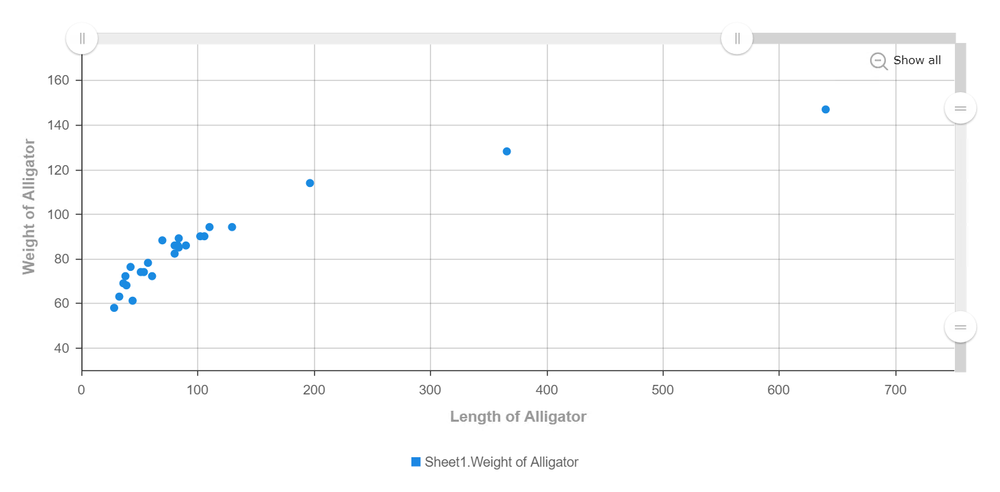

# Scatter Plot

Scatter plots are diagrams that uses dots to mark or represent values for two different numeric variables. Each individual data point within a dataset is indicated through the position of each dot within the horizontal and vertical axis. The scatter plot can be used to observe relationships between the variables, whereby patterns that happen within the chart are taken as a whole.

## Data Binding

There are a few mandatory field bindings required to generate the chart which are the **X-Axis**, **Y-Axis** and **Group** properties. For each property, specific data type need to be fulfilled in order for the chart to render correctly, such as below:

|Bindings|Data Type|
|---|---|
|X-Axis|Numerical|
|Y-Axis|Numerical|
|Group|Category(Text, Numeric or Date)|

### X-Axis

For scatter plot generation, the **X-Axis** is uses one of the numerical fields in order to cross reference itself with the **Y-Axis** to find their relationship between one another is linear or non-linear.

### Y-Axis

For scatter plot generation, the **Y-Axis** is uses one of the numerical fields in order to cross reference itself with the **X-Axis** to find their relationship between one another is linear or non-linear.

### Group

The **Group** binding determines the category to use to display the data points in the chart. It can be a Date, Text or Numeric data type.

## Other Settings

### Size

With the **Size** binding, a numerical field can be used to show the qualitative difference in values between all the data markers. This makes it easier to spot data points of interest at a glance.

### Sort

You can use this setting to arrange your data points based on the field that you need. For example, to sort data by Country field in Ascending order.

### Filter

Another setting that can be used is **Filter** whereby specifying the filter(s) will restrict the values shown so that users can focus on analyzing the filtered data shown in the chart.

 > *NOTE*: Settings such as **Size**, **Sort** and **Filter** are used in order to prevent overplotting to happen from large datasets as there would be too many data points overlapping one another to properly distinguish their relationships.

## Use Cases
### Alligator Sizes Based on Weight and Length
The dataset on this use case was created to see the relationship between the size of an alligator with the total weight (in pounds) and total length (in inches). Since there are more than one numerical value needed to analyse the data, a scatter plot can be used to find out the relationship between each of the fields. Download sample data [here](./sample-data/scatter-plot/alligator-size.xlsx).

As the dataset provides only numerical fields, generation of the scatter plot would be relatively easy, as there would only be two fields that need to be used which are **Length of Alligator(inches)** and **Weight of Alligator(pounds)**. For the **Group** binding, either the **Length of Alligator(inches)** and **Weight of Alligator(pounds)** could be used to give the user flexibility in  doing analysis on both types of groups provided.

|Bindings|Field to Select|
|---|---|
|X-Axis|Length of Alligator(inches)|
|Y-Axis|Weight of Alligator(pounds)|
|Group|Length of Alligator(inches) *OR* Weight of Alligator(pounds)|

From the scatter plot, it can be seen that the data has a linear regression pattern. This means that the length of the alligator is directly proportional to the weight of the alligator, affecting the sizes of alligators respectively.

**Output**

### GDP per capita and Life Expectency in 2015
Taken from a study in 2015, this large dataset compares the relationship between the world GDP (Gross Domestic Product) per capita in US Dollars and the life expectancy from each country. For this scatter plot, we will be grouping the countries into their respective continents to prevent data marker over-plotting. Download sample data [here](./sample-data/scatter-plot/data-uoiYJ.csv).

Since the dataset contains several data fields, there is more flexibility in the creation of this scatter plot, which affects the data analysis. In this example, the fields used for the scatter plot are shown in the table below:

|Bindings|Field to Select|
|---|---|
|X-Axis|GDP per capita|
|Y-Axis|Life Expectancy|
|Size|Population|
|Group|Continent|

Here's the output of the scatter plot using the above data bindings:

**Output**

**Analysis**

By analysing the chart deeper, it can be concluded that the GDP per capita affects the people's life expectancy of the countries within the continents. With this, a clear relationship between the numerical attributes can be seen and we can say that a higher standard of living would also increase the longevity of a nation's livelihood. Adding on, as the graph has an almost linear plot, it can be used to identify any data outliers (i.e. the grey data marker and yellow data marker, which do not lie within the linear path of the data plot). This would be something of interest for further investigation or research.