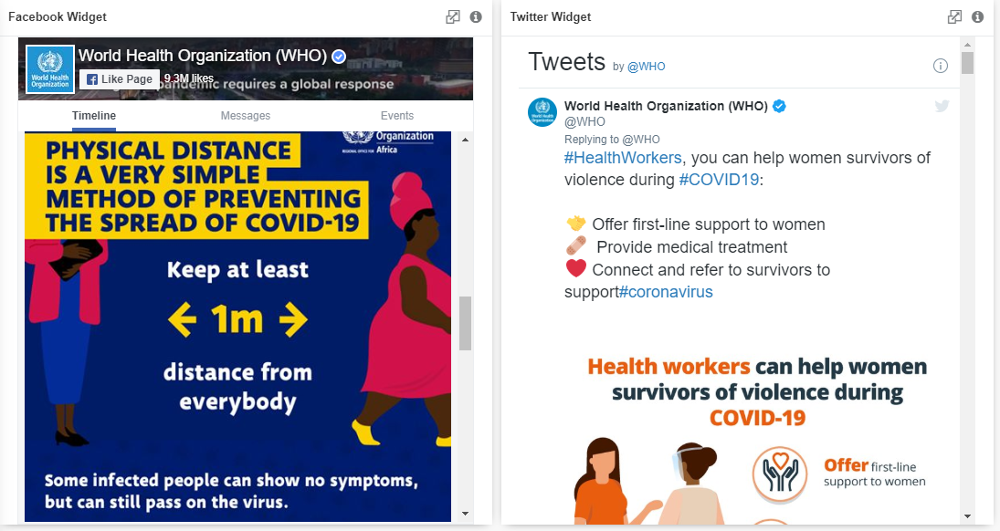

## Social Media

  

There are two social media widgets in GIANT, which are the Facebook and Twitter widget. By using the widget, you could keep track of what is going on in the social media of a certain page, people or group that you wish to monitor. It can be used to redirect users as well, to visit the pages and learn more about the people or companies.

 

## Data Binding

There is only a single mandatory binding for each widget which are **Facebook Page Url** for Facebook and **Twitter Id** for Twitter.

|Bindings|Data Type|
|---|---|
|Facebook Page Url|*Url*|
|Twitter Id|*Twitter Id*|

## Facebook Settings

### Facebook Page Url

Copy the Url of the Facebook Page that you wish to include in the chart.

### Cover Photo

The **Cover Photo** option allows you to turn on or turn off the cover photo.

### Profile Photos

The **Profile Photos** option allows you to turn on or turn off the profile photos.

### Small Header

The **Small Header** option allows you to turn on or turn off the small header.

### Locale

The **Locale** allows you to choose your preferred language from the drop-down list.

## Twitter Settings

### Twitter Id

Based on "twitter.com/XXXXXX", where XXXXXX is the Twitter ID.

### Data Widget Id

Insert Twitter's data widget ID if there is any available widget in-use.

### Header

The **Header** option allows you to turn on or turn off the header.

### Footer

The **Footer** option allows you to turn on or turn off the footer.

### Border 

The **Border** option allows you to turn on or turn off the border.

### Language

The **Language** allows you to choose your preferred language from the drop-down list.

 

## Use Case 1
### Customer Service on Social Media
Most, if not all, companies today have their own social media pages. This is due to the ease of managing customer traffic when providing information, social media accessibility from anywhere, anytime and the low costs to market their businesses. Consumers could reach out to customer service quicker than ever nowadays with the use of social media and some businesses even provide real-time customer service online. Their social media managers will monitor the companies' social media and make responses accordingly.

To monitor the social media's posts, reactions and comments, a social media widget that connects to two of the largest social media platforms worldwide, Facebook and Twitter, is needed. Apart from monitoring your own social media content, you can also use it to monitor and analyse your competitors' social media pages.

Configure the Facebook widget with settings as follows:

|Bindings|Select|
|---|---|
|Facebook Page Url|https://www.facebook.com/FusionexInternational|

Configure the Twitter widget with settings as follows:

|Bindings|Select|
|---|---|
|Twitter Id|FusionexInt|

Other settings that are not mentioned in the tables above, are just aesthethic settings which will not have any
significant impact.

**Output**

**Analysis**

By using the social media widgets, a social media manager or online customer service representative could monitor any available page on Facebook/Twitter as long as the posts are visible to the public, including reactions, shares and comments. It is also clickable whereby upon clicking on the post from the widget, it redirects you to the particular post. Hence, if any changes to the post is needed or replying feedback, this can be done quite easily.

## Use Case 2
### Social Media Widget to Redirect Users
World Health Organization (WHO) is one of the key organizations in the world in the year 2020 due to the COVID-19 pandemic. For example, several charts have been added to the dashboard including current donation vs. amount of donation needed, number of new cases, patients recovered and death count.

Social media widgets could then be added after all the aforementioned charts to redirect users to learn more about WHO such as what the organization is about, what are they doing to tackle the emergence of this very new global pandemic - COVID-19.

Configure the Facebook widget with settings as follows:

|Bindings|Select|
|---|---|
|Facebook Page Url|https://www.facebook.com/WHO|

Configure the Twitter widget with settings as follows:

|Bindings|Select|
|---|---|
|Twitter Id|WHO|

Other settings that are not mentioned in the tables above, are just aesthethic settings which will not have any significant impact.

**Output**

**Analysis**

With the inclusion of social widget, the page is just one-click away for users that are interested to learn more about WHO. This will help WHO to spread more awareness about the COVID-19 pandemic and thus bringing in more people to donate to those who are in need or spread the news via word-of-mouth.