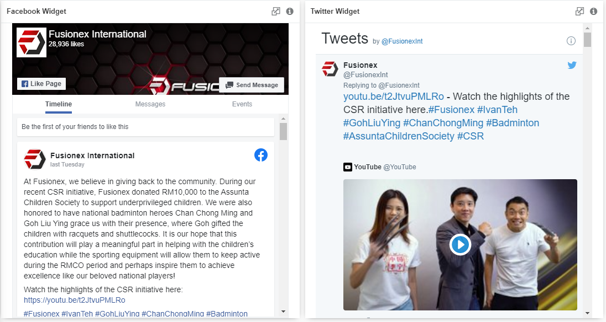

## Social Media

  

There are two social media widgets including Facebook and Twitter. By using the widget, you could keep track
of what is going on in the social media of a certain page, people or group that you wish to monitor.

 

## Data Binding

There is only a single mandatory binding for each widget which are **Facebook Page Url** and **Twitter Id** for Facebook and Twitter, respectively.

|Bindings|Data Type|
|---|---|
|Facebook Page Url|*Url*|
|Twitter Id|*Twitter Id*|

## Facebook Settings

### Facebook Page Url

Copy the Url of the Facebook Page that you wish to include in the chart.

### Cover Photo

The **Cover Photo** option allows you to turn on or off the cover photo.

### Profile Photos

The **Profile Photos** option allows you to turn on or off the profile photos.

### Small Header

The **Small Header** option allows you to turn on or off the small header.

### Locale

The **Locale** allows you to choose your preferred language from the drop-down list.

## Twitter Settings

### Twitter Id

Based on "twitter.com/XXXXXX", where XXXXXX is the twitter ID.

### Data Widget Id

Insert Twitter's data widget ID if there is any available widget in-use.

### Header

The **Header** option allows you to turn on or off the header.

### Footer

The **Footer** option allows you to turn on or off the footer.

### Border 

The **Border** option allows you to turn on or off the border.

### Language

The **Language** allows you to choose your preferred language from the drop-down list.

 

## Use Case
### Customer Service on Social Media
Most if not all companies today have their own social media pages because of its customer traffic,
accessibility from anywhere, anytime and the low costs to market your business. Customers could reach out to
customer service quicker than ever nowadays with the use of social media and some businesses even provide
real-time customer serivce online and have their social media managers monitoring their social media and
make responses accordingly.

To monitor its page's posts, reactions and comments, a social media widget consisting of two of the largest
social media platforms worldwide, Facebook and Twitter, is needed. You could also utilise it to monitor
other pages such that you are analysing your competitors.

Configure the Facebook widget with settings as follows:

|Bindings|Select|
|---|---|
|Facebook Page Url|https://www.facebook.com/FusionexInternational|

Configure the Twitter widget with settings as follows:

|Bindings|Select|
|---|---|
|Twitter Id|FusionexInt|

Other settings that are not mentioned in the tables above, are just aesthethic settings which will not have any
significant impact.

**Output**

**Analysis**

By using the social widgets, a social media manager or online customer service could monitor any available 
page on Facebook/Twitter as long as the posts are visible to the public, including reactions, shares and 
comments. It is also clickable where it directs you to the particular post if any changes to the post is
needed or replying feedback.