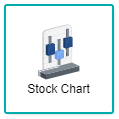
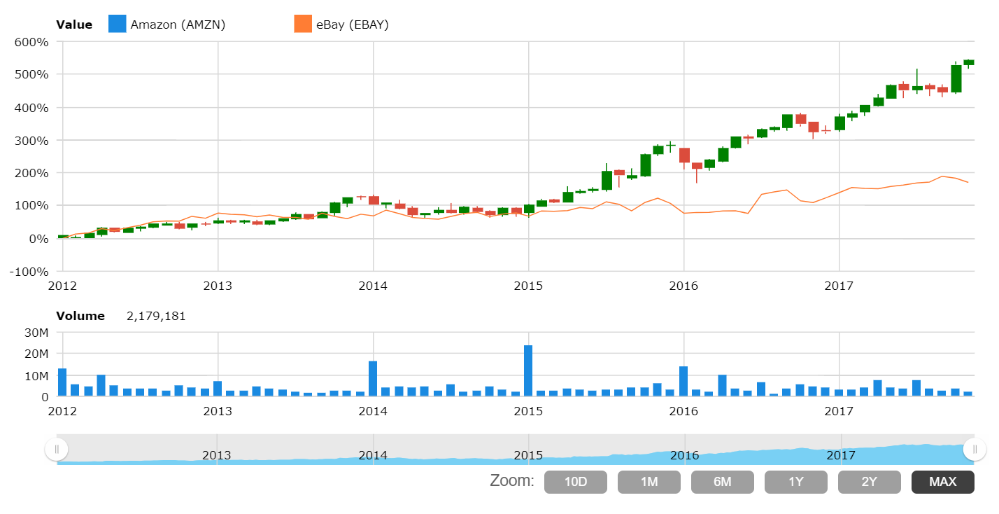

## Stock Chart

Stock chart is another visualisation of a price chart, where the stock prices are plotted over a time frame. Several key terms within the chart are necessary to be understood before moving onwards to analysing the chart such as the Stock Symbol, Chart Period, Price Change, and Volume.

There are 3 different mini-charts that will display different values within the stock chart, the first and most notable is the Candle and Stick chart to display the OHLC (Open, High, Low, Close) data in an easy to read manner. The second is the Bar chart that plots the OHLC data for each day, and lastly is the Line chart to plot the closing price of a chart over time.

Stock charts are generally used by investors and traders for allowing them to create predictions on a stock's future price action, whereby the chart patterns, volume analysing and price area pinpoints will be made.

> *NOTE:* The key terms of stock chart will be explained in further detail within the **Data Binding** section of this documentation.

## Data Binding

For creating the stock chart, there are several mandatory bindings used to properly generate the chart which are the **Stock Code**, **Stock Name**, **Stock Date**, **Open**, **High**, **Low**, **Close** and **Volume**.

|Bindings|Data Type|
|---|---|
|Stock Code|Text|
|Stock Name|Text|
|Stock Date|Date|
|Open|Numeric|
|High|Numeric|
|Low|Numeric|
|Close|Numeric|
|Volume|Numeric|

### Stock Code

A field with Text data type can be used for **Stock Code** binding. This will be displayed as the Stock Symbol, usually ranged from 1-5 letters.

### Stock Name

A field with Text or Date data type can be used for **Stock Name** binding. This will be displayed as the Name of the Stock Code, where it represents the company from the Stock Exchange.

### Stock Date

The **Stock Date** binding determines the Time Period to be placed within X-Axis values of the chart. A Date data type is used to display the dimension as it is possible to alter between 10 Days, 1 Month, 6 Months, 1 Year, 2 Years, and Max (Total).

### Open

A field with Numeric data type can be used for **Open** binding. This will display the measurement on Price Change for the price of the first trade.

### High

A field with Numeric data type can be used for **High** binding. This will display the measurement on Price Change for the highest price at which the stock traded during the Time Period.

### Low

A field with Numeric data type can be used for **Low** binding. This will display the measurement on Price Change for the lowest price at which the stock traded during the Time Period.

### Close

A field with Numeric data type can be used for **Close** binding. This will display the measurement on Price Change for the last price at which the stock was traded.

### Volume

The **Volume** binding determines the Volume amount of stock that has been bought and sold within the Time Period. A Numeric data type is used to display the measurement.

## Other Settings

### All/Top/Bottom

By default, the option selected is All (which means, all the data points will be shown in the chart). Select Top or Bottom, followed by the number of data points required to show the selected number of top-most data rows **OR** selected number of bottom-most data rows.

### Sort

You can use this setting to arrange your data points based on the field that you need. For example, to sort by Country in ascending order.

### Filter

Add filters to restrict your data so that analysis will be focused on data which are shown in the chart.

## Use Cases
### Stock Market Comparison between Amazon, eBay & Walmart (2012-2017)
The dataset on this use case is fetched from the US Stock Market for Amazon, eBay and Walmart for the years of 2012 to 2017. Download sample data [here](./sample-data/stock-chart/stock-amzn-ebay-wmt.csv).

Below are the fields required for the data binding to generate the chart according to the given dataset:

|Bindings|Select|
|---|---|
|Stock Code|Stock Code|
|Stock Name|Stock Name|
|Stock Date|Date|
|Open|Open|
|High|High|
|Low|Low|
|Close|Close|
|Volume|Volume|

From the chart analysis, it is easily visible that the trend pattern alters every 12 months, this occurs on months that have a high volume of stock trading for Amazon and eBay. This could be interpreted from the colour change of Candle and Stick chart (from red to green) along with the increase of Volume seen in the Bar chart.

**Output**

>*NOTE:* Click on the *MAX* button on the bottom right to generate the same output as below (full display of 5 years)

**Analysis**

The conclusion of the use case chart for Stock Market Comparison shows an already established trend pattern, meaning that once there is a spike in volume, the trend for Amazon and eBay will change. As shown within the diagram, the January of every year will experience a high volume of stock trading participation among traders and investors where it is done kickstart a new trend pattern of stock trading within the year. Not only that, it can also be seen that the trend pattern of each year are gradually increasing every year, with a faster pace starting 2015 onwards. For potential traders and investors to seek to enter the stock trade of Amazon, eBay and Walmart, it is advisable for them to start in January as it would be easier to find stocks to buy and sell among other traders.