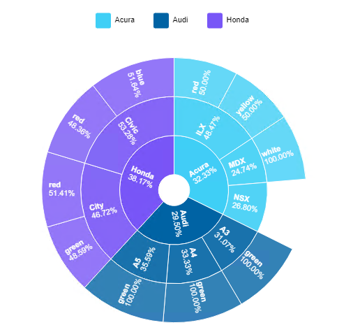

# Sunburst Chart

Sunburst chart is an illustration of categorical data to show the effect of different categories on the overall data. It is able to illustrate data for multiple levels of categories.The chart can be utilized to see which category of data has a larger effect, making it more important. It is more efficient than a regular chart because the releationship between different catgeories can be seen in one whole pie chart. The size of a slice is able to show the effect of a particular category and value on the overall data. It is typically used for data such as total sales as it is able to filter the sales generated by many different categories and illustrate each category's impact.

## Diagram Design / Configuration
---

### Binding
- The bindings required are only 1 dimension and 1 measuremnent binding.  
- Only 1 dimension binding is required despite multiple dimension bindings are available.
- There can be multiple dimension bindings which creates more layers in the sunburst chart.
    >The bindings are Category Path(s) for dimension and Value Path for measurement 

### Other Settings

#### All/Top/Bottom

By default, the option selected is All (which means, all the data points will be shown in the chart). Select Top or Bottom, followed by the number of data points required to show the selected number of top-most data rows **OR** selected number of bottom-most data rows.

#### Sort

You can use this setting to arrange your data points based on the field that you need. For example, to sort by Country in ascending order.

#### Filter

Add filters to restrict your data so that analysis will be focused on data which are shown in the chart.

#### Cross Chart

You can use this setting if you wish to publish filter selected data across charts within dashboard.

#### Color Palette

You can use this setting if you wish to change the colors of the slices used in the sunburst chart.

#### Legend

You can use this setting if you wish to change the position of the legend or remove it completely.

#### Label/No Label

You can use this setting if you wish to remove the data labels on the sunburst chart.

## Use Case
---

### Sales Analysis of Apple Retail Products 
The dataset for this use case is a combined sales report of Apple product sales from January to June. The sales report consist of rows with information on each Apple product purchasal over the 6 months. It has information such as date purchased, store purchased, state store is located, units purchased, customer gender/age and more. 

Sample data can be downloaded [here](./sample-data/sunburst-chart/data.xlsx).

The first example of how the sunburst chart can be utilized in this case is by using the state the store is located together with the customer gender and age columns in the dataset. The bindings for this dataset would be putting data.state, data.gender and data.age as the multiple dimension bindings while the only measurement binding in this case would be the sum of sales. Here is a table for better understanding corresponding to the setting controls.

|Bindings |Data Type|
|---|---|
|Category Path|product name|
|Category Path|state|
|Value Path|sum of sales|

### Output

### Analysis

From the graph, we can see how different categories contribute to the total sales. We can tell that in general iMac provides the greatest contribution to the overall sales. A unique analysis that can only be easily seen on a sunburst chart is such as the comparison between Macbook and iPhone 12 sales in Sabah. Both sales contributed 33.1% to the state total sales but it can be seen clearly that the sales generated by Macbook is higher because it is a larger piece of the pie. This analysis will be harder to reach when breaking down drill down levels of other charts which is why a sunburst chart is helpful in cases like this where multiple level of filters are used to analyze data. It becomes easier to visualize how much does a slice contribute to the whole pie without being affected by the percentage it contributes to each level. For example, despite iPad and iMac sales in Johor having similar percentage numbers, iMac sales contributed more to the whole pie in terms of total sales.
