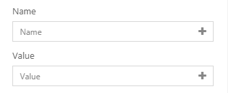

# SVG Funnel
SVG Funnel is a spiced up variation on a regular stacked bar or column chart. It uses a meaningful subject-related image to frame the values of the whole divided into segments comprising that whole. 

## Diagram Design / Configuration

### Bindings
- The bindings required are 1 dimension and 1 measurement.
    > Name will be the dimension and Value will be the measurement.
- The name will be the label for each level while value will determine the area of the dimension in the SVG.

### Setting SVG Path
- SVG Path can be set by entering the desired SVG image path in the *Icon SVG Path* input field.
- Sample SVG [here](./sample-data/svg-funnel/sample-svg.txt).
    >Copy and paste the svg path to see the below output.

- If no path is entered, the default human icon will be used.

### Caveats
- If there is a null column in name field, it will still work with only value.
- If there is a null column in value field, it will not exist in the diagram but will only exist in the legend.
- If there is a negative value, the chart will not function properly.

Example: 

## Use Cases
### Coca Cola Ingredients
We can use SVG Funnel to show the ingredients of coca cola. We can use coca cola icon to make the visual fascinating and attractive.
Sample data download [here](./sample-data/svg-funnel/coca-cola-ingredients.csv)
Get Coca Cola SVG Path [here](./sample-data/svg-funnel/coca-cola-svg.txt)

#### Ouput

#### Binding 
The diagram below shows the data binding for coca cola ingredients use case.

### Airplane Materials
We can use SVG Funnel to show the materials of an airplane. We can use an airplane icon to visualize the material of an airplane. 
Sample data download [here](./sample-data/svg-funnel/airplane-material.csv)
Get Airplane SVG Path [here](./sample-data/svg-funnel/airplane-svg.txt)

#### Output

#### Binding
The diagram below shows the data binding for airplane materials use case.

