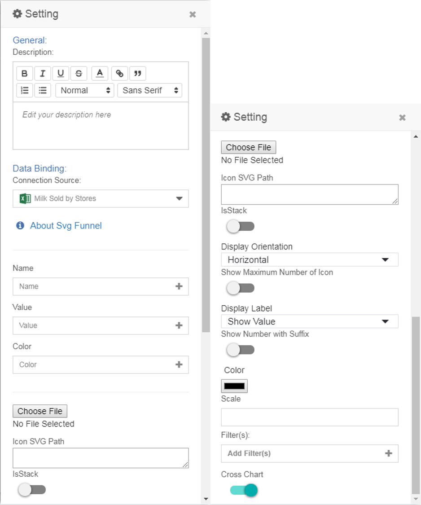

# SVG Funnel

## Introduction
The SVG Funnel is a visual that uses an image to represent the categories and values in a chart. There are two types available, depending on the chart mode that you choose for the chart:

**a) Type 1 - Stacked SVG Funnel**   
Stacked SVG Funnel is a spiced up variation of a regular stacked bar or column chart. It uses an image to provide an overview of the categories, represented in segments. Each segment corresponds to the value of each category.

**b) Type 2 - Non-Stacked SVG Funnel**   
Non-Stacked SVG Funnel is a pictograph which shows data using images. A pictograph uses picture symbols to convey the meaning of statistical information. Each picture symbol stands for a certain value.

## Visual Configuration   
After selecting the chart to add to your dashboard, you will see the following data binding fields shown in the **Setting** panel:

\** NOTES:  
1. Colour Code - This is the list of supported formats for the colour code:

2. SVG Path - Refer [here](https://www.w3schools.com/graphics/svg_path.asp) for more info on SVG Path. Get the sample [here](./sample-data/svg-funnel/sample-svg.txt).
 
The next sections provide more details on the data bindings which are specific to the **Stacked SVG Funnel** and **Non-Stacked SVG Funnel**.

### Data Binding for Stacked SVG Funnel
To get this chart, you need to **enable** the **IsStack** toggle

The image below shows the fields related to the chart's data bindings.

 
- The required bindings are 1 dimension and 1 measurement.
    > **Name** will be the dimension and **Value** will be the measurement.
- The **Color** field is an optional binding.
- The values from the **Name** field will be shown as the label for each category. The area or height of the segments in the image is auto-calculated from the **Value** field binding. The value from the **Color** field will determine the color of each segment.
- You can also use the Color Palette to configure the color of the image. 
    > NOTE: If a valid data binding for the **Color** field is provided, the selected **Color Palette** will be ignored.
    
    
    
- Upload an SVG image (click on **Choose File** button to do so) or use the **Icon SVG Path** to set the image displayed in the chart.

- You can get the sample SVG [here](./sample-data/svg-funnel/sample-svg/sample.svg).
    > Copy and paste the svg path to see the below output.

- If **SVG file** is not provided or **Icon SVG Path** not specified, the default human icon will be used.
    > NOTE: If the SVG file is provided, the **Icon SVG Path** will be ignored.
    
- Here's the Sample Output of the chart with completed data bindings.

### Data Binding for Non-Stacked SVG Funnel
To get this chart, you need to **disable** the **IsStack** toggle

The image below shows the fields related to the chart's data bindings.

- The required bindings are 1 dimension and 1 measurement.
    > **Name** will be the dimension and **Value** will be the measurement.
- The **Color** field is an optional binding.
- The values from the **Name** field will be shown as the label for each category. The number of icons shown for each category is auto-calculated from the **Value** field binding and the value specified in the **Scale** field. The value from the **Color** field will determine the color of the icon.    
- Upload an SVG image (click on **Choose File** button to do so) or use the **Icon SVG Path** to set the image displayed in the chart.
- You can get the sample SVG [here](./sample-data/svg-funnel/sample-svg/sample.svg).
    > Copy and paste the svg path to see the below output.

- If **SVG file** is not provided or **Icon SVG Path** not specified, the default human icon will be used.
    > NOTE: If the SVG file is provided, the **Icon SVG Path** will be ignored.
- **Display Orientation**: Select the value to display the icons in **Horizontal** or **Vertical** orientation.
- **Show Maximum Number of Icon**: Enable the toggle to show the maximum number of icons for each Category (it will be the same as the number of icons shown for the category with the highest value).

    

- **Display Label**: Choose to show the actual **Value**, show the value in **Percentage** or show both the **Value and Percentage**.

    Example for **Show Value**
    

    Example for **Show Percentage**
    

    Example for **Show Value and Percentage**
    
    
- **Show Number with Suffix**: To show large numbers as formatted value (i.e. 1,000,000 will be shown as 1.00M)

    

- **Color**: To set the color of the icons.

    

- **Scale**: To set the value represented by one icon (e.g. to set one icon is equal to 8,000 units)

    

- Here's the Sample Output of the chart with completed data bindings.
    

### Caveats
- If there is a null value in the **Name** field, it will still show in the chart with only the value .
- If there is a null value in **Value** field, it will not exist in the chart but shown in the legend.
- If there is a negative value, the chart will not function properly.

Examples:   
Caveat 1

Caveat 2

## Use Cases

### Stacked SVG Funnel

- ### Coca Cola Ingredients
    We can use the SVG Funnel to show the ingredients of the Coca Cola drink. We can use the Coca Cola icon to make the visual fascinating and attractive.
Download sample data [here](./sample-data/svg-funnel/coca-cola-ingredients.csv). Get Coca Cola SVG file [here](./sample-data/svg-funnel/coca-cola-svg/coca-cola.svg).

    #### Output
    

    #### Binding 
    The diagram below shows the data bindings for the Coca Cola ingredients use case.

    

- ### Airplane Materials
    We can use the SVG Funnel to show the composition of materials of an airplane. We can use an airplane icon to visualize the use case. 
Download sample data [here](./sample-data/svg-funnel/airplane-material.csv). Get Airplane SVG Path [here](./sample-data/svg-funnel/airplane-svg/airplane-svg.txt)

    #### Output
    

    #### Binding
    The diagram below shows the data bindings for the airplane materials composition use case.
    
    
    
### Non-Stacked SVG Funnel

- ### Quantity of Strawberry Milk Sold
    We can use the SVG Funnel to show the quantity of strawberry milk sold in stores. The pictogram makes it easy to analyse at a quick glance on the quantity sold (in bottles) at each store.
Download sample data [here](./sample-data/svg-funnel/milk-sold.csv). Get the Milk Bottle SVG file [here](./sample-data/svg-funnel/non-stacked-svg/milk-bottle.svg).

    #### Output
    

    #### Binding 
    The diagram below shows the data bindings for the Quantity of Milk Sold use case.

    

- ### Grade of a Child
    The SVG Funnel can show the number of stars received by a child in kindergarten which corresponds to the child's daily behaviour in a week.
Download sample data [here](./sample-data/svg-funnel/child-grades.csv). Get the Star SVG file [here](./sample-data/svg-funnel/non-stacked-svg/star.svg).

    #### Output
    

    #### Binding 
    The diagram below shows the data bindings for the Child's Daily Behaviour use case.

    
