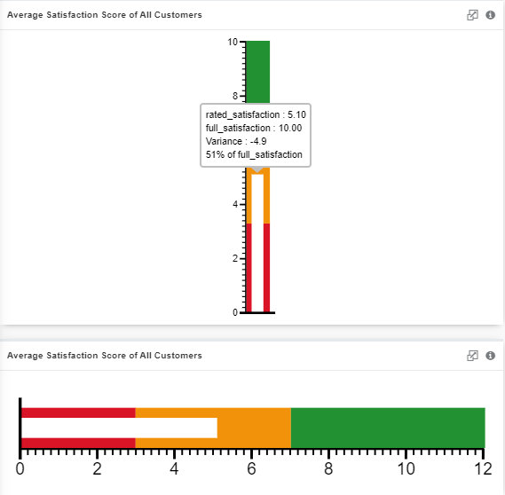
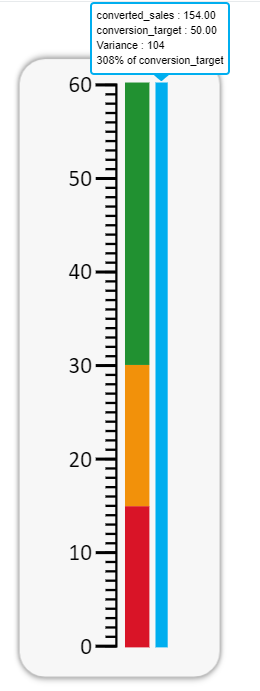
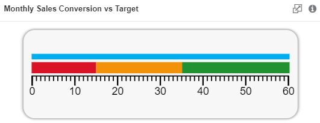

## Target Visuals

  
  
 

Target visuals are visuals that indicates progress towards meeting a target. 
There are three main types of visuals, Gauge, Bullet and Thermometer, which are then further broken down into six different visuals 
including Radial Gauge, Cylinder Gauge, Bullet Vertical, Bullet Horizontal, Thermometer Vertical and Thermometer Horizontal.
  First, a **Radial Gauge** has an appearance similar to a speedometer in a car, with a needle that moves to indicate the 
proximity of the current value to the goal. When you hover your cursor over the needle, more information will be shown.
  Second, a **Cylinder Gauge** is a 3D cylinder bar chart that would fill up as the actual value increases with the filled colour 
being the threshold set in the settings. When you hover your cursor over the filled area, more information will be shown.
  Third, a **Bullet Vertical or Bullet Horizontal** is a bullet chart that depicts the actual value as a white bar overlapping on the 
threshold bar with colours shown according to your settings. When you hover your cursor over the white bar, more information will be shown.
  Fourth, a **Thermometer Vertical or Thermometer Horizontal** is a thermometer chart that has similar appearance as a bullet chart 
except that the bar indicating the actual value are shown on the right side of the threshold bar and it is blue colour. When you hover 
your cursor over the blue bar, more information will be shown.

 

## Data Binding

The Data Binding options are the same across all target visuals. There are two mandatory bindings which are **Actual** value and **Target** value.

|Bindings|Data Type|
|---|---|
|Actual|Numeric|
|Target|Numeric|

### Actual/Target

Only Numeric data type can be used for both **Actual** and **Target** bindings with an exception for 'Unique' and 'Count' expressions.
For example, if you are to include a non-numeric data type field named 'Movie Name' and you would like to:
1. Find out how many non-repeated movies are in the connected source --> 'Unique' expression can be applied on non-numeric field to 
generate the total number of rows without repeated value.
2. Find out how many movies are there in total --> 'Count' expression can be applied on non-numeric field to generate the total number of
rows.

Ultimately, only numerical values will be shown.

## Other Settings

### All/Top/Bottom

By default, the option selected is All (which means, all the data points will be shown in the chart). Select Top or Bottom, followed by the number of data points required to show the selected number of top-most data rows **OR** selected number of bottom-most data rows.

### Threshold

You can choose between 'Increasing Better' or 'Decreasing Better' for Trending, and to set number of threshold quartiles and range of each
quartile. You can also change the colour of each quartile by clicking on the colour bar and a colour palette will pop up. You can even
add more quartile if you need more and remove them by pressing on 'X' button beside the percentage symbol.

### Filter

Add filters to restrict your data so that analysis will be focused on data which are shown in the chart.

 

## Use Case for Radial Gauge
### Bank's Website Weekly Downtime
The dataset used simulates a bank's website weekly downtime. For example, Bank ABC will have a daily fixed downtime from 12:00 AM to
2:00 AM for their internals to perform maintenance. The estimated downtime per day is 2 hours and would amount to a total of 14 hours
per week. An allowance for mistakes is given 1 hour per day, totalling 7 hours per week.

In this case, it is an 'Decreasing Better' trend, a green threshold should be within the range of 0% - 100%, indicating the percentage 
of target (14 hours and below). An orange threshold should be within the range of 100% - 150% (Above 14hrs, 21hrs and below) and 
anything above 150% should be classified as red.

Download sample data [here](./sample-data/target-visuals/downtime.csv).
 Provided within the dataset are the necessary fields needed to generate the radial gauge.

|Bindings|Select|
|---|---|
|Actual|\[Sum]*actual_downtime*|
|Target|\[Sum]*estimated_downtime*|

There are three fields in the CSV file, two of which are mentioned above, while the last one is a *date* field. You could filter *date* 
to look into the downtime per day. As shown in the table above, selecting \[Sum] expression for both
fields because you need the total value of actual downtime for a week and since the estimated downtime is defined per day, it should be
\[Sum] as well.

**Output**

**Analysis**

The green colour threshold is typically used to indicate a 'good zone', orange for slightly worse than expectation but still acceptable,
and red is for unsatisfactory output which requires immediate attention.
In this radial gauge, you can see that the green zone is leaning towards smaller number, which means this radial gauge is a "Decreasing
is better" trend as downtime is something every business trying to minimize.
Since the needle is pointing towards the orange zone, it means that something unusual have happened even though it is not as major that it would skew the output towards the red zone.
As you could see from the information pop-up box, the actual downtime is 3 hours more than the expected downtime. From here, you could 
deduce that the average downtime per day is 2 hours which are for bank to perform maintenance and transactional verification. 
Subtracting the expected value, you get a variance of 3 hours and this meant that the 3 hours are unexpected and unusual, you might
want to look into this further such as drilling down what day or hour when it happened, and to find out what is the cause. 
It might be due to lacking server memory as the business grows, so it is time to bring this issue to the management to procure a better 
server or to upgrade the memory.

 

## Use Case for Cylinder Gauge
### Tracking Kickstarter's Project Fund
The dataset used simulates a Kickstarter's project fund tracker. For example, Person A created a new Kickstarter project and gauged the
fund required to kickstart the project. The project owner set the end goal of the project at $20,000 required, with $15,000 as a healthy
progression, $10,000 to $14,999 as on track progression, and anything below $10,000 as off track progression.

In this case, it is an 'Increasing Better' trend, a green threshold should be within the range of 75% - 100%, indicating the percentage 
of target ($20,000). An orange threshold should be within the range of 50% - 75% and anything below 50% should be classified as red. Of 
course, sometimes a Kickstarter's project would receive more funding than expected, a blue threshold can then be added as well, to 
indicate a progression of beyond 100% (expected target).

Download sample data [here](./sample-data/target-visuals/kickstarter.csv).
 Provided within the dataset are the necessary fields needed to generate the cylinder gauge.

|Bindings|Select|
|---|---|
|Actual|\[Sum]*fund_raised*|
|Target|\[Maximum]*fund_needed*|
|Filter|*kickstarter_project*|

There are four fields in the CSV file, three of which are mentioned above, while the last one is a *date* field. You could filter *date*
to look into the amount of fund raised per day. As shown in the table above, selecting \[Sum] expression for Actual field because you 
need the total amount of fund raised, \[Maximum] or \[Minimum] could be interchangably used for Target field in this case because the 
fund_needed is defined per project so it is a fixed value. Filter is used to select a specific project to generate the output.

**Output**

**Analysis**

A Kickstarter project owner would need to monitor its project fund status at all times to track if it is on track in reaching the 
funding goal so that the project will have sufficient budget to sustain.
From the output shown above, you could see that the fund raised is $16,827 currently, as compared to the fund needed of $20,000.
The variance shows that it is $3,173 shy from reaching the goal.
The colour filling up the cylinder represents the threshold defined and since it is showing green in this case, it meant that the
funding is in a healthy status currently.

 

## Use Case for Bullet Vertical/Horizontal
### Average Customer Satisfaction (CSAT) of All Customers
The dataset used simulates a business's customer satisfaction score. For example, CSAT uses a 10-point scale to rate customer's 
satisfaction, with 1 - 3 as bad, 3 - 7 as average, and 7 - 10 as good.

In this case, it is an 'Increasing Better' trend, a green threshold should be within the range of 66% - 100%, indicating the percentage 
of target (10-point). An orange threshold should be within the range of 33% - 66% and anything below 33% should be classified as red.

Download sample data [here](./sample-data/target-visuals/csat.csv).
 Provided within the dataset are the necessary fields needed to generate the bullet vertical/horizontal.

|Bindings|Select|
|---|---|
|Actual|\[Average]*rated_satisfaction*|
|Target|\[Maximum]*full_satisfaction*|

There are three fields in the CSV file, two of which are mentioned above, while the last one is a *customer_name* field. You could 
filter *customer_name* to look into individual satisfaction score. As shown in the table above, selecting \[Average] expression for 
Actual field because we are calculating the average CSAT of all customers, \[Maximum] or \[Minimum] could be interchangably used for 
Target field in this case because full_satisfaction is defined as a fixed value to depict the CSAT scale.

**Output**

**Analysis**

A customer satisfaction (CSAT) score is critical for a business's customer service to understand how do their products or services are
being perceived by their customers. From the output as shown above, you could see that the actual value lies within the orange zone with 
the average CSAT score standing at 5.10 which is only 51% out of the maximum score of 10.00. Since the thresholds defined
that 3 - 7 as average score, this means that customers are slightly unsatisfied with its products or services. It shows that the
business has room for improvement and you could filter by *customer_name* to find out specifically who are giving lower ratings that 
skewed the output and could further drill down the cause(s) by targeting the specific group and inquire about it.

 

## Use Case for Thermometer Vertical/Horizontal
### Monthly Sales Conversion vs. Sales Target
The dataset used simulates a sales company. For example, a water bottle sales company with several sales representatives and a monthly
target of 50 sales conversion. The number of sales conversion is calculated daily so you could see which sales representatives converted 
how many customers per day vs. their monthly target. The sales manager then sets the benchmarks, 0 - 15 as bad, 15 - 30 as average, 
30 - 60 as good.

In this case, it is an 'Increasing Better' trend, a green threshold should be within the range of 60% - 120%, indicating the percentage 
of target (50 conversion). An orange threshold should be within the range of 30% - 60% and anything below 30% should be classified as 
red. Although it is optional but a blue threshold can be added as well, to indicate sales covnersion of beyond 120% (>60) as an
overachieving range of conversion.

Download sample data [here](./sample-data/target-visuals/sales.csv).
 Provided within the dataset are the necessary fields needed to generate the bullet vertical/horizontal.

|Bindings|Select|
|---|---|
|Actual|\[Sum]*converted_sales*|
|Target|\[Maximum]*conversion_target*|

There are four fields in the CSV file, two of which are mentioned above, the other two are *sales_rep_name* and *date* fields. Filter
could be used to filter per sales rep, or by date. 
As shown in the table above, selecting \[Sum] expression for Actual field because we are calculating the total converted sales of all 
customers, \[Maximum] or \[Minimum] could be interchangably used for Target field in this case because *conversion_target* is defined
as a fixed value throughout the dataset.

**Output**

**Analysis**

Tracking sales conversion is important to a business as it reflects the effectiveness of sales representatives in converting 
strangers/visitors/leads to customers. The output above shows the monthly overall sales conversion vs. sales target. Filter could be
applied on *sales_rep_name* or *date* field to look into per sales rep or per day. 
This dataset contains daily sales conversion of each sales rep's for May 2020. 
From the output shown above, you can see that in May 2020, the total converted sales by all sales reps are 154 deals, which surpassed 
the sales target of 50 deals, standing at 308% beyond the target. 
This results show that the business is doing well and all sales reps have contributed in achieving the sales target for that particular 
month.
However, it is worth noting that although it is common to have 3 levels of threshold, you could always add more to it.
Take this output for example, if your business continues to overachieve the sales target, you can either start adjusting the sales
target appropriately or to add another level of threshold of Blue colour depicting a 'bonus' threshold. It will serve as a motivation
to sales reps who managed to achieve more than the green zone which depicts 'good' threshold.
