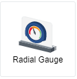
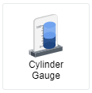
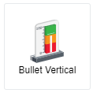
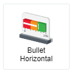
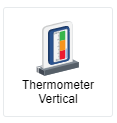
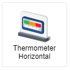
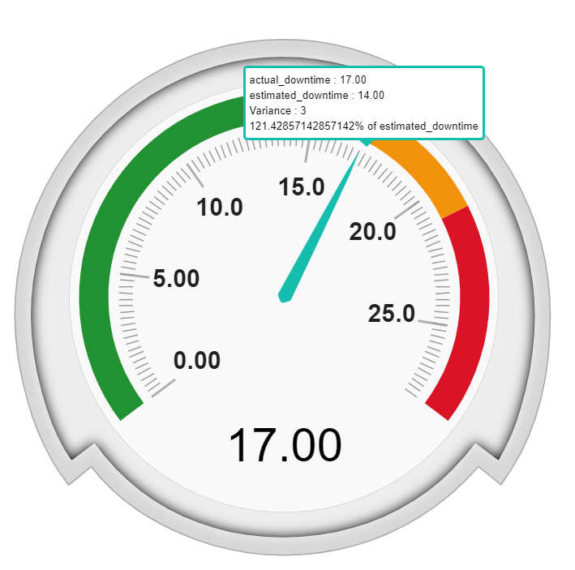
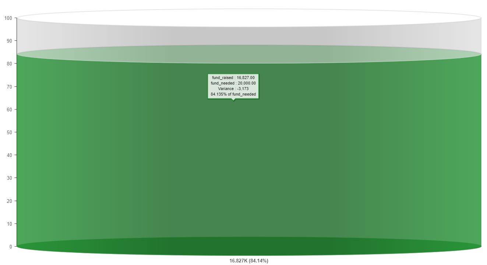

## Target Visuals

  
  
 

Target visuals are visuals that indicates progress towards meeting a target. 
There are three main types of visuals, Gauge, Bullet and Thermometer, which are then further broken down into six different visuals 
including Radial Gauge, Cylinder Gauge, Bullet Vertical, Bullet Horizontal, Thermometer Vertical and Thermometer Horizontal.
  First, a **Radial Gauge** has an appearance similar to a speedometer in a car, with a needle that moves to indicate the 
proximity of the current value to the goal. When you hover your cursor over the needle, more information will be shown.
  Second, a **Cylinder Gauge** is a 3D cylinder bar chart that would fill up as the actual value increases with the filled colour 
being the threshold set in the settings. When you hover your cursor over the filled area, more information will be shown.
  Third, a **Bullet Vertical or Bullet Horizontal** is a bullet chart that depicts the actual value as a white bar overlapping on the 
threshold bar with colours shown according to your settings. When you hover your cursor over the white bar, more information will be shown.
  Fourth, a **Thermometer Vertical or Thermometer Horizontal** is a thermometer chart that has similar appearance as a bullet chart 
except that the bar indicating the actual value are shown on the right side of the threshold bar and it is blue colour. When you hover 
your cursor over the blue bar, more information will be shown.

 

## Data Binding

The Data Binding options are the same across all target visuals. There are two mandatory bindings which are **Actual** value and **Target** value.

|Bindings|Data Type|
|---|---|
|Actual|Numeric|
|Target|Numeric|

### Actual/Target

Only Numeric data type can be used for both **Actual** and **Target** bindings with an exception for 'Unique' and 'Count' expressions.
For example, if you are to include a non-numeric data type field named 'Movie Name' and you would like to:
1. Find out how many non-repeated movies are in the connected source --> 'Unique' expression can be applied on non-numeric field to 
generate the total number of rows without repeated value.
2. Find out how many movies are there in total --> 'Count' expression can be applied on non-numeric field to generate the total number of
rows.

Ultimately, only numerical values will be shown.

## Other Settings

### All/Top/Bottom

By default, the option selected is All (which means, all the data points will be shown in the chart). Select Top or Bottom, followed by the number of data points required to show the selected number of top-most data rows **OR** selected number of bottom-most data rows.

### Threshold

You can choose between 'Increasing Better' or 'Decreasing Better' for Trending, and to set number of threshold quartiles and range of each
quartile. You can also change the colour of each quartile by clicking on the colour bar and a colour palette will pop up. You can even
add more quartile if you need more and remove them by pressing on 'X' button beside the percentage symbol.

### Filter

Add filters to restrict your data so that analysis will be focused on data which are shown in the chart.

 

## Use Case for Radial Gauge
### Bank's Website Weekly Downtime
A dataset is generated using Mockaroo. Download sample data [here](./sample-data/target-visuals/downtime.csv).
 Provided within the dataset are the necessary fields needed to generate the radial gauge.

|Bindings|Select|
|---|---|
|Actual|\[Sum]actual_downtime|
|Target|\[Sum]estimated_downtime|

There are three fields in the CSV file, two of which are mentioned above, while the last one is a Date field. You could filter Date to look into the downtime per day. As shown in the table above, selecting \[Sum] expression for both
fields because you need the total value of actual downtime for a week and since the estimated downtime is defined per day, it should be
\[Sum] as well.

**Output**

**Analysis**

The green colour threshold is typically used to indicate a 'good zone', orange for slightly worse than expectation but still acceptable,
and red is for unsatisfactory output which requires immediate attention.
In this radial gauge, you can see that the green zone is leaning towards smaller number, which means this radial gauge is a "Decreasing
is better" trend as downtime is something every business trying to minimize.
Since the needle is pointing towards the orange zone, it means that something unusual have happened even though it is not as major that it would skew the output towards the red zone.
As you could see from the information pop-up box, the actual downtime is 3 hours more than the expected downtime. From here, you could 
deduce that the average downtime per day is 2 hours which are for bank to perform maintenance and transactional verification. 
Subtracting the expected value, you get a variance of 3 hours and this meant that the 3 hours are unexpected and unusual, you might
want to look into this further such as drilling down what day or hour when it happened, and to find out what is the cause. 
It might be due to lacking server memory as the business grows, so it is time to bring this issue to the management to procure a better 
server or to upgrade the memory.

 

## Use Case for Cylinder Gauge
### Tracking Kickstarter's Project Fund
A dataset is generated using Mockaroo. Download sample data [here](./sample-data/target-visuals/kickstarter.csv).
 Provided within the dataset are the necessary fields needed to generate the radial gauge.

|Bindings|Select|
|---|---|
|Actual|\[Sum]fund_raised|
|Target|\[Maximum]fund_needed|
|Filter|kickstarter_project|

There are four fields in the CSV file, three of which are mentioned above, while the last one is a Date field. You could filter Date to
look into the amount of fund raised per day. 
As shown in the table above, selecting \[Sum] expression for Actual field because you need the total amount of fund raised, 
\[Maximum] or \[Minimum] could be interchangably used for Target field in this case because the fund_needed is defined per project so it 
is a fixed value.
Filter is used to select a specific project to generate the output.

**Output**

**Analysis**

A Kickstarter project owner would need to monitor its project fund status at all times to track if it is on track in reaching the 
funding goal so that the project will have sufficient budget to sustain.
From the output shown above, you could see that the fund raised is $16,827 currently, as compared to the fund needed of $20,000.
The variance shows that it is $3,173 shy from reaching the goal.
The colour filling up the cylinder represents the threshold defined and since it is showing green in this case, it meant that the
funding is in a healthy status currently.
