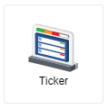
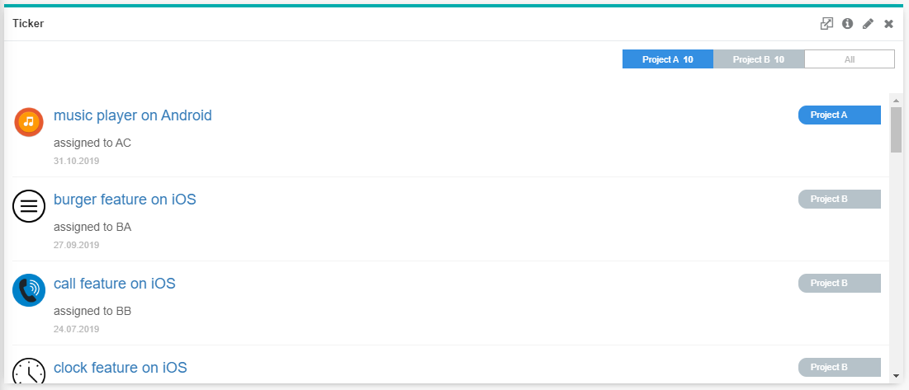

## Ticker

 

A Ticker chart allows us to have a clear view on each subject tagged to their respective category with additional details including message, date/time and a thumbnail. The subject could be hyperlinked so that it is clickable and would direct the user to the link attached. Category is clickable as well, to filter all the subjects tagged under the particular category. Furthermore, a ticker chart could be used as a news feed as well, showing headlines row-by-row.

 

## Data Binding

There are two mandatory bindings which are **Subject** and **Category** and four optional bindings including **Message**, **Date Time**, **Image URL** and **Link**.

|Bindings|Data Type|
|---|---|
|Subject|String|
|Category|String|

### Subject/Category

Both **Subject** and **Category** accept String data type. **Subject** is the title of each row of record which could be hyperlinked and **Category** determines the grouping of each subject.

### Message

The **Message** binding accepts String data type and is shown below the subject input. It can be used to show a description of the subject or a brief explanation about the subject.

### Date Time

The **Date Time** binding accepts Date and Time data type and is shown below the message input. It can be used to show the due date of an ongoing project or sub-project, or to show published date for news feed usage.

### Image URL 

The **Image URL** binding accepts URL data type. It retrieves the image from inserted URL and present the image as a thumbnail on the left side of each subject.

### Link

The **Link** binding accepts any link and will hyperlink the subject. A clickable title that directs user to look into further details of the subject.

## Other Settings

### All/Top/Bottom

By default, the option selected is All (which means, all the data points will be shown in the chart). Select Top or Bottom, followed by the 
number of data points required to show the selected number of top-most data rows **OR** selected number of bottom-most data rows.

### Filter

The **Filter** binding can be used to restrict or focus on data shown in the chart.

 

## Use Case
### Mobile Phone Software House
A mobile phone software house has 2 ongoing projects currently, which are developing features on different operating systems, namely Android and iOS. A person-in-charge is assigned to develop each unique feature on each operating system. 

The project manager would like to keep track of what are the ongoing features, who is the person-in-charge of each feature, what is the start date of each feature, thumbnail to show the feature and clickable titles.

Using the sample data [here](./sample-data/ticker/ticker.csv), configure the chart with settings as follows:

|Bindings|Select|
|---|---|
|Subject|*subject*|
|Message|*message*|
|Category|*category*|
|Date Time|*startdate*|
|Image URL|*image_url*|
|Link|*link*|

**Output**

**Analysis**

The project manager could have a clear view on each feature that is being developed, which project each feature is under, who are the person-in-charge, the start date, the thumbnail of the feature in-development, clickable titles, and also able to view all the relevant features under their respective category, which are Project A and Project B. The category shown on top right corner could be clicked to filter all the subjects that are relevant. The hyperlink could be in-depth details of each feature development progress so that the project manager could monitor the progress individually.