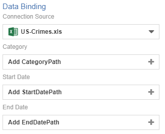
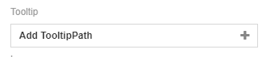
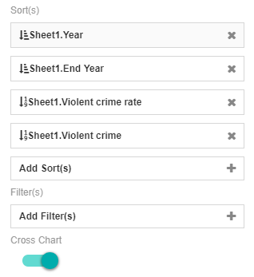
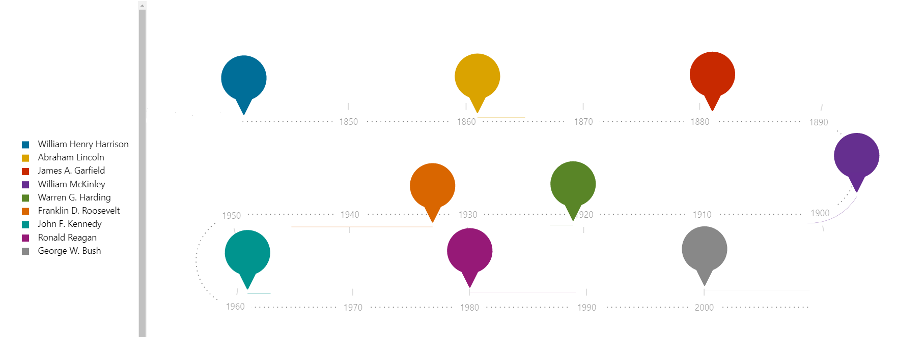
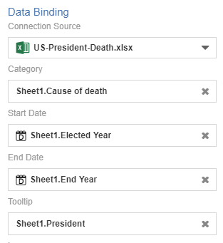
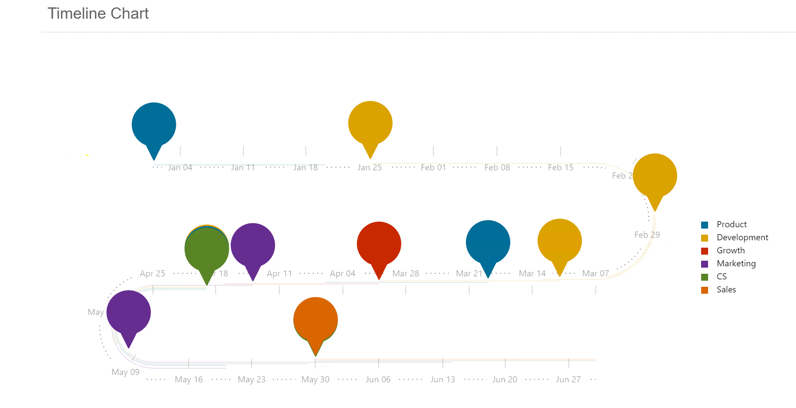

# Time Line

Time Line Chart is a graphical visualisation of a period of time, where the process is ordered chronologically. Since details are displayed graphically, the most important events can be easily seen and are marked from the start to the end. This chart is typically used for managing a project's schedule, where it adds transparency and gives the chance in analysing what happened in the past to plan for the future.

## Diagram Design / Configuration
### Binding
The minimum bindings required are Category, Start Date and End Date bindings.

### Tooltips
Tool Tip Path is nothing but an indicator to set a description for the point markers within the timeline chart.

### ImagePath
Image Path enables the addition of images onto the timeline chart if there are images within the dataset used.

### Sorting and Filtering
Sorting and filtering helps in minimising large data sets to focus on certain 

## Use Cases
### US President Deaths and Terms
A list of USA Presidents term length along with their deaths can be displayed using Timeline Chart. This use case uses a flow that has a start and end date using the year format. From the diagram, we can see that year of when the US president gets elected until the end of their term, due to their deaths.

Download sample data [here](./sample-data/timeline-chart/US-president-death.xlsx).

**Output**

**Binding**

The diagram below shows the data binding for US President Deaths and Terms use case 

### Sample Use Case 2
Current dataset displays the project management flow of a product release from the inception of the requirements until the launching of the product. Displayed in the chart, it can be seen that there are six different teams involved in the whole project, ranging from Product, Development, Growth, Marketing, CS and Sales.

Download sample data [here](./sample-data/timeline-chart/sample-project-mgmt.csv).

**Output**

**Binding**

The diagram below shows the data binding for project management use case 

