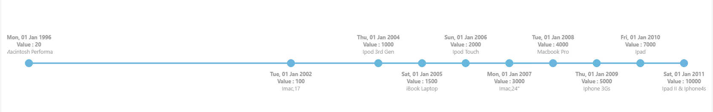
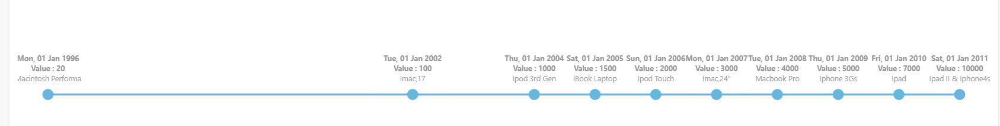

# Timeline Chart
Timeline chart is typically used to show a specific or huge event happening on a company or an individual profile 

## Diagram Design / Configuration
---
### Binding
- The bindings required are 2 dimensions binding 
    >Date and event name for dimensions
      

    
  
- The optional binding is measurement binding which shows a number of Value ( usually networth / calculated things )

    

    

Sample data download [here](./sample-data/timeline-chart/01.TimelineApple.xlsx).

---

### Diagram label align Order
There are three options for this configuration which are *Alternate*, *Above*, *Below*. The default option is *Alternate*.
- Alternate: Arrange the label position to be above - below  the bullet alternatively.
- Above: Arrange all of the labels to be positioned above the bullet.
- Below: Arrange all of the labels to be positioned below the bullet.

    
    
    A. Alternate
    

    B. Above  
    
    
    C. Below
    

---

## Incompatible data source 
- The data source should not contain unmodified Date format , it should present DD-MM-YYYY 

- For the above cases, "INVALID DATE" will occur on the Date label

---

## Unhandled conditions
- Date bindings from Date 1 to Date 2 are too short / long ( extreme ) since the chart xValue(date) the distance between Date1 to Date2 are proportional among all distance

- Too much data, when the data is too much, it would make the labels very hard to read 

- Haven't implemented a scrollbar to scroll the timeline to left / right 

   

---

## Use cases

### Company Specific product launch with networth of the company 
   
To show what product has been launched by the company and it could input the value of it ( maybe networth / product price / market stock price)

   

Sample data download [here](./sample-data/timeline-chart/01.TimelineApple.xlsx).

### Specific events on an individual life
   
This sample use case is to show what happen from Day1-Day7 of creation , you can opt not to input the value

 
Sample data download [here](./sample-data/timeline-chart/02.TimelineCreation.xlsx).

