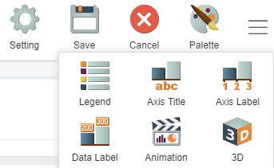
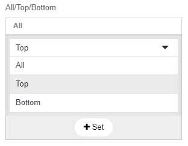
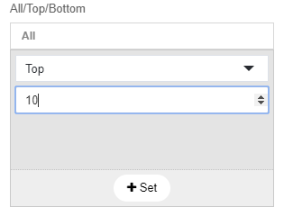

# Giant 101: Using bar charts

## Introduction:
Bar charts effectively show the KPI's/summary of data. It is easy to visualize and understand making it one of the most useful graphs within GIANT. This guide will show you examples of how to utilize this chart:

## Example 1:

When using GIANT, it is very important to always think about the structure of your data before using it to create your chart. GIANT has many built-in functions that make it easy for you to aggregate data within the system so you might want to think about this before trying to aggregate your data externally.

In this example, I will be using a source called **Stationary Sales**.

As you can see by the columns of my data, it shows the information about different stationary items being sold. If I wanted to showcase the **total number of items sold within each store**, I would have to aggregate my data to create a bar chart  within GIANT. Since there are already built in functions, I can just aggregate my current data within GIANT.

First we connect to our data source: **Stationary Sales**. The x-axis represents the different stores within my data. Since my data shows the number of **units** sold of **each specified item** from different stores, I have to use the built-in function **sum** when selecting **units** in order to get the **total number of items purchased from each store** for my y-axis. 

Make sure to always change your **Display Name** when choosing your column for the axis so that the information you are showcasing is clear to your audience. In this case, I label my **[Sum]Sales Data.Units** to be **Number of items sold** because that is what I get when aggregating my data using GIANT's built in function. We want to make sure that the naming of your axis are appropriate for the target audience to read. Ideally, we do not want any "_" or "-" within our display name. Our axis should be labeled to reflect our ideas of what we want to show.

The given result is as follows:

If you want to sort your bars in order, your **Sort(s)** for y-axis has to be the first on the list. You can do this by dragging the bar to the top or by **choosing your y-axis first**. When you click on the bar, you can then choose whether you want your bar chart to be displayed in ascending or descending order.

In this case, I want to see which store has the most sales to the store who has the least sales because I want to show which store is doing the best in terms of sales. 

This is the given output:

## Example 2:

In this example, I will be using a unique use case using data on **Insurance policy renewal intervals for users**. This data was aggregated externally so we will not be using any of GIANT's built-in functions.

This is the structure of the data I will be using for this example. **Interval** represents the number of days users leave between renewing their insurance policy and **count** represents the number of users who fall into that specific interval period. Given the way this data is aggregated, we are able to create a histogram.

Here we connect to our data source: **intervals.csv**. The x-axis represents the **interval** periods whilst the y-axis represents the **number of members** that fit into each period.

In this specific case, we must add a filter for when **interval period is equal to 0** because it does not make sense for users to be able to renew insruance policies in the same day. We recognise that this may be a problem with the data given, so we filter to omit it. 

This is the given output:

However, if we want to see our histogram on a bigger scale as **intervals.csv** has more data points, we must click the **show all** button at the **top right part** of our graph.

Here is the final output of our histogram that shows the number of members within each renewal interval period. We also want to include no legend in order to make the graph cleaner and easier to read for the target audience.

Click the hamburger icon in the top right of your screen and you will see the **legend** option. Click the legend option and select **no legend**.

## Giant's built in functions:

**Unique** - Counts the distinct values within the column you choose. For example, if your data contains multiple names, it only takes into account a name once. This is particularly useful when wanting to know how many unique users exist in your consumer base.

**Count** - Counts the number of rows within a column.

**Maximum** - Takes the maximum value within your column.

**Minimum** - Takes the minimum value within your column.

**Sum** - Sums the numeric values within your column.

**Average** - Takes the average value within your column.

**None** - Does not affect your column. Used when your current data is already aggregated.

**Group by** - Used when you want to look at the data within different groups of your data. For example: **Sales within categories for different age groups**.

**Sort** - Sorts your data in ascending/descending order depending on the data/data-type.

**Filter** - Allows you to choose columns within your table to filter our specific criteria for the data you want to show.

## Important notes:

- This type of chart can only be used when ur data is two dimensional thus it is important to know how your data is structured and what you want to show before you actually create a chart.

- If you have data you want to show that requires 3 dimensions, I recommend to find a different way to show your data.

- Bar charts are normally used to show summaries/overviews so if you want to show a large number of data points that requires legends or data labels, it may get very messy. 

-  You may also want to stay away from the **group by** feature as it can make your bar chart messy and difficult for the audience to understand.

In this example, I show the **total sales within each region grouped by the store which the items are sold from**. What I want to show requires both legends and data labels so it isn't ideal that I use this bar chart as it makes the data very messy and difficult to read.

- If you wanted to perform more specific analysis by making comparisons, limit the data points. For example: if you wanted to show the **top products sold**, you might want to limit it to the **top 10** products so your chart does not get messy. 

You can do this by going to the **All/Top/Bottom** feature under **settings**. Click the **All** button and click **Top**.

You can then set the number of which you want to limit your data. In this example, I choose the **top 10** points of my data. This will filter your data based on the axis of your data. You can also filter by seeing the bottom by clicking the **bottom** button.

- If you have date-time data, It would be better to showcase your data using a line-chart.

    Here it the link to line-chart documentation:
    [using-line-chart.md](giant-documentations\visual\using-line-chart.md)