# GIANT 101: Using Bar Charts

## Introduction
Bar charts are easy to visualize and understand making it one of the most useful graphs within GIANT. This guide will show you examples of how to utilize this chart:

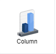

## Example 1

In this example, we will be using a source called **Stationary Sales**.

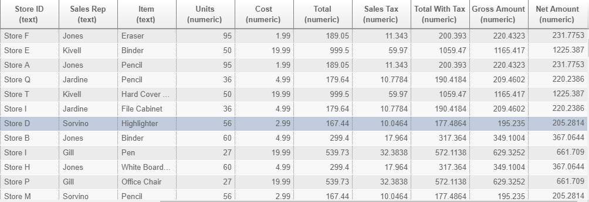

By the columns of the data, it shows the information about different stationary items being sold. If we want to showcase the **total number of items sold within each store**, we would have to aggregate the data to create a bar chart within GIANT. Since there are already built in functions, we can just aggregate the current data within GIANT.

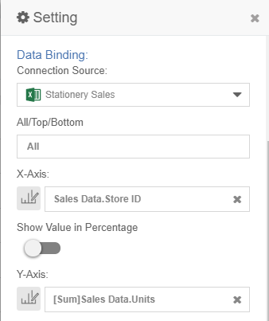

First, we connect to the data source: **Stationary Sales**. This can be found in [sample-data](sample-data/giant-101). The x-axis represents the different stores within the data. Since the data shows the number of **units** sold of **each specified item** from different stores, we have to use the built-in function **sum** when selecting **units** in order to get the **total number of items purchased from each store** for the Y-axis. 

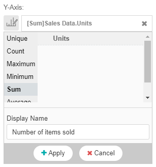

Make sure to always change the **Display Name** when choosing a column for the chart axis so that the information being showcased is clear to the audience. In this case, we label **[Sum]Sales Data.Units** to be **Number of items sold** because that is what we get when aggregating the data using GIANT's built in function.

The given result is as follows:

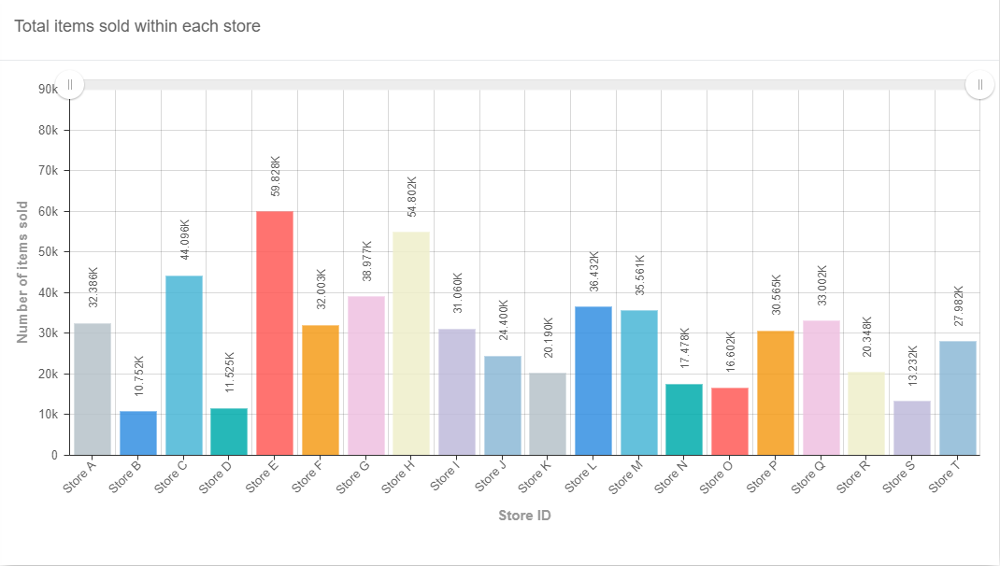

If we want to sort the bars in any specific order, we can do this by dragging the chosen data column to the top in the **Sort(s)** list. For example, if we want to sort the data by **Store ID**, the **Store ID** data column needs to be the first in the **Sort(s)** list. Whereas, if we want to sort by **Units**, the **Units** data column needs to be the first in the **Sort(s)** list. When we click on the data column, a menu is shown. We can then choose whether we want the data to be displayed in ascending or descending order.

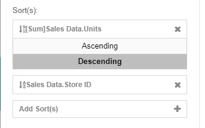

In this case, we want to see which store has the most sales to the store who has the least sales because we want to show which store is doing the best in terms of sales. 

This is the given output:

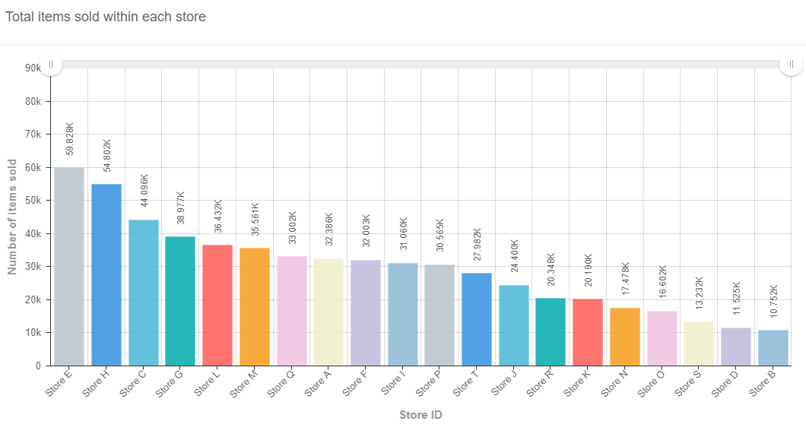

## Example 2

In this example, we will be using the unique use case using data on **Insurance policy renewal intervals for users**. This data was aggregated externally so we will not be using any of GIANT's built-in functions.

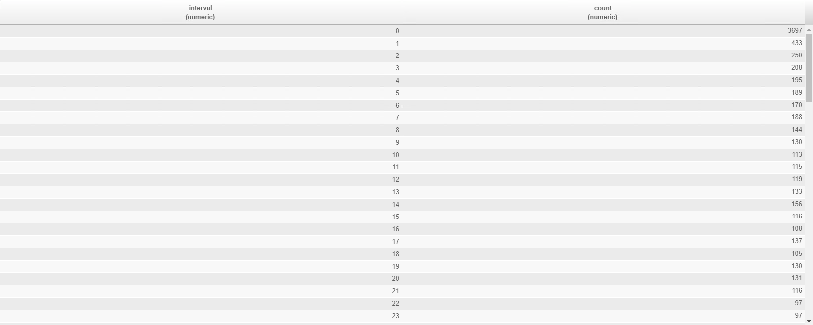

This is the structure of the data we will be using for this example. **Interval** represents the number of days users leave between renewing their insurance policy and **count** represents the number of users who fall into that specific interval period. Given the way this data is aggregated, we are able to create a histogram.

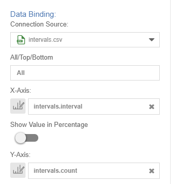

Here we connect to the data source: **intervals.csv**. This can be found in [sample-data](sample-data/giant-101). The x-axis represents the **interval** periods whilst the y-axis represents the **number of members** that fit into each period.

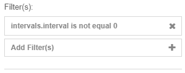

In this specific case, we must add a filter for when **interval period is equal to 0** because it does not make sense for users to be able to renew insurance policies in the same day. We recognise that this may be a problem with the data given, so we filter to omit it. 

This is the given output:

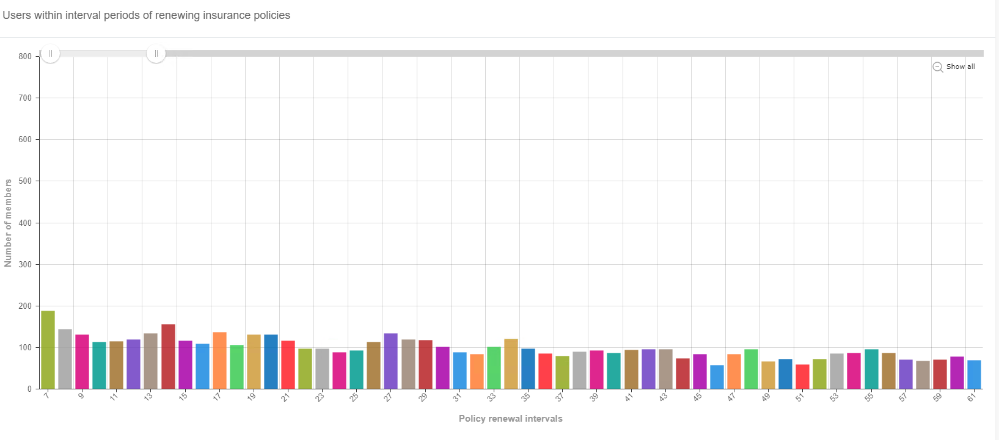

However, if we want to see our histogram on a bigger scale as **intervals.csv** has more data points, we must click the **show all** button at the **top right part** of our graph.

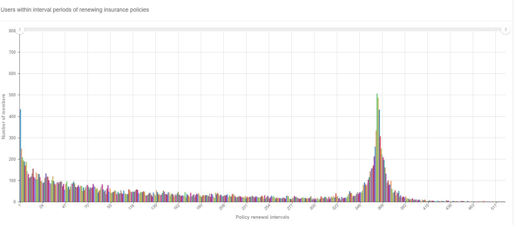

Here is the final output of our histogram that shows the number of members within each renewal interval period. 

## GIANT's Built-In Functions

**Unique** - Counts the distinct values within the column chosen. For example, if the data contains multiple names, it only takes into account a unique name once. This is particularly useful when wanting to know how many unique users exist in the consumer base.

**Count** - Counts the number of rows within a column.

**Maximum** - Takes the maximum value within a column.

**Minimum** - Takes the minimum value within a column.

**Sum** - Sums the numeric values within a column.

**Average** - Takes the average value within a column.

**None** - Does not affect the column. Used when the current data is already aggregated.

**Group By** - Used to look at the data within different groups of the data. For example: **Sales by Store ID for different Age Groups**.

**Sort** - Sorts the data in Ascending/Descending order depending on the data type.

**Filter** - Allows choosing columns within the table to filter specific criteria for the data.

## Important Notes

- If there is date-time data, it would be better to showcase the data using a line-chart.

- This type of chart can only be used when your data is two dimensional thus it is important to know how the data is structured and what  to show before you actually create a chart.

- If the data includes 3 dimensions, use a different visual to show the data OR try the **Drill-Down** feature.

- Bar charts are normally used to show summary or overviews for comparison. So, if there are a large number of data points that requires legends or data labels, it may get very messy. 

- Depending on the data and use case, stay away from the **Group By** feature as it can make the bar chart messy and difficult for the audience to understand.

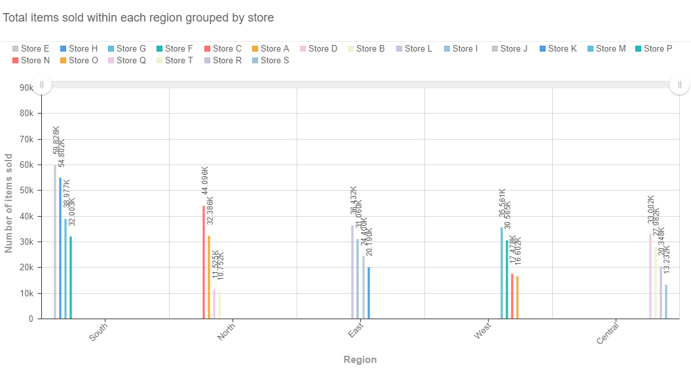

In this example, we show the **total sales within each region grouped by the store which the items are sold from**. What we want to show requires both legends and data labels so it isn't ideal that we use this bar chart as it makes the data very messy and difficult to read.
